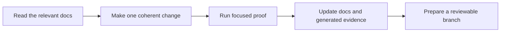
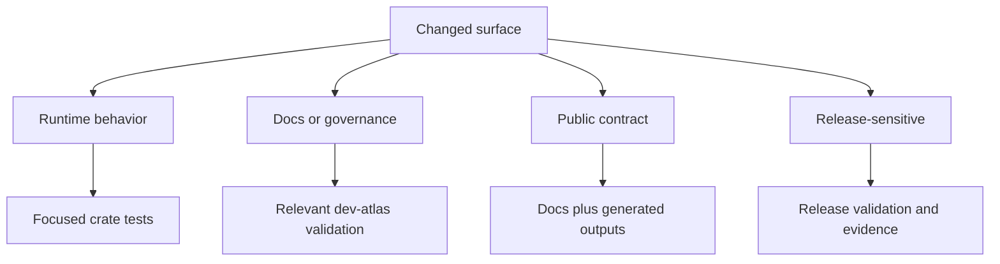

# Contributing to Bijux Atlas

Atlas expects contributors to work from source-of-truth documents, governed commands, and small reviewable changes. If a README, comment, or habit disagrees with the numbered docs spine or a control-plane check, treat the docs spine and the check as authoritative.



This contributor path is here to make the review standard explicit. Atlas changes are expected to
carry their own explanation and proof, not just code edits in isolation.

## Prerequisites

- Rust 1.85.0 through [`rust-toolchain.toml`](rust-toolchain.toml)
- Cargo
- GNU Make
- Python 3 when you need to run the MkDocs documentation toolchain from [`configs/sources/repository/docs/requirements.txt`](configs/sources/repository/docs/requirements.txt)

## Local Setup

Start from the repository root and verify the control-plane surfaces before making broader edits:

```bash
cargo fetch
cargo run -q -p bijux-dev-atlas -- docs doctor --format json
cargo run -q -p bijux-dev-atlas -- governance validate --format json
make help
```

If you are changing published docs behavior or MkDocs configuration, also run:

```bash
make docs-validate
```

## Read Before You Edit

Start here before opening a broad change:

- contributor workflow: [`docs/06-development/contributor-workflow.md`](docs/06-development/contributor-workflow.md)
- automation model: [`docs/bijux-atlas-dev/automation/automation-control-plane.md`](docs/bijux-atlas-dev/automation/automation-control-plane.md)
- local workflow: [`docs/06-development/local-development.md`](docs/06-development/local-development.md)
- testing expectations: [`docs/06-development/testing-and-evidence.md`](docs/06-development/testing-and-evidence.md)
- change and compatibility model: [`docs/06-development/change-and-compatibility.md`](docs/06-development/change-and-compatibility.md)
- source layout and ownership: [`docs/05-architecture/source-layout-and-ownership.md`](docs/05-architecture/source-layout-and-ownership.md)
- repository laws: [`configs/sources/repository/repo-laws.json`](configs/sources/repository/repo-laws.json)

## Working Rules

- work from the repository root
- use `bijux-dev-atlas` as the canonical automation surface
- use `make` only through the curated wrapper targets exposed by [`makes/root.mk`](makes/root.mk)
- keep make recipes boring and thin; orchestration belongs in Rust
- keep one coherent concern per commit
- use Conventional Commit / Commitizen-style commit messages such as `fix(configs): ...` or `refactor(makes): ...`
- avoid temporary or history-shaped names in files, directories, commits, and identifiers
- update docs, tests, configs, ops inputs, and generated evidence together when a governed surface changes
- do not hand-edit generated artifacts unless the owning command regenerated them in the same change

These rules exist so the repository stays explainable months later. A reviewer should be able to
look at a commit, a generated artifact, and the owning command and see one coherent story.

## Local Baseline

These commands are a good first pass from a fresh checkout:

```bash
cargo fetch
cargo test -p bijux-dev-atlas --no-run
cargo run -q -p bijux-dev-atlas -- governance validate --format json
cargo run -q -p bijux-dev-atlas -- docs doctor --format json
make help
```

If these fail, fix the environment or the repository state before adding more edits.

When your change touches install guidance or the `bijux atlas ...` routed surface, verify both the direct Atlas binaries and the umbrella route where applicable so `bijux-atlas` and `bijux-cli` stay aligned.

## Choosing Validation Honestly

Run the smallest meaningful proof for the surface you changed, then the wrapper or lane that reviewers will rely on.

- runtime behavior change: run focused crate tests and update the matching reference or contract page
- docs, configs, ops, or makes change: run the relevant `bijux-dev-atlas` validation command and the narrowest matching lane
- public command, schema, or contract change: update the checked-in documentation and any generated outputs that describe the surface
- moved or renamed docs page: regenerate redirects with `cargo run -q -p bijux-dev-atlas -- docs redirects sync --allow-write`
- release-sensitive change: review [`docs/06-development/release-and-versioning.md`](docs/06-development/release-and-versioning.md) and refresh the supporting evidence



This validation map keeps “run some tests” from becoming vague advice. Different surfaces need
different proof, and the right proof should be obvious before review starts.

## Pull Request Standard

Before asking for review, make sure the branch shows a clean, believable story:

- each commit has a clear intention and a meaningful scope
- the pull request explains the user-visible or operator-visible impact
- compatibility impact is called out explicitly, even when the answer is "none"
- reviewers can rerun the proof with one or two copy-paste commands
- ownership is respected; use [`.github/CODEOWNERS`](.github/CODEOWNERS) when the change crosses boundaries

## When You Add Automation

Do not solve repository problems by adding one more shell wrapper, hidden script, or duplicate source of truth.

Prefer this order:

1. extend `bijux-dev-atlas`
2. expose a thin curated `make` wrapper only if it improves ergonomics
3. document the surface in the numbered docs spine

## When You Are Unsure

Default to clarity:

- choose explicit names over timeline-shaped names
- choose one obvious source of truth over duplicated convenience files
- choose smaller commits over one bulk rewrite
- choose documented behavior over folklore
