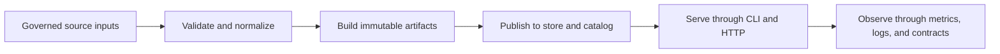
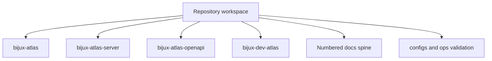
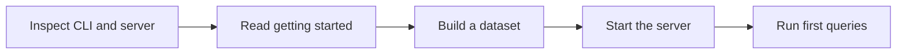
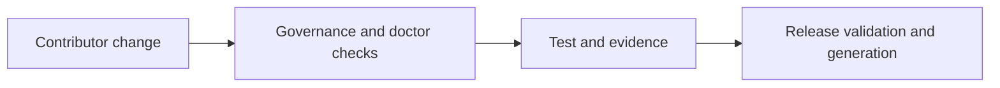
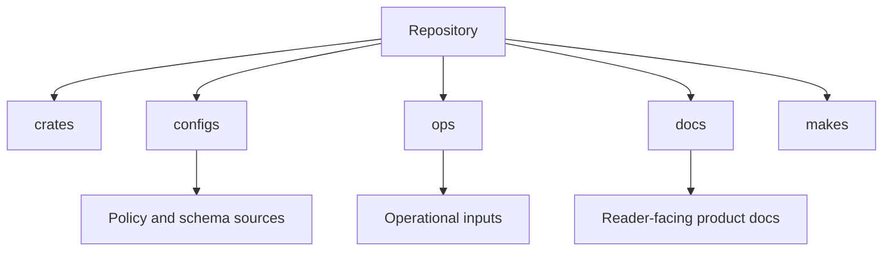

# Bijux Atlas

<a id="top"></a>

**Bijux Atlas is a Rust-owned genomics dataset delivery platform for GFF3/FASTA ingest, immutable gene-query artifacts, governed HTTP APIs, and reproducible operations evidence.**

This repository currently ships four connected surfaces:

* `bijux-atlas`: the end-user CLI for dataset and query workflows,
* `bijux-atlas-server`: the HTTP runtime server,
* `bijux-atlas-openapi`: the OpenAPI export surface,
* `bijux-dev-atlas`: the maintainer control plane binary defined in this workspace.

The public promise today is a deterministic runtime, explicit repository governance, stable documented contracts, and release inputs that can be validated instead of hand-waved.
Atlas also plugs into the sibling [`bijux-cli`](https://github.com/bijux/bijux-cli) umbrella runtime: install Atlas through `bijux` when you want routed `bijux atlas ...` and `bijux dev atlas ...` commands, or install Atlas directly when you want the standalone binaries only.

[](https://crates.io/crates/bijux-atlas)
[](https://docs.rs/bijux-atlas/latest/bijux_atlas/)
[](https://bijux.github.io/bijux-atlas/)
[](https://github.com/bijux/bijux-atlas/actions)
[](LICENSE)

Rust crate: [crates.io](https://crates.io/crates/bijux-atlas)
Rust API docs: [docs.rs](https://docs.rs/bijux-atlas/latest/bijux_atlas/)
Project docs: [GitHub Pages](https://bijux.github.io/bijux-atlas/)
Source docs spine: [`docs/index.md`](docs/index.md)

> **At a glance**
> Immutable datasets · Runtime CLI and server · OpenAPI export · Repository control plane · Governed configs, ops, and release inputs
> **Quality**
> Quality status is checked from live maintainer commands and checked-in contracts.
> `artifacts/` is disposable local output and is not part of the repository contract.
> Published artifacts and `v*` git tags define the public release line.
> Untagged checkout builds stay anchored to the latest real tag while the source tree can still be preparing the next release.

---

## Table of Contents

* [Why Bijux Atlas?](#why-bijux-atlas)
* [What Ships Today](#what-ships-today)
* [How Atlas Fits With Bijux CLI](#how-atlas-fits-with-bijux-cli)
* [Key Features](#key-features)
* [Installation](#installation)
* [Runtime in 60 Seconds](#runtime-in-60-seconds)
* [Maintainer Control Plane](#maintainer-control-plane)
* [Packages, Configs, and Ops](#packages-configs-and-ops)
* [What Does Not Ship Yet](#what-does-not-ship-yet)
* [Project Tree](#project-tree)
* [Release Line & Stability](#release-line--stability)
* [Roadmap](#roadmap)
* [Docs & Resources](#docs--resources)
* [Contributing](#contributing)
* [License](#license)

---

## Why Bijux Atlas?

Bijux Atlas is for repository-managed dataset systems where:

* datasets must become immutable release artifacts,
* runtime APIs need explicit contracts and provenance,
* configs and ops inputs must be validated before they become policy,
* release claims should come from checked evidence instead of folklore,
* and maintainers need one honest control plane instead of scattered shell logic.



This product map is the shortest accurate picture of Atlas. The repository does not revolve around
mutable runtime state alone. It revolves around turning governed inputs into immutable artifacts and
then exposing those artifacts through explicit surfaces.

---

## What Ships Today

The repository is strongest when it stays concrete about what is already real:

* a runtime CLI named `bijux-atlas`,
* a server binary named `bijux-atlas-server`,
* an OpenAPI export binary named `bijux-atlas-openapi`,
* the maintainer binary `bijux-dev-atlas`,
* governed `configs/`, `ops/`, `docs/`, and `makes/` trees that are validated together,
* and release inputs for crates, images, docs, and operations evidence.

This README intentionally describes the shipped release surfaces and their contracts, not every internal experiment or implementation detail in the workspace.



This release-surface diagram is important because Atlas ships more than one binary and more than
one kind of repository contract. Readers should be able to see immediately which surfaces are for
runtime use and which are for repository maintenance.

---

## How Atlas Fits With Bijux CLI

Atlas owns the domain runtime for genomic dataset build, query, and serving workflows.
`bijux-cli` owns the umbrella command runtime that can route Atlas alongside other Bijux tools.

Choose one command identity per environment:

* use `bijux-atlas`, `bijux-atlas-server`, and `bijux-atlas-openapi` when you want the Atlas binaries directly
* use `bijux atlas ...` and `bijux dev atlas ...` when you already standardize on the `bijux` umbrella runtime

The routed and direct entrypoints should describe the same Atlas runtime surface. The difference is packaging and command routing, not a different product contract.

---

## Key Features

### Immutable Dataset Delivery

Atlas treats dataset builds as release artifacts with explicit manifests, provenance, and reproducible packaging inputs.

### Runtime Surfaces With Clear Boundaries

`bijux-atlas`, `bijux-atlas-server`, and `bijux-atlas-openapi` are the user-facing runtime surfaces.
The installed umbrella runtime namespace is `bijux atlas ...`.
The maintainer namespace is `bijux dev atlas ...`, backed by the `bijux-dev-atlas` binary.

### Governed Repository Inputs

`configs/`, `ops/`, `docs/`, and `makes/` are checked together so release, policy, and operating guidance can stay aligned with the code that uses them.

### Thin Makes Wrapper Layer

GNU Make exists as a boring convenience layer rooted at [`makes/root.mk`](makes/root.mk).
Orchestration logic belongs in Rust commands, not in shell-heavy wrapper files.

### Honest Release Evidence

The release story includes checked manifests, compatibility tables, docs deployment, crates.io publication, and GitHub release automation instead of one-off manual steps.

---

## Installation

Choose one install route at a time.

If you already use the `bijux` umbrella CLI, prefer the routed Atlas install so the runtime stays reachable through the same command root as the rest of your Bijux toolchain:

```bash
bijux install bijux-atlas
bijux atlas --help
bijux atlas version
```

Use direct Cargo installation when you want Atlas by itself, or when CI and local Rust workflows call the binaries directly:

```bash
cargo install --locked bijux-atlas
bijux-atlas --help
bijux-atlas version
```

For maintainer automation, the installed umbrella namespace is:

```bash
bijux install bijux-dev-atlas
bijux dev atlas --help
```

Quick verification for the standalone binaries:

```bash
bijux-atlas version
bijux-atlas --help
bijux-atlas-server --help
bijux-atlas-openapi --help
```

From a workspace checkout, run the current source tree directly with:

```bash
cargo run -q -p bijux-atlas --bin bijux-atlas -- version
cargo run -q -p bijux-dev-atlas -- --help
```

The runtime crate is published through Cargo. The maintainer crate is part of the repository contract and the `bijux dev atlas ...` umbrella surface, even when you run it directly from a checkout.

Atlas does not publish a Python package yet. The planned Python bridge is a future release item, not a hidden install path today.

---

## Runtime in 60 Seconds

```bash
# Inspect the runtime surface
bijux-atlas --help
bijux-atlas version

# Export the OpenAPI document
bijux-atlas-openapi --help

# Inspect the server surface
bijux-atlas-server --help
```

For the canonical runtime references, start with:

* [`docs/02-getting-started/index.md`](docs/02-getting-started/index.md)
* [`docs/04-operations/index.md`](docs/04-operations/index.md)
* [`docs/07-reference/command-surface.md`](docs/07-reference/command-surface.md)



This quick-start path is intentionally shorter than the full docs spine. It is for readers who want
to confirm the product shape before they commit to a deeper setup.

---

## Maintainer Control Plane

Atlas keeps repository automation explicit:

```bash
bijux dev atlas --help
cargo run -q -p bijux-dev-atlas -- --help
make help
```

Use `bijux dev atlas ...` as the canonical installed automation surface.
Use `bijux-dev-atlas` or `cargo run -p bijux-dev-atlas -- ...` when you are working from a checkout.
Use `make` only through the curated wrappers exposed from [`makes/root.mk`](makes/root.mk).

Helpful maintainer entrypoints:

```bash
cargo run -q -p bijux-dev-atlas -- check doctor --format json
cargo run -q -p bijux-dev-atlas -- governance validate --format json
cargo run -q -p bijux-dev-atlas -- release validate --format json
make ci-fast
```



The maintainer surface is separate on purpose. It keeps repository validation, docs generation, and
release evidence out of the runtime binaries that end users depend on.

---

## Packages, Configs, and Ops

Atlas carries more release-facing material in-repo than a typical single-crate project.
That is intentional, but the boundaries stay explicit:

* `crates/` owns runtime and maintainer binaries,
* `configs/` owns policy, schema, registry, and repository inputs,
* `ops/` owns deployment, observability, release, and scenario data,
* `docs/` owns the numbered documentation spine and contract references,
* `makes/` owns the thin wrapper surface over governed commands.

The goal is not “everything is public API.”
The goal is one honest source of truth for each governed concern.



This repository map helps explain why Atlas looks broader than a single-crate project. The extra
trees are not incidental clutter; they are part of the governed release and operations surface.

---

## What Does Not Ship Yet

Atlas is deliberately explicit about non-shipped scope:

* there is no published `bijux-atlas-python` package yet,
* there is no mutable lab workflow engine inside the runtime,
* and `artifacts/` is not a source-of-truth tree.

If a surface is planned, internal, or future-facing, it should be described as such instead of being implied by README language.

---

## Project Tree

| Path | Purpose |
| --- | --- |
| `crates/bijux-atlas/` | Runtime crate and user-facing binaries |
| `crates/bijux-dev-atlas/` | Maintainer control plane for docs, checks, governance, release, configs, and ops |
| `configs/` | Repository-owned policy, schemas, registries, and examples |
| `ops/` | Release specs, scenarios, deployment inputs, observability, and contracts |
| `makes/` | Thin GNU Make wrapper surface |
| `docs/` | Canonical reader-facing documentation |
| `artifacts/` | Generated local outputs and evidence |

---

## Release Line & Stability

Published crates, GitHub releases, docs deployment, and `v*` git tags define the public release line.
Untagged checkout builds derive their operator-facing version from the latest real tag, while workspace manifests and checked-in release inputs can move ahead for the next intended release.

Release expectations live in [`docs/06-development/release-and-versioning.md`](docs/06-development/release-and-versioning.md).
Compatibility and operational promises live under [`docs/08-contracts/index.md`](docs/08-contracts/index.md).

---

## Roadmap

Planned follow-on work stays separate from the shipped release story:

* `v0.3.0`: publish `bijux-atlas-python` as an installable Python bridge similar in shape to `bijux-cli`, without changing Rust runtime ownership
* `v0.4.0`: add lab experiment provenance and metadata ingestion from ELN/LIMS exports so immutable dataset releases can carry explicit sample and experiment context

Those items are roadmap commitments, not current release claims.

---

## Docs & Resources

Start with the numbered docs spine:

* overview: [`docs/01-introduction/index.md`](docs/01-introduction/index.md)
* getting started: [`docs/02-getting-started/index.md`](docs/02-getting-started/index.md)
* operations: [`docs/04-operations/index.md`](docs/04-operations/index.md)
* architecture: [`docs/05-architecture/index.md`](docs/05-architecture/index.md)
* development: [`docs/06-development/index.md`](docs/06-development/index.md)
* reference: [`docs/07-reference/index.md`](docs/07-reference/index.md)
* contracts: [`docs/08-contracts/index.md`](docs/08-contracts/index.md)

Root policies:

* contribution guide: [`CONTRIBUTING.md`](CONTRIBUTING.md)
* security policy: [`SECURITY.md`](SECURITY.md)
* code ownership: [`.github/CODEOWNERS`](.github/CODEOWNERS)

---

## Contributing

See [`CONTRIBUTING.md`](CONTRIBUTING.md).
Use small, coherent Conventional Commit / Commitizen-style commits such as `fix(configs): ...` or `refactor(makes): ...`.

---

## License

Apache-2.0. See [`LICENSE`](LICENSE).
