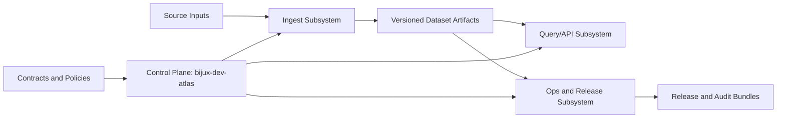
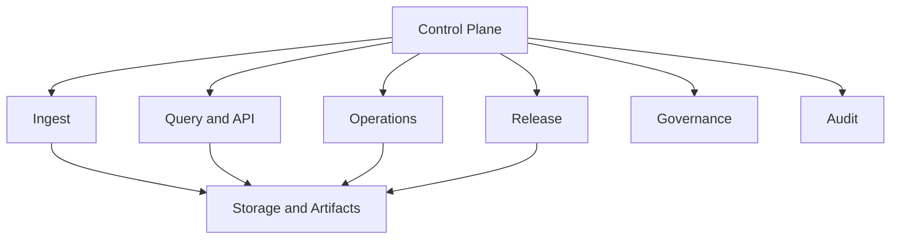
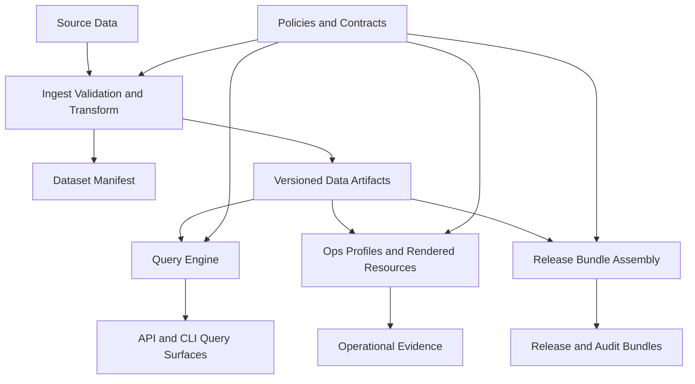
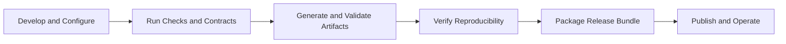

# Bijux Atlas

Bijux Atlas is a deterministic genomics data platform for ingesting, validating, serving, and governing release-grade biological datasets.

## System Definition
Bijux Atlas is a contract-driven data platform that converts genomics source inputs into reproducible query artifacts and governed release bundles.

## System Category
Platform and infrastructure engine for deterministic genomics data delivery.

## Problem Atlas Solves
Genomics data pipelines often fail reproducibility and auditability requirements because ingestion, validation, serving, and release governance are fragmented. Bijux Atlas unifies these concerns under one deterministic control plane and one contract surface.

## Target Users
- Platform engineers operating data and release infrastructure.
- Bioinformatics and data engineers publishing curated dataset releases.
- Reliability, security, and governance reviewers validating operational evidence.

## Main Capabilities
- Deterministic ingest from governed source inputs to stable dataset artifacts.
- Query APIs and CLI workflows over versioned, validated dataset releases.
- Contract, policy, and check enforcement for repository and runtime surfaces.
- Reproducible release and audit bundles with traceable evidence.

## System Elevator Pitch
Bijux Atlas turns genomics data delivery into a deterministic, policy-enforced, and auditable system from ingest to release.

## Quick System Overview
Bijux Atlas is built around a Rust control plane (`bijux-dev-atlas`) that enforces contracts and executes workflows. Operational and release outputs are treated as governed artifacts, not ad-hoc side effects.

## What Atlas Is
- A deterministic ingest-and-query platform with strict contract enforcement.
- A control plane that governs docs, configs, ops, CI, release, and audit surfaces.
- A repository whose executable checks are the source of truth for governance rules.

## What Atlas Is Not
- A generic workflow runner without domain invariants.
- An eventually-consistent release process based on manual checklists.
- A governance-by-documentation-only project with unenforced policies.

## Key Design Principles
- Determinism first: same inputs and commit produce the same governed outputs.
- Contracts over convention: critical rules are executable and testable.
- Traceable evidence: operational and release decisions generate inspectable artifacts.
- Explicit boundaries: data plane, control plane, and policy layers are separated.

## Deterministic Infrastructure
Determinism is enforced through pinned toolchains, canonical serialization, stable ordering, and contract checks that reject drift across docs, configs, artifacts, and release outputs.

## Contract-Driven System
Contracts define required system behavior and are executed by the control plane across domains (`ops`, `docs`, `configs`, `ci`, `release`, `governance`, `audit`). This keeps policy claims and enforcement synchronized.

## Core Capabilities
- Ingest pipeline with validation gates and reproducibility checks.
- Query surface with controlled filters, pagination, and compatibility guarantees.
- Ops workflows for profile rendering, validation, install, and evidence generation.
- Release workflows for manifest generation, bundle hashing, and verification.
- Governance and audit workflows for institutional readiness.

## Architecture Summary Diagram

## Component Map

## System Components
- Control plane: command and contract execution engine (`bijux-dev-atlas`).
- Ingest subsystem: parses, validates, and transforms source genomic inputs.
- Query subsystem: serves deterministic dataset views through API and CLI surfaces.
- Storage/artifact subsystem: persists versioned datasets, manifests, and evidence.
- Ops subsystem: profile-driven render/validate/install workflows.
- Release subsystem: manifest, bundle, hash, and verification workflows.
- Governance and audit subsystem: policy linkage, coverage, and readiness evidence.

## Atlas Lifecycle
1. Sources are ingested through deterministic pipeline stages.
2. Artifacts are validated and promoted into governed dataset releases.
3. Query/API surfaces serve versioned datasets with controlled compatibility.
4. Ops and release workflows produce evidence-rich bundles.
5. Governance and audit workflows validate institutional readiness.

## Typical Workflow
1. Ingest and validate a dataset revision.
2. Run contracts/checks to prove policy and surface integrity.
3. Render and validate ops profiles for deployment intent.
4. Build and verify release bundles with reproducibility evidence.
5. Publish release and audit artifacts for review and operations.

## Example Use Case
A platform team needs to publish an updated human genome annotation release:
1. They ingest the new source set and run validation gates.
2. They verify query and API behavior against contract expectations.
3. They run ops profile validation and simulation evidence generation.
4. They build a release bundle with manifest, SBOM, docs, and provenance references.
5. They publish the release with audit-ready artifacts and deterministic hashes.

## Documentation Entrypoints
- Start here: [`docs/start-here.md`](docs/start-here.md)
- System index: [`docs/index.md`](docs/index.md)
- Architecture: [`docs/architecture/index.md`](docs/architecture/index.md)
- Operations: [`docs/operations/index.md`](docs/operations/index.md)
- Reference: [`docs/reference/index.md`](docs/reference/index.md)

## Repository Layout
- `crates/`: Rust crates for ingest, query, API, server, and control plane.
- `configs/`: governed configuration and policy surfaces.
- `ops/`: operational manifests, schemas, and execution surfaces.
- `docs/`: user-facing and internal documentation.
- `release/`: release-related schemas, workflows, and supporting assets.
- `artifacts/`: generated evidence, reports, and reproducibility outputs.

## System Architecture
Bijux Atlas uses a layered architecture:
- Source ingestion and transformation layers produce canonical dataset artifacts.
- Query and API layers consume immutable dataset artifacts.
- Ops, release, and audit layers produce runtime and institutional evidence artifacts.
- A single control plane orchestrates validations and enforces cross-domain contracts.
- Policy and contract definitions remain externalized in governed config surfaces.

## Data Flow
1. Source datasets enter ingest pipelines with schema and integrity validation.
2. Ingest outputs produce versioned artifacts and manifests.
3. Query/API services load approved artifacts and expose deterministic response surfaces.
4. Ops workflows render and validate deployment resources from governed profiles.
5. Release workflows package artifacts into verifiable bundles and generate audit evidence.

## Architecture Diagram

## Workflow Diagram

## Development Workflow
1. Change code, configs, docs, or ops surfaces in bounded commits.
2. Run targeted checks/contracts for affected domains.
3. Run full quality gates before merge (`make test-all`, `make contract-all`, `make checks-all`).
4. Regenerate governed artifacts through control-plane commands, not manual edits.
5. Merge only when deterministic outputs and required governance evidence are clean.

## Testing Philosophy
- Determinism is a first-class test requirement, not an optional quality signal.
- Contracts validate invariants at repository, runtime, and release boundaries.
- Slow tests are explicitly tagged to keep default feedback loops fast and predictable.
- Generated artifacts are treated as testable, governed outputs.
- Failures must be actionable and tied to explicit policy or contract authority.

## Governance Model
Governance is encoded as executable contracts, checks, and policy registries. Changes to high-risk surfaces must preserve policy linkage, schema coverage, and evidence generation. Governance drift is detected as a build failure, not a post-merge review comment.

## Ops Model
Operations are profile-driven. Each profile defines safety posture, required resources, and policy boundaries. Ops workflows render manifests, validate constraints, and produce evidence artifacts to support release and audit readiness.

## Release Model
Releases are manifest-based and artifact-centric. A release is defined by deterministic bundle composition, digest-backed artifact references, reproducibility checks, and contract-verified metadata integrity.

## Performance Goals
- Deterministic query behavior under governed profile constraints.
- Bounded control-plane execution times for core validation lanes.
- Profile-aware scalability rules for production-oriented deployments.
- Reproducible performance evidence captured in release and ops artifacts.

## Reliability Goals
- Predictable behavior across repeated runs with the same inputs.
- Controlled failure modes with explicit recovery workflows.
- Release and operational evidence sufficient for institutional review.
- Guardrails that prevent silent drift in critical surfaces.

## Security Model
- Policy-enforced boundaries for secrets, network, and execution effects.
- Digest-pinned artifacts and governed dependency posture for release workflows.
- Structured audit evidence for controls, checks, and contract enforcement.
- Explicit disclosure, upgrade, and maintenance policy documentation in operations docs.

## Roadmap
- Strengthen architecture and workflow documentation for external reviewers.
- Expand simulation and audit demonstrations for institutional readiness.
- Continue reducing ambiguity in CLI, docs, and release surfaces.
- Keep governance and runtime evidence tightly coupled and reproducible.

## Project Status
Active development with enforced contracts/checks and deterministic release governance. Current focus is improving system clarity and architectural communication for maintainers and reviewers.

## Why This Exists
Bijux Atlas exists to make genomics data infrastructure reproducible, reviewable, and operable at institutional quality bars, without relying on undocumented manual process.

## Comparison With Alternatives
- Compared to ad-hoc pipelines, Atlas enforces executable contracts across repository and runtime surfaces.
- Compared to documentation-only governance, Atlas fails builds on policy and evidence drift.
- Compared to loosely versioned release processes, Atlas treats release composition and verification as deterministic artifacts.

## Contributing
See [`CONTRIBUTING.md`](CONTRIBUTING.md) for contribution workflow, standards, and review expectations.

## License
Licensed under Apache-2.0. See [`LICENSE`](LICENSE).

## CI Status

