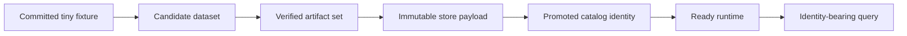
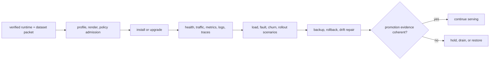
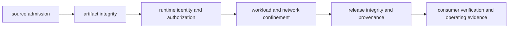
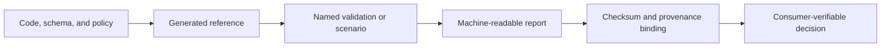
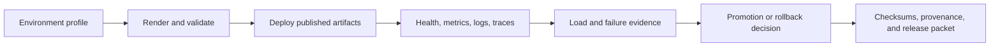
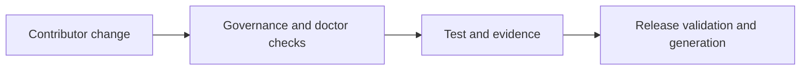

# Bijux Atlas

<a id="top"></a>

**Bijux Atlas is a release-shaped genomics delivery system for turning governed
GFF3 and FASTA inputs into immutable query artifacts, stable APIs, and
auditable operational evidence.**

Atlas is built around one public promise: the same release should describe what
was ingested, what was published, what can be queried, and what evidence
supports operating it. The repository exists to make those claims reviewable
instead of implicit.

Three binaries expose that promise: `bijux-atlas` for dataset workflows,
`bijux-atlas-server` for HTTP serving, and `bijux-atlas-openapi` for the wire
contract. Eleven publishable crates own the product and operations boundaries;
the repository-only `bijux-atlas-dev` crate owns maintenance and release
automation. Registry badges report live channel state. Source manifests report
intended ownership, not proof that a release was published.

<!-- bijux-atlas-badges:generated:start -->
[](https://github.com/bijux/bijux-atlas/blob/main/LICENSE)
[](https://github.com/bijux/bijux-atlas/actions/workflows/ci.yml?query=branch%3Amain)
[](https://github.com/bijux/bijux-atlas/actions/workflows/deploy-docs.yml)
[](https://github.com/bijux/bijux-atlas/actions/workflows/release-crates.yml)
[](https://github.com/bijux/bijux-atlas/actions/workflows/release-ghcr.yml)
[](https://github.com/bijux/bijux-atlas/actions/workflows/release-github.yml)
[](https://github.com/bijux/bijux-atlas/releases)
[](https://github.com/bijux?tab=packages&repo_name=bijux-atlas)
[](https://github.com/bijux/bijux-atlas/tree/main/crates)

[](https://crates.io/crates/bijux-atlas)
[](https://crates.io/crates/bijux-atlas-api)
[](https://crates.io/crates/bijux-atlas-cli)
[](https://crates.io/crates/bijux-atlas-core)
[](https://crates.io/crates/bijux-atlas-ingest)
[](https://crates.io/crates/bijux-atlas-model)
[](https://crates.io/crates/bijux-atlas-ops)
[](https://crates.io/crates/bijux-atlas-query)
[](https://crates.io/crates/bijux-atlas-runtime)
[](https://crates.io/crates/bijux-atlas-server)
[](https://crates.io/crates/bijux-atlas-store)

[](https://github.com/bijux/bijux-atlas/pkgs/container/bijux-atlas%2Fbijux-atlas)
[](https://github.com/bijux/bijux-atlas/pkgs/container/bijux-atlas%2Fbijux-atlas-api)
[](https://github.com/bijux/bijux-atlas/pkgs/container/bijux-atlas%2Fbijux-atlas-cli)
[](https://github.com/bijux/bijux-atlas/pkgs/container/bijux-atlas%2Fbijux-atlas-core)
[](https://github.com/bijux/bijux-atlas/pkgs/container/bijux-atlas%2Fbijux-atlas-ingest)
[](https://github.com/bijux/bijux-atlas/pkgs/container/bijux-atlas%2Fbijux-atlas-model)
[](https://github.com/bijux/bijux-atlas/pkgs/container/bijux-atlas%2Fbijux-atlas-ops)
[](https://github.com/bijux/bijux-atlas/pkgs/container/bijux-atlas%2Fbijux-atlas-query)
[](https://github.com/bijux/bijux-atlas/pkgs/container/bijux-atlas%2Fbijux-atlas-runtime)
[](https://github.com/bijux/bijux-atlas/pkgs/container/bijux-atlas%2Fbijux-atlas-server)
[](https://github.com/bijux/bijux-atlas/pkgs/container/bijux-atlas%2Fbijux-atlas-store)

[](https://bijux.io/bijux-atlas/bijux-atlas/)
[](https://bijux.io/bijux-atlas/bijux-atlas/)
[](https://docs.rs/bijux-atlas/latest/bijux_atlas/)
[](https://bijux.io/bijux-atlas/bijux-atlas-ops/)
[](https://bijux.io/bijux-atlas/bijux-atlas-dev/)
<!-- bijux-atlas-badges:generated:end -->

Rust crate: [crates.io](https://crates.io/crates/bijux-atlas)
Rust API docs: [docs.rs](https://docs.rs/bijux-atlas/latest/bijux_atlas/)
Project docs: [bijux.io](https://bijux.io/bijux-atlas/)
Source docs spine: [`docs/index.md`](docs/index.md)

> **At a glance**
> Immutable datasets · Queryable release artifacts · Direct Cargo binaries ·
> Published split crates · Maintainer control plane · Governed docs, ops, and
> release evidence
> **Quality**
> Quality status is checked from live maintainer commands and checked-in contracts.
> `artifacts/` is disposable local output and is not part of the repository contract.
> Published artifacts and `v*` git tags define the public release line.
> Untagged checkout builds stay anchored to the latest real tag while the source tree can still be preparing the next release.

## Why Atlas Exists

Atlas is for dataset systems where a release is more important than a
long-running process and where the artifact boundary needs to stay visible.
It is a fit when:

* datasets must become immutable release artifacts,
* runtime APIs need explicit contracts and provenance,
* configs and ops inputs must be validated before they become policy,
* release claims should come from checked evidence instead of folklore,
* and maintainers need one honest control plane instead of scattered shell logic.


```mermaid
flowchart LR
    Sources[Governed source inputs] --> Validate[Validate and normalize]
    Validate --> Build[Build immutable artifacts]
    Build --> Verify[Verify artifact identity and integrity]
    Verify --> Store[Publish immutable store payload]
    Store --> Catalog[Promote dataset into catalog]
    Catalog --> Serve[Serve through CLI and HTTP]
    Serve --> Observe[Observe through metrics, logs, and contracts]
```

This is the center of gravity for the repository: Atlas does not primarily own
mutable runtime state. It owns the path from governed inputs to immutable
artifacts and then from immutable artifacts to stable delivery surfaces.

---

## Follow One Dataset End to End

The shortest useful evaluation is not a `--help` command or a health check. It
is the committed `tiny` dataset moving through every release boundary and then
answering an identity-bearing query:

| Boundary | Action | Result worth inspecting |
| --- | --- | --- |
| build | ingest the committed GFF3, FASTA, and FAI fixture | candidate manifest, SQLite payload, QC output, and exact dataset tuple |
| verify | validate structure, then run deep integrity verification | findings for the candidate bytes and references |
| publish | copy the verified payload into an immutable serving store | store lock, checksums, publication marker, and lifecycle record |
| promote | add the published tuple to the catalog | discoverable `release/species/assembly` identity |
| serve | start the server against the serving store, not the build directory | readiness, version, catalog, and query responses |

The [local Atlas walkthrough](docs/bijux-atlas/workflows/run-atlas-locally.md)
connects those boundaries without hiding them behind a bootstrap script. It
uses repository-owned fixtures and keeps disposable state under
`artifacts/getting-started/`. The walkthrough is evidence of the documented
local path only; it is not a production capacity, remote-store, security, or
failover qualification.


```mermaid
flowchart LR
    Fixture[Committed tiny fixture] --> Candidate[Candidate dataset]
    Candidate --> Verified[Verified artifact set]
    Verified --> Published[Immutable store payload]
    Published --> Catalog[Promoted catalog identity]
    Catalog --> Runtime[Ready runtime]
    Runtime --> Query[Identity-bearing query]
```

---

## Operate the Released Dataset

Atlas treats operation as a continuation of dataset release custody. A
deployment is not qualified merely because manifests render or pods become
ready; operators must connect the exact runtime and dataset identities to
security, telemetry, capacity, recovery, and distribution evidence.


```mermaid
flowchart LR
    Packet["verified runtime + dataset packet"] --> Admit["profile, render, policy admission"]
    Admit --> Rollout["install or upgrade"]
    Rollout --> Observe["health, traffic, metrics, logs, traces"]
    Observe --> Stress["load, fault, churn, rollout scenarios"]
    Stress --> Recover["backup, rollback, drift repair"]
    Recover --> Decide{"promotion evidence coherent?"}
    Decide -->|yes| Serve["continue serving"]
    Decide -->|no| Hold["hold, drain, or restore"]
```

| Operational decision | Evidence that belongs with it | Evidence that cannot replace it |
| --- | --- | --- |
| admit a deployment | release identity, profile, values digest, rendered inventory, policy results | a valid chart schema alone |
| accept a rollout | workload revision, readiness history, traffic state, errors and saturation | one successful readiness probe |
| accept a capacity envelope | scenario identity, target, concurrency, measurements, thresholds and comparable baseline | an unexecuted scenario definition |
| accept failure tolerance | injected fault, affected dependency, service behavior, recovery action and residual state | a nominal load result |
| accept recovery | backup identity, restore or rollback execution, post-recovery query and drift verification | presence of backup files |
| promote a release | coherent packet binding all required results to distributed artifacts | independent green checks with no shared identity |

The [operations handbook](docs/bijux-atlas-ops/index.md) follows these decisions
through stack composition, Kubernetes, observability, load and release
contracts. It also states where checked-in inventories exceed the behavior of
the current executable commands, so declared coverage is not mistaken for an
observed pass.

---

## Trust Boundaries

Atlas security is a chain of independently enforced boundaries. Source
admission protects what enters a dataset build. Artifact integrity protects
what becomes publishable. Runtime identity and authorization protect who can
request or administer published data. Deployment controls protect workload and
network exposure. Release evidence protects the decision to distribute or
promote exact bytes.


```mermaid
flowchart LR
    Source["source admission"] --> Artifact["artifact integrity"]
    Artifact --> Runtime["runtime identity and authorization"]
    Runtime --> Deploy["workload and network confinement"]
    Deploy --> Release["release integrity and provenance"]
    Release --> Evidence["consumer verification and operating evidence"]
```

| Boundary | Primary authority | Failure posture |
| --- | --- | --- |
| source admission | format, normalization, anomaly, and dataset policy | reject ambiguous or inadmissible inputs |
| artifact integrity | manifest, hashes, deep verification, immutable publication | quarantine unexplained bytes; never manufacture trust from a new checksum |
| request security | authentication mode, principal, action, resource, and default-deny authorization | reject before dataset or administrative work executes |
| workload exposure | profile values, pod security, service account, RBAC, ingress, egress, and secrets | hold promotion when rendered and effective posture disagree |
| release trust | SBOMs, evidence manifest, checksum ledger, provenance, and consumer policy | reject incomplete, stale, revoked, or incoherent release sets |

No boundary substitutes for another. A verified dataset does not authorize a
caller, a non-root pod does not authenticate an artifact producer, and a clean
checksum ledger does not prove target-environment isolation. Start with
[Security Operations](docs/bijux-atlas-ops/kubernetes/security-operations.md)
for the implemented deployment and runtime controls.

---

## Surface Ownership

Atlas separates product behavior, operational qualification, and repository
maintenance so that a public binary does not silently acquire release or
governance responsibilities.

| Surface | Direct owner | Public responsibility |
| --- | --- | --- |
| `bijux-atlas` | `bijux-atlas-cli` | dataset build, publication, and query workflows |
| `bijux-atlas-server` | `bijux-atlas-server` | HTTP lifecycle and service entrypoint |
| `bijux-atlas-openapi` | `bijux-atlas-api` | versioned HTTP contract export |
| shared runtime foundation | `bijux-atlas-runtime` | configuration, cache, store adapters, application ports, cluster, security, and policy domains |
| historical import | `bijux-atlas` crate | compatibility for the `bijux_atlas` name |
| operations | `bijux-atlas-ops` | deployment, telemetry, load, recovery, and release models |
| maintenance | `bijux-atlas-dev` | repository-only validation and release automation |

The [crate boundary contract](docs/bijux-atlas/foundations/crate-boundary-contract.md)
maps the supporting core, model, query, ingest, and store crates to these
surfaces.

## How to Verify an Atlas Claim

Atlas distinguishes a declared contract from evidence that the contract held
for a particular build, deployment, or release. Source code and schemas define
what must be true; generated references make those rules inspectable; run
reports show what was exercised; signed release material binds the result to
the artifacts consumers receive.


```mermaid
flowchart LR
    Contract[Code, schema, and policy] --> Reference[Generated reference]
    Reference --> Execution[Named validation or scenario]
    Execution --> Report[Machine-readable report]
    Report --> Binding[Checksum and provenance binding]
    Binding --> Decision[Consumer-verifiable decision]
```

| Claim | Primary authority | Evidence required for a concrete release |
| --- | --- | --- |
| a command or HTTP shape is supported | owning crate plus generated CLI or OpenAPI reference | contract validation tied to the source revision |
| a dataset is publishable | ingest, artifact, and store contracts | manifest, hashes, provenance, and store publication record |
| a dataset is discoverable | catalog identity and promotion contracts | promoted catalog entry bound to the published payload |
| a deployment is admissible | chart schema, profile values, and Kubernetes policy | render and admission evidence plus results from the exact executable checks selected for the profile |
| a performance budget holds | named scenario, threshold, and metric contract | measured run plus baseline comparison from the same scenario identity |
| a release is distributable | channel manifests and signing policy | coherent packet, checksums, provenance, and verifier result |

A checked-in sample, schema-valid fixture, or empty report inventory proves
shape only. It does not prove that a live scenario ran or that the current
release passed. The [operations handbook](docs/bijux-atlas-ops/index.md)
separates these evidence levels for deployment and promotion decisions.

## Choose the Right Surface

Start with the surface that matches the job in front of you:

| If you need... | Start here | Why |
| --- | --- | --- |
| the end-user Atlas command | `bijux-atlas-cli` | owns the installed `bijux-atlas` binary |
| the long-running HTTP process | `bijux-atlas-server` | owns server startup, telemetry bootstrap, and route exposure |
| OpenAPI export and API wire contracts | `bijux-atlas-api` | owns DTOs, parameters, envelopes, and `bijux-atlas-openapi` |
| the shared runtime foundation | `bijux-atlas-runtime` | supplies configuration, cache, adapters, ports, and runtime-owned policy domains |
| the historical Rust import path | `bijux-atlas` | preserves the `bijux_atlas` compatibility surface |
| stack, load, and observability contracts | `bijux-atlas-ops` | owns operator-facing reference and release-support surfaces |
| maintainer automation and repository law | `bijux-atlas-dev` | owns governance, docs validation, release planning, and reports |

---

## How Atlas Fits With Bijux CLI

Atlas owns the genomic dataset runtime and release model.
`bijux-cli` owns the umbrella command runtime that can host Atlas alongside
other Bijux tools.

Choose one command identity per environment:

* use `bijux-atlas`, `bijux-atlas-server`, and `bijux-atlas-openapi` when you want the Atlas binaries directly
* use `bijux atlas ...` and `bijux dev atlas ...` when you already standardize on the `bijux` umbrella runtime

The routed and direct entrypoints should describe the same Atlas runtime
surface. The difference is packaging and command routing, not a different
product contract.

---

## Operations Are a Governed System

The `ops/` contract system is not a collection of deployment examples. It owns
profile intent, Helm and Kubernetes contracts, network and workload security,
service topology, observability packs, load scenarios and thresholds, drift
detection, recovery drills, checksums, provenance, and release evidence.
Reusable Rust models live in `bijux-atlas-ops`; executable repository
orchestration belongs to `bijux-atlas-dev`.


```mermaid
flowchart LR
    Profile[Environment profile] --> Render[Render and validate]
    Render --> Deploy[Deploy published artifacts]
    Deploy --> Signals[Health, metrics, logs, traces]
    Signals --> Stress[Load and failure evidence]
    Stress --> Release[Promotion or rollback decision]
    Release --> Proof[Checksums, provenance, and release packet]
```

The operational surface is organized by decisions rather than tool names:

| Decision | Start with | Completion evidence |
| --- | --- | --- |
| admit or remove traffic | [Health, Readiness, and Drain](docs/bijux-atlas-ops/observability/health-readiness-and-drain.md) | stable probe window plus representative user-path behavior |
| diagnose a request | [Logging, Metrics, and Tracing](docs/bijux-atlas-ops/observability/logging-metrics-and-tracing.md) | correlated request ID, trace, logs, and population metrics |
| isolate data or cache failure | [Cache and Store Operations](docs/bijux-atlas-ops/stack/cache-and-store-operations.md) | verified store authority and bounded cache recovery |
| publish a release | [Distribution Channels](docs/bijux-atlas-ops/release/distribution-channels.md) | required immutable channel identities resolve and agree |
| accept transported evidence | [Release Packets](docs/bijux-atlas-ops/release/release-packets.md) | fresh consumer verification receipt |

A successful command, healthy process, uploaded artifact, or present report is
only one checkpoint. Promotion requires the identities and evidence across the
relevant decision path to agree.

---

## Installation

Use direct Cargo installation when you want Atlas by itself, or when CI and
local Rust workflows call the binaries directly. For a version available on
crates.io, install the direct binaries with:

```bash
cargo install --locked bijux-atlas-cli --bin bijux-atlas
cargo install --locked bijux-atlas-server --bin bijux-atlas-server
cargo install --locked bijux-atlas-api --bin bijux-atlas-openapi
bijux-atlas --help
bijux-atlas version
```

If you already operate through the sibling `bijux-cli` umbrella runtime, the
same Atlas surfaces can also be reached as `bijux atlas ...` and `bijux dev
atlas ...`. That routed command story is secondary to the direct Cargo-managed
Atlas binaries documented here.

Publishable crates are intended to be consumed directly from Cargo. Atlas
does not hide the release line behind a repository-only bootstrap wrapper.

Quick verification for the standalone binaries:

```bash
bijux-atlas version
bijux-atlas --help
bijux-atlas-server --help
bijux-atlas-openapi --help
```

From a workspace checkout, run the current source tree directly with:

```bash
cargo run -q -p bijux-atlas-cli --bin bijux-atlas -- version
cargo run -q -p bijux-atlas-server --bin bijux-atlas-server -- --help
cargo run -q -p bijux-atlas-api --bin bijux-atlas-openapi -- --help
cargo run -q -p bijux-atlas-dev -- --help
```

Runtime crates are configured for Cargo publication. The maintainer crate is
part of the repository contract and the `bijux dev atlas ...` umbrella
surface, even when you run it directly from a checkout.

Atlas does not publish a Python package. Binary help confirms command ownership
and shape; it does not prove dataset behavior. Continue with the
[product workflows](docs/bijux-atlas/workflows/index.md) and keep binary,
dataset, store, and catalog identities visible through the executed path.

---

## Maintainer Control Plane

Atlas keeps repository automation explicit:

```bash
bijux dev atlas --help
cargo run -q -p bijux-atlas-dev -- --help
make help
```

Use `bijux dev atlas ...` as the canonical installed automation surface.
Use `bijux-atlas-dev` or `cargo run -p bijux-atlas-dev -- ...` when you are working from a checkout.
Use `make` only through the curated wrappers exposed from [`makes/root.mk`](makes/root.mk).

Helpful maintainer entrypoints:

```bash
cargo run -q -p bijux-atlas-dev -- docs doctor --format json
cargo run -q -p bijux-atlas-dev -- governance validate --format json
cargo run -q -p bijux-atlas-dev -- release validate --format json
make ci-fast
```


```mermaid
flowchart LR
    Change[Contributor change] --> Validate[Governance and doctor checks]
    Validate --> Test[Test and evidence]
    Test --> Release[Release validation and generation]
```

The maintainer surface is separate on purpose. It keeps repository validation, docs generation, and
release evidence out of the runtime binaries that end users depend on.

---

## Repository Boundaries

Atlas is broader than a single Rust crate because its release contract includes
the product, the deployment model, and the evidence needed to operate it.

| Path | Authority |
| --- | --- |
| `crates/` | publishable product and operations crates plus the private maintainer crate |
| `configs/` | policies, schemas, registries, budgets, and governed defaults |
| `ops/` | Kubernetes, stack, telemetry, security, load, recovery, and release inputs |
| `docs/` | product, operations, and maintainer handbooks |
| `makes/` | thin wrappers over governed Rust commands |
| `artifacts/` | disposable local outputs and run evidence |

The `ops/` tree is an operational contract system, not a folder of deployment
examples. Its checked-in inventories establish intended coverage; only an
executed, identity-bound result establishes that a deployment or scenario
passed.

## Current Public Limits

* Atlas does not publish a Python package.
* The runtime does not contain a mutable lab workflow engine.
* `artifacts/` is not a source-of-truth tree.
* Checked-in release inputs may describe a candidate that is not available in
  every public channel; verify the registry and release records before use.

---

## Release Line & Stability

Crates.io records, GitHub releases, deployed documentation, and `v*` git tags
define the observable public release line.
Untagged checkout builds derive their operator-facing version from the latest
real tag. Workspace manifests and checked-in release inputs can move ahead for
the next intended release.
The workspace version and release inputs express intent, not channel state.
Confirm availability through the live registry and release badges before
installing or promoting a version. `bijux-atlas-dev` remains repository-only,
and this repository does not declare a Python publication channel.

Release expectations live in [`docs/bijux-atlas-dev/delivery/release-and-versioning.md`](docs/bijux-atlas-dev/delivery/release-and-versioning.md).
Badge contract expectations live in [`docs/bijux-atlas-dev/governance/badge-catalog.md`](docs/bijux-atlas-dev/governance/badge-catalog.md).
Compatibility and operational promises live under [`docs/bijux-atlas/contracts/index.md`](docs/bijux-atlas/contracts/index.md).

---

## Docs & Resources

Start with the package handbooks:

* product runtime: [`docs/bijux-atlas/index.md`](docs/bijux-atlas/index.md)
* operations: [`docs/bijux-atlas-ops/index.md`](docs/bijux-atlas-ops/index.md)
* maintainer control plane: [`docs/bijux-atlas-dev/index.md`](docs/bijux-atlas-dev/index.md)

Root policies:

* contribution guide: [`CONTRIBUTING.md`](CONTRIBUTING.md)
* security policy: [`SECURITY.md`](SECURITY.md)
* code ownership: [`.github/CODEOWNERS`](.github/CODEOWNERS)

---

## Contributing

See [`CONTRIBUTING.md`](CONTRIBUTING.md).
Use small, coherent Conventional Commit / Commitizen-style commits such as `fix(configs): ...` or `refactor(makes): ...`.

---

## License

Apache-2.0. See [`LICENSE`](LICENSE) and [`NOTICE`](NOTICE).
