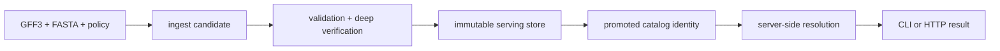
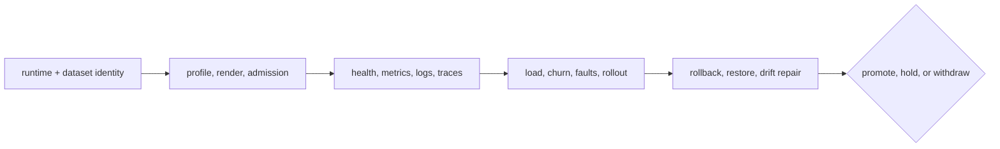

# Bijux Atlas

Bijux Atlas is a Rust platform for turning governed GFF3 and FASTA inputs into
immutable genomic dataset releases, queryable APIs, and reviewable operational
evidence.

Atlas keeps dataset construction, publication, serving, and operational
qualification separate. That separation lets a reader answer four questions
without reconstructing the system from logs or directory names:

- which source and policy inputs produced a dataset;
- which immutable artifacts were published;
- which dataset and software identities answered a query; and
- which security, load, rollout, and recovery evidence supported operation.

<!-- bijux-atlas-badges:generated:start -->
[](https://github.com/bijux/bijux-atlas/blob/main/LICENSE)
[](https://github.com/bijux/bijux-atlas/actions/workflows/ci.yml?query=branch%3Amain)
[](https://github.com/bijux/bijux-atlas/actions/workflows/deploy-docs.yml)
[](https://github.com/bijux/bijux-atlas/actions/workflows/release-crates.yml)
[](https://github.com/bijux/bijux-atlas/actions/workflows/release-ghcr.yml)
[](https://github.com/bijux/bijux-atlas/actions/workflows/release-github.yml)
[](https://github.com/bijux/bijux-atlas/releases)
[](https://github.com/bijux?tab=packages&repo_name=bijux-atlas)
[](https://github.com/bijux/bijux-atlas/tree/main/crates)

[](https://crates.io/crates/bijux-atlas)
[](https://crates.io/crates/bijux-atlas-api)
[](https://crates.io/crates/bijux-atlas-cli)
[](https://crates.io/crates/bijux-atlas-core)
[](https://crates.io/crates/bijux-atlas-ingest)
[](https://crates.io/crates/bijux-atlas-model)
[](https://crates.io/crates/bijux-atlas-ops)
[](https://crates.io/crates/bijux-atlas-query)
[](https://crates.io/crates/bijux-atlas-runtime)
[](https://crates.io/crates/bijux-atlas-server)
[](https://crates.io/crates/bijux-atlas-store)

[](https://github.com/bijux/bijux-atlas/pkgs/container/bijux-atlas%2Fbijux-atlas)
[](https://github.com/bijux/bijux-atlas/pkgs/container/bijux-atlas%2Fbijux-atlas-api)
[](https://github.com/bijux/bijux-atlas/pkgs/container/bijux-atlas%2Fbijux-atlas-cli)
[](https://github.com/bijux/bijux-atlas/pkgs/container/bijux-atlas%2Fbijux-atlas-core)
[](https://github.com/bijux/bijux-atlas/pkgs/container/bijux-atlas%2Fbijux-atlas-ingest)
[](https://github.com/bijux/bijux-atlas/pkgs/container/bijux-atlas%2Fbijux-atlas-model)
[](https://github.com/bijux/bijux-atlas/pkgs/container/bijux-atlas%2Fbijux-atlas-ops)
[](https://github.com/bijux/bijux-atlas/pkgs/container/bijux-atlas%2Fbijux-atlas-query)
[](https://github.com/bijux/bijux-atlas/pkgs/container/bijux-atlas%2Fbijux-atlas-runtime)
[](https://github.com/bijux/bijux-atlas/pkgs/container/bijux-atlas%2Fbijux-atlas-server)
[](https://github.com/bijux/bijux-atlas/pkgs/container/bijux-atlas%2Fbijux-atlas-store)

[](https://bijux.io/bijux-atlas/bijux-atlas/)
[](https://bijux.io/bijux-atlas/bijux-atlas/)
[](https://docs.rs/bijux-atlas/latest/bijux_atlas/)
[](https://bijux.io/bijux-atlas/bijux-atlas-ops/)
[](https://bijux.io/bijux-atlas/bijux-atlas-dev/)
<!-- bijux-atlas-badges:generated:end -->

## Choose a Starting Point

| You want to… | Start with… |
| --- | --- |
| understand the product, dataset identity, and crate boundaries | the [product handbook](docs/bijux-atlas/index.md) |
| build and query the committed sample dataset | the [local Atlas walkthrough](docs/bijux-atlas/workflows/run-atlas-locally.md) |
| integrate the CLI, HTTP API, OpenAPI, or Rust crates | the [interface guide](docs/bijux-atlas/interfaces/index.md) |
| deploy, observe, load-test, secure, or recover Atlas | the [operations handbook](docs/bijux-atlas-ops/index.md) |
| change repository automation or prepare a release | the [maintainer handbook](docs/bijux-atlas-dev/index.md) |

## Follow a Dataset to a Query

The dataset tuple `release/species/assembly` is the logical identity carried
from publication into catalog discovery and query provenance. Artifact hashes
bind that tuple to exact bytes.


```mermaid
flowchart LR
    Source["GFF3 + FASTA + policy"] --> Candidate["ingest candidate"]
    Candidate --> Verify["validation + deep verification"]
    Verify --> Store["immutable serving store"]
    Store --> Catalog["promoted catalog identity"]
    Catalog --> Server["server-side resolution"]
    Server --> Query["CLI or HTTP result"]
```

These are separate authority transfers:

| Boundary | What it establishes |
| --- | --- |
| build | a candidate exists for governed inputs |
| verify | the candidate satisfies the selected structure and integrity checks |
| publish | immutable artifacts exist in the serving store |
| promote | the catalog names the published dataset tuple |
| resolve | a server can open the selected catalog and artifact generation |
| query | a specific interface returned a result for that identity |

No later success repairs a missing earlier boundary. Serving directly from a
build directory would bypass store publication and catalog promotion.

## Operations Are a Product Capability

Atlas operations extend far beyond a crate or example Helm chart. The
`ops/` contracts cover stack composition, Kubernetes admission and rollout,
workload and network security, telemetry, load and failure experiments,
recovery, release evidence, and consumer verification.


```mermaid
flowchart LR
    Identity["runtime + dataset identity"] --> Deploy["profile, render, admission"]
    Deploy --> Observe["health, metrics, logs, traces"]
    Observe --> Stress["load, churn, faults, rollout"]
    Stress --> Recover["rollback, restore, drift repair"]
    Recover --> Decide{"promote, hold, or withdraw"}
```

A rendered manifest proves intended configuration. A ready pod proves traffic
eligibility at one moment. A scenario definition proves an experiment exists.
Only executed, identity-bound evidence supports a deployment, capacity,
resilience, or recovery claim.

The operations handbook is explicit about current limitations, including
production lifecycle gaps, incomplete administrative-route classification,
non-executable rollout-under-load registrations, and the absence of a
repository-provided production backup system.

## Install the Public Binaries

Atlas requires Rust 1.86 or newer. Install the direct command, server, and
OpenAPI exporter from crates.io:

```bash
cargo install --locked bijux-atlas-cli --bin bijux-atlas
cargo install --locked bijux-atlas-server --bin bijux-atlas-server
cargo install --locked bijux-atlas-api --bin bijux-atlas-openapi

bijux-atlas version
bijux-atlas --help
bijux-atlas-server --help
bijux-atlas-openapi --help
```

From a checkout:

```bash
cargo run -q -p bijux-atlas-cli --bin bijux-atlas -- version
cargo run -q -p bijux-atlas-server --bin bijux-atlas-server -- --help
cargo run -q -p bijux-atlas-api --bin bijux-atlas-openapi -- --help
```

Atlas does not publish a Python package. The sibling `bijux-cli` can route
Atlas commands as `bijux atlas ...`, but the direct binaries above remain the
standalone Atlas entrypoints.

## Package Ownership

| Owner | Responsibility |
| --- | --- |
| `bijux-atlas-core` and `bijux-atlas-model` | shared contracts and genomic domain identity |
| `bijux-atlas-ingest` | source validation, normalization, and artifact construction |
| `bijux-atlas-store` | immutable publication and catalog operations |
| `bijux-atlas-query` | query semantics over verified artifacts |
| `bijux-atlas-runtime` | configuration, policy, store ports, and shared runtime semantics |
| `bijux-atlas-server` | HTTP composition, admission, caching, telemetry, and request handling |
| `bijux-atlas-api` | wire contracts and OpenAPI export |
| `bijux-atlas-cli` | operator command composition |
| `bijux-atlas-ops` | reusable operational contracts and models |
| `bijux-atlas` | historical Rust compatibility facade |
| `bijux-atlas-dev` | repository-only validation and release automation |

The CLI and server are composition roots. The runtime crate supplies shared
capabilities; it is not a central service through which every product action
passes.

## Trust the Right Evidence

| Claim | Evidence that can support it | Evidence that is insufficient |
| --- | --- | --- |
| a dataset is publishable | candidate validation, deep verification, manifest, and hashes | successful ingest alone |
| a dataset is discoverable | publication record and promoted catalog entry | files in a build directory |
| an interface is compatible | owning contract plus compatibility evidence | one successful request |
| a deployment is admissible | rendered and admitted identity plus effective-state checks | schema-valid values |
| a performance budget holds | governed workload, target, baseline, measurements, and thresholds | a checked-in scenario |
| a release is distributable | coherent artifacts, evidence, checksums, provenance, and consumer verification | internally consistent files from an untrusted packet |

Atlas establishes provenance and system behavior for accepted inputs. It does
not establish the biological correctness of upstream source data.

## Repository Map

| Path | Contents |
| --- | --- |
| `crates/` | public product and operations crates plus repository-only maintenance |
| `configs/` | schemas, policies, registries, budgets, examples, and generated references |
| `ops/` | deployment, security, telemetry, load, recovery, and release contracts |
| `docs/` | product, operations, and maintainer handbooks |
| `makes/` | curated wrappers over repository commands |
| `artifacts/` | disposable local outputs and run evidence |

## Contributing and Security

Read [CONTRIBUTING.md](CONTRIBUTING.md) for repository boundaries and
verification commands. Report vulnerabilities through [SECURITY.md](SECURITY.md);
do not disclose unpatched security details in a public issue.

The public release line is defined by crates.io records, GitHub releases,
deployed documentation, and `v*` tags. Workspace manifests can describe the
next intended release before every public channel contains it, so verify the
live registry and release records before installation or promotion.

## License

Apache-2.0. See [LICENSE](LICENSE) and [NOTICE](NOTICE).
