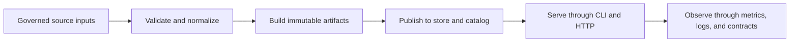
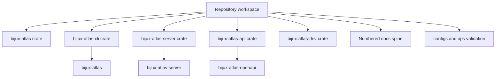
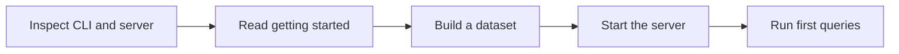
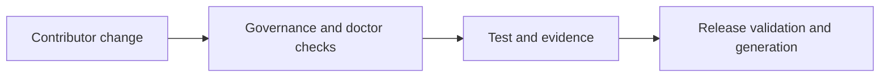
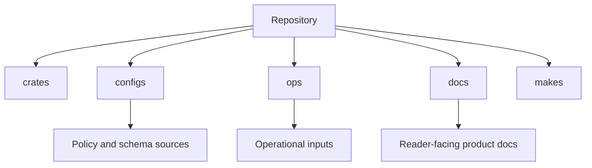

# Bijux Atlas

<a id="top"></a>

**Bijux Atlas is a release-shaped genomics delivery system for turning governed
GFF3 and FASTA inputs into immutable query artifacts, stable APIs, and
auditable operational evidence.**

This repository ships three direct binaries, eleven published Rust crates, and
one repository-only maintainer crate:

* `bijux-atlas`: the direct CLI binary, owned by `bijux-atlas-cli`,
* `bijux-atlas-server`: the HTTP runtime server, owned by `bijux-atlas-server`,
* `bijux-atlas-openapi`: the OpenAPI export surface, owned by `bijux-atlas-api`,
* `bijux-atlas-runtime`: the canonical orchestration library crate,
* `bijux-atlas`: the compatibility alias crate for the historical Rust import path,
* `bijux-atlas-ops`: the published operational contracts crate for stack, load, observability, and release-support surfaces,
* `bijux-atlas-dev`: the maintainer control-plane crate that stays repository-owned instead of shipping to crates.io.

Atlas is built around one public promise: the same release should describe what
was ingested, what was published, what can be queried, and what evidence
supports operating it. The repository exists to make those claims reviewable
instead of implicit.

<!-- bijux-atlas-badges:generated:start -->
[](https://github.com/bijux/bijux-atlas/blob/main/LICENSE)
[](https://github.com/bijux/bijux-atlas/actions/workflows/ci.yml?query=branch%3Amain)
[](https://github.com/bijux/bijux-atlas/actions/workflows/deploy-docs.yml)
[](https://github.com/bijux/bijux-atlas/actions/workflows/release-crates.yml)
[](https://github.com/bijux/bijux-atlas/actions/workflows/release-ghcr.yml)
[](https://github.com/bijux/bijux-atlas/actions/workflows/release-github.yml)
[](https://github.com/bijux/bijux-atlas/releases)
[](https://github.com/bijux?tab=packages&repo_name=bijux-atlas)
[](https://github.com/bijux/bijux-atlas/tree/main/crates)

[](https://crates.io/crates/bijux-atlas)
[](https://crates.io/crates/bijux-atlas-api)
[](https://crates.io/crates/bijux-atlas-cli)
[](https://crates.io/crates/bijux-atlas-core)
[](https://crates.io/crates/bijux-atlas-ingest)
[](https://crates.io/crates/bijux-atlas-model)
[](https://crates.io/crates/bijux-atlas-ops)
[](https://crates.io/crates/bijux-atlas-query)
[](https://crates.io/crates/bijux-atlas-runtime)
[](https://crates.io/crates/bijux-atlas-server)
[](https://crates.io/crates/bijux-atlas-store)

[](https://github.com/bijux/bijux-atlas/pkgs/container/bijux-atlas%2Fbijux-atlas)
[](https://github.com/bijux/bijux-atlas/pkgs/container/bijux-atlas%2Fbijux-atlas-api)
[](https://github.com/bijux/bijux-atlas/pkgs/container/bijux-atlas%2Fbijux-atlas-cli)
[](https://github.com/bijux/bijux-atlas/pkgs/container/bijux-atlas%2Fbijux-atlas-core)
[](https://github.com/bijux/bijux-atlas/pkgs/container/bijux-atlas%2Fbijux-atlas-ingest)
[](https://github.com/bijux/bijux-atlas/pkgs/container/bijux-atlas%2Fbijux-atlas-model)
[](https://github.com/bijux/bijux-atlas/pkgs/container/bijux-atlas%2Fbijux-atlas-ops)
[](https://github.com/bijux/bijux-atlas/pkgs/container/bijux-atlas%2Fbijux-atlas-query)
[](https://github.com/bijux/bijux-atlas/pkgs/container/bijux-atlas%2Fbijux-atlas-runtime)
[](https://github.com/bijux/bijux-atlas/pkgs/container/bijux-atlas%2Fbijux-atlas-server)
[](https://github.com/bijux/bijux-atlas/pkgs/container/bijux-atlas%2Fbijux-atlas-store)

[](https://bijux.io/bijux-atlas/bijux-atlas/)
[](https://bijux.io/bijux-atlas/bijux-atlas/)
[](https://docs.rs/bijux-atlas/latest/bijux_atlas/)
[](https://bijux.io/bijux-atlas/bijux-atlas-ops/)
[](https://bijux.io/bijux-atlas/bijux-atlas-dev/)
<!-- bijux-atlas-badges:generated:end -->

Rust crate: [crates.io](https://crates.io/crates/bijux-atlas)
Rust API docs: [docs.rs](https://docs.rs/bijux-atlas/latest/bijux_atlas/)
Project docs: [bijux.io](https://bijux.io/bijux-atlas/)
Source docs spine: [`docs/index.md`](docs/index.md)

> **At a glance**
> Immutable datasets · Queryable release artifacts · Direct Cargo binaries ·
> Published split crates · Maintainer control plane · Governed docs, ops, and
> release evidence
> **Quality**
> Quality status is checked from live maintainer commands and checked-in contracts.
> `artifacts/` is disposable local output and is not part of the repository contract.
> Published artifacts and `v*` git tags define the public release line.
> Untagged checkout builds stay anchored to the latest real tag while the source tree can still be preparing the next release.

---

## Table of Contents

* [Why Atlas Exists](#why-atlas-exists)
* [What Ships in 0.2.2](#what-ships-in-022)
* [Choose the Right Surface](#choose-the-right-surface)
* [How Atlas Fits With Bijux CLI](#how-atlas-fits-with-bijux-cli)
* [Key Features](#key-features)
* [Installation](#installation)
* [Runtime in 60 Seconds](#runtime-in-60-seconds)
* [Maintainer Control Plane](#maintainer-control-plane)
* [Packages, Configs, and Ops](#packages-configs-and-ops)
* [What Does Not Ship Yet](#what-does-not-ship-yet)
* [Project Tree](#project-tree)
* [Release Line & Stability](#release-line--stability)
* [Roadmap](#roadmap)
* [Docs & Resources](#docs--resources)
* [Contributing](#contributing)
* [License](#license)

---

## Why Atlas Exists

Atlas is for dataset systems where a release is more important than a
long-running process and where the artifact boundary needs to stay visible.
It is a fit when:

* datasets must become immutable release artifacts,
* runtime APIs need explicit contracts and provenance,
* configs and ops inputs must be validated before they become policy,
* release claims should come from checked evidence instead of folklore,
* and maintainers need one honest control plane instead of scattered shell logic.


```mermaid
flowchart LR
    Sources[Governed source inputs] --> Validate[Validate and normalize]
    Validate --> Build[Build immutable artifacts]
    Build --> Publish[Publish to store and catalog]
    Publish --> Serve[Serve through CLI and HTTP]
    Serve --> Observe[Observe through metrics, logs, and contracts]
```

This is the center of gravity for the repository: Atlas does not primarily own
mutable runtime state. It owns the path from governed inputs to immutable
artifacts and then from immutable artifacts to stable delivery surfaces.

---

## What Ships in 0.2.2

The release line is strongest when it stays concrete about what is already
real:

* a runtime CLI named `bijux-atlas`,
* a server binary named `bijux-atlas-server`,
* an OpenAPI export binary named `bijux-atlas-openapi`,
* eleven published crates that separate runtime, API, query, ingest, model, core, store, server, CLI, compatibility, and operations-contract ownership,
* one repository-only crate, `bijux-atlas-dev`, that governs maintainer automation and release policy,
* governed `configs/`, `ops/`, `docs/`, and `makes/` trees that are validated together,
* and release inputs for crates, images, docs, and operations evidence.

This README intentionally describes the released product and maintainer
surfaces, not every internal implementation detail in the workspace.


```mermaid
flowchart TD
    Workspace[Repository workspace] --> Runtime[bijux-atlas crate]
    Workspace --> CLI[bijux-atlas-cli crate]
    Workspace --> ServerCrate[bijux-atlas-server crate]
    Workspace --> API[bijux-atlas-api crate]
    Workspace --> ControlPlane[bijux-atlas-dev crate]
    CLI --> RuntimeCLI[bijux-atlas]
    ServerCrate --> Server[bijux-atlas-server]
    API --> OpenAPI[bijux-atlas-openapi]
    Workspace --> Docs[Numbered docs spine]
    Workspace --> Governance[configs and ops validation]
```

This release-surface diagram is important because Atlas ships more than one binary and more than
one kind of repository contract. Readers should be able to see immediately which surfaces are for
runtime use and which are for repository maintenance.

## Choose the Right Surface

Start with the surface that matches the job in front of you:

| If you need... | Start here | Why |
| --- | --- | --- |
| the end-user Atlas command | `bijux-atlas-cli` | owns the installed `bijux-atlas` binary |
| the long-running HTTP process | `bijux-atlas-server` | owns server startup, telemetry bootstrap, and route exposure |
| OpenAPI export and API wire contracts | `bijux-atlas-api` | owns DTOs, parameters, envelopes, and `bijux-atlas-openapi` |
| the orchestration library | `bijux-atlas-runtime` | composes ingest, query, store, API, and runtime policy |
| the historical Rust import path | `bijux-atlas` | preserves the `bijux_atlas` compatibility surface |
| stack, load, and observability contracts | `bijux-atlas-ops` | owns operator-facing reference and release-support surfaces |
| maintainer automation and repository law | `bijux-atlas-dev` | owns governance, docs validation, release planning, and reports |

### Release Surface Directory

| Surface | Ownership | Release contract |
| --- | --- | --- |
| `bijux-atlas` | `bijux-atlas-cli` | direct end-user CLI binary |
| `bijux-atlas-server` | `bijux-atlas-server` | direct HTTP runtime binary |
| `bijux-atlas-openapi` | `bijux-atlas-api` | direct OpenAPI export binary |
| `bijux-atlas-runtime` | `bijux-atlas-runtime` | canonical Rust orchestration crate |
| `bijux-atlas` crate | `crates/bijux-atlas/` | compatibility alias for the historical Rust import path |
| `bijux-atlas-ops` | `bijux-atlas-ops` | published operations-contract crate |
| `bijux-atlas-dev` | `bijux-atlas-dev` | repository-only maintainer control plane |

## Crate Boundary Map

Atlas currently enforces a twelve-crate workspace boundary:

* `crates/bijux-atlas-core/`: runtime-independent primitives and invariants
* `crates/bijux-atlas-model/`: stable dataset, gene, diff, and policy types
* `crates/bijux-atlas-query/`: query parsing, planning, cursoring, and SQLite execution
* `crates/bijux-atlas-ingest/`: ingest normalization, anomaly handling, and artifact build execution
* `crates/bijux-atlas-store/`: immutable artifact publication and backend contracts
* `crates/bijux-atlas-api/`: API DTOs, Rust client surface, OpenAPI generation, and the `bijux-atlas-openapi` binary
* `crates/bijux-atlas-runtime/`: canonical runtime composition crate with orchestration, policies, runtime config, and cache wiring
* `crates/bijux-atlas/`: compatibility alias crate for the historical `bijux_atlas` Rust import path
* `crates/bijux-atlas-cli/`: direct `bijux-atlas` binary owner plus CLI contract tests
* `crates/bijux-atlas-server/`: direct `bijux-atlas-server` binary owner plus server-facing integration tests and benchmarks
* `crates/bijux-atlas-ops/`: repository-owned operational path, Kubernetes, load, and release-support contracts
* `crates/bijux-atlas-dev/`: maintainer-only control plane for governance and repository operations

The boundary contract for this map lives at
[`docs/bijux-atlas/foundations/crate-boundary-contract.md`](docs/bijux-atlas/foundations/crate-boundary-contract.md).

---

## How Atlas Fits With Bijux CLI

Atlas owns the genomic dataset runtime and release model.
`bijux-cli` owns the umbrella command runtime that can host Atlas alongside
other Bijux tools.

Choose one command identity per environment:

* use `bijux-atlas`, `bijux-atlas-server`, and `bijux-atlas-openapi` when you want the Atlas binaries directly
* use `bijux atlas ...` and `bijux dev atlas ...` when you already standardize on the `bijux` umbrella runtime

The routed and direct entrypoints should describe the same Atlas runtime
surface. The difference is packaging and command routing, not a different
product contract.

---

## Key Features

### Immutable Dataset Delivery

Atlas treats dataset builds as release artifacts with explicit manifests, provenance, and reproducible packaging inputs.

### Split Runtime Surfaces With Clear Ownership

`bijux-atlas` is owned by `bijux-atlas-cli`.
`bijux-atlas-server` is owned by `bijux-atlas-server`.
`bijux-atlas-openapi` remains a user-facing Atlas binary, but it is API-owned and built from `bijux-atlas-api`.
The installed umbrella runtime namespace is `bijux atlas ...`.
The maintainer namespace is `bijux dev atlas ...`, backed by the `bijux-atlas-dev` binary.

### Governed Repository Inputs

`configs/`, `ops/`, `docs/`, and `makes/` are checked together so release, policy, and operating guidance can stay aligned with the code that uses them.

### Thin Makes Wrapper Layer

GNU Make exists as a boring convenience layer rooted at [`makes/root.mk`](makes/root.mk).
Orchestration logic belongs in Rust commands, not in shell-heavy wrapper files.

### Honest Release Evidence

The release story includes checked manifests, compatibility tables, docs deployment, crates.io publication, and GitHub release automation instead of one-off manual steps.

---

## Installation

Use direct Cargo installation when you want Atlas by itself, or when CI and
local Rust workflows call the binaries directly. This is the primary install
story for Atlas `0.2.2`:

```bash
cargo install --locked bijux-atlas-cli --bin bijux-atlas
cargo install --locked bijux-atlas-server --bin bijux-atlas-server
cargo install --locked bijux-atlas-api --bin bijux-atlas-openapi
bijux-atlas --help
bijux-atlas version
```

If you already operate through the sibling `bijux-cli` umbrella runtime, the
same Atlas surfaces can also be reached as `bijux atlas ...` and `bijux dev
atlas ...`. That routed command story is secondary to the direct Cargo-managed
Atlas binaries documented here.

Published crates are also intended to be consumed directly from Cargo. Atlas
does not hide the release line behind a repository-only bootstrap wrapper.

Quick verification for the standalone binaries:

```bash
bijux-atlas version
bijux-atlas --help
bijux-atlas-server --help
bijux-atlas-openapi --help
```

From a workspace checkout, run the current source tree directly with:

```bash
cargo run -q -p bijux-atlas-cli --bin bijux-atlas -- version
cargo run -q -p bijux-atlas-server --bin bijux-atlas-server -- --help
cargo run -q -p bijux-atlas-api --bin bijux-atlas-openapi -- --help
cargo run -q -p bijux-atlas-dev -- --help
```

The runtime crate is published through Cargo. The maintainer crate is part of the repository contract and the `bijux dev atlas ...` umbrella surface, even when you run it directly from a checkout.

Atlas does not publish a Python package yet. The planned Python bridge is a future release item, not a hidden install path today.

---

## Runtime in 60 Seconds

```bash
# Inspect the runtime surface
bijux-atlas --help
bijux-atlas version

# Export the OpenAPI document
bijux-atlas-openapi --help

# Inspect the server surface
bijux-atlas-server --help
```

For the canonical runtime references, start with:

* [`docs/bijux-atlas/workflows/index.md`](docs/bijux-atlas/workflows/index.md)
* [`docs/bijux-atlas-ops/index.md`](docs/bijux-atlas-ops/index.md)
* [`docs/bijux-atlas/interfaces/command-surface.md`](docs/bijux-atlas/interfaces/command-surface.md)


```mermaid
flowchart LR
    Inspect[Inspect CLI and server] --> BuildDocs[Read getting started]
    BuildDocs --> Ingest[Build a dataset]
    Ingest --> Serve[Start the server]
    Serve --> Query[Run first queries]
```

This quick-start path is intentionally shorter than the full docs spine. It is for readers who want
to confirm the product shape before they commit to a deeper setup.

---

## Maintainer Control Plane

Atlas keeps repository automation explicit:

```bash
bijux dev atlas --help
cargo run -q -p bijux-atlas-dev -- --help
make help
```

Use `bijux dev atlas ...` as the canonical installed automation surface.
Use `bijux-atlas-dev` or `cargo run -p bijux-atlas-dev -- ...` when you are working from a checkout.
Use `make` only through the curated wrappers exposed from [`makes/root.mk`](makes/root.mk).

Helpful maintainer entrypoints:

```bash
cargo run -q -p bijux-atlas-dev -- docs doctor --format json
cargo run -q -p bijux-atlas-dev -- governance validate --format json
cargo run -q -p bijux-atlas-dev -- release validate --format json
make ci-fast
```


```mermaid
flowchart LR
    Change[Contributor change] --> Validate[Governance and doctor checks]
    Validate --> Test[Test and evidence]
    Test --> Release[Release validation and generation]
```

The maintainer surface is separate on purpose. It keeps repository validation, docs generation, and
release evidence out of the runtime binaries that end users depend on.

---

## Packages, Configs, and Ops

Atlas carries more release-facing material in-repo than a typical single-crate project.
That is intentional, but the boundaries stay explicit:

* `crates/` owns the published Atlas crate set plus the repository-only maintainer control plane crate,
* `configs/` owns policy, schema, registry, and repository inputs,
* `ops/` owns deployment, observability, release, and scenario data,
* `docs/` owns the package handbooks and contract references,
* `makes/` owns the thin wrapper surface over governed commands.

The goal is not “everything is public API.”
The goal is one honest source of truth for each governed concern.


```mermaid
flowchart TD
    Repo[Repository] --> Crates[crates]
    Repo --> Configs[configs]
    Repo --> Ops[ops]
    Repo --> Docs[docs]
    Repo --> Makes[makes]
    Docs --> ReaderFace[Reader-facing product docs]
    Configs --> Policy[Policy and schema sources]
    Ops --> RuntimeOps[Operational inputs]
```

This repository map helps explain why Atlas looks broader than a single-crate project. The extra
trees are not incidental clutter; they are part of the governed release and operations surface.

---

## What Does Not Ship Yet

Atlas is deliberately explicit about non-shipped scope:

* there is no published `bijux-atlas-python` package yet,
* there is no mutable lab workflow engine inside the runtime,
* and `artifacts/` is not a source-of-truth tree.

If a surface is planned, internal, or future-facing, it should be described as such instead of being implied by README language.

---

## Project Tree

| Path | Purpose |
| --- | --- |
| `crates/bijux-atlas/` | Compatibility alias crate for the historical `bijux_atlas` import path |
| `crates/bijux-atlas-runtime/` | Canonical runtime orchestration crate |
| `crates/bijux-atlas-dev/` | Repository-only maintainer control plane for docs, checks, governance, release, configs, and ops |
| `crates/bijux-atlas-ops/` | Published operational contract and stack-support crate |
| `configs/` | Repository-owned policy, schemas, registries, and examples |
| `ops/` | Release specs, scenarios, deployment inputs, observability, and contracts |
| `makes/` | Thin GNU Make wrapper surface |
| `docs/` | Canonical reader-facing documentation |
| `artifacts/` | Generated local outputs and evidence |

---

## Release Line & Stability

Published crates, GitHub releases, docs deployment, and `v*` git tags define
the public release line.
Untagged checkout builds derive their operator-facing version from the latest real tag, while workspace manifests and checked-in release inputs can move ahead for the next intended release.
The currently published artifact surfaces are crates.io for the eleven
publishable Atlas crates, GHCR for `bijux-atlas/bijux-atlas`, and GitHub
Releases. `bijux-atlas-dev` remains repository-only, and PyPI stays
intentionally disabled in this repository until the planned Python bridge
exists.

Release expectations live in [`docs/bijux-atlas-dev/delivery/release-and-versioning.md`](docs/bijux-atlas-dev/delivery/release-and-versioning.md).
Badge contract expectations live in [`docs/bijux-atlas-dev/governance/badge-catalog.md`](docs/bijux-atlas-dev/governance/badge-catalog.md).
Compatibility and operational promises live under [`docs/bijux-atlas/contracts/index.md`](docs/bijux-atlas/contracts/index.md).

---

## Roadmap

Planned follow-on work stays separate from the shipped release story:

* `v0.3.0`: publish `bijux-atlas-python` as an installable Python bridge similar in shape to `bijux-cli`, without changing Rust runtime ownership
* `v0.4.0`: add lab experiment provenance and metadata ingestion from ELN/LIMS exports so immutable dataset releases can carry explicit sample and experiment context

Those items are roadmap commitments, not current release claims.

---

## Docs & Resources

Start with the package handbooks:

* product runtime: [`docs/bijux-atlas/index.md`](docs/bijux-atlas/index.md)
* operations: [`docs/bijux-atlas-ops/index.md`](docs/bijux-atlas-ops/index.md)
* maintainer control plane: [`docs/bijux-atlas-dev/index.md`](docs/bijux-atlas-dev/index.md)

Root policies:

* contribution guide: [`CONTRIBUTING.md`](CONTRIBUTING.md)
* security policy: [`SECURITY.md`](SECURITY.md)
* code ownership: [`.github/CODEOWNERS`](.github/CODEOWNERS)

---

## Contributing

See [`CONTRIBUTING.md`](CONTRIBUTING.md).
Use small, coherent Conventional Commit / Commitizen-style commits such as `fix(configs): ...` or `refactor(makes): ...`.

---

## License

Apache-2.0. See [`LICENSE`](LICENSE) and [`NOTICE`](NOTICE).
