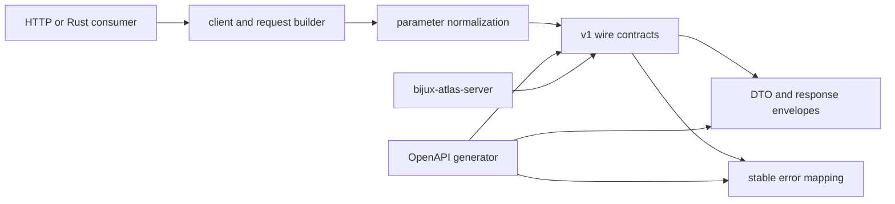

# bijux-atlas-api

[](https://crates.io/crates/bijux-atlas-api)
[](https://github.com/bijux/bijux-atlas/blob/main/LICENSE)
[](https://github.com/bijux/bijux-atlas)
[](https://crates.io/crates/bijux-atlas-api)
[](https://github.com/bijux/bijux-atlas/pkgs/container/bijux-atlas%2Fbijux-atlas-api)
[](https://docs.rs/bijux-atlas-api/latest/bijux_atlas_api/)
[](https://bijux.io/bijux-atlas/bijux-atlas/)

`bijux-atlas-api` is the published contract crate for Atlas HTTP and OpenAPI
consumers. It owns the request, response, error, and schema surfaces that the
rest of the runtime is required to honor, and it also ships the
`bijux-atlas-openapi` binary.

The crate is useful without starting a server. Rust clients can build and
normalize requests, services can share the same DTOs and error vocabulary, and
release automation can emit the canonical OpenAPI document from one owner.



## Contract Surface

| Surface | Public entrypoint | Guarantee |
| --- | --- | --- |
| Client | `AtlasClient`, `RequestBuilder`, `DatasetQuery` | Requests use the same dataset identity and filters as the HTTP API. |
| Parameters | `ListGenesParams`, region and range parsers | Invalid or oversized inputs become stable API errors before query execution. |
| Responses | `ApiResponseEnvelope`, `ContentNegotiation` | Media-type selection and envelope shape remain explicit. |
| Errors | `ApiError`, `ApiErrorCode`, `map_error` | Codes, status mapping, details, and request identity share one vocabulary. |
| Schema | `openapi_v1_spec()` | The generated v1 document is deterministic and tied to the crate's wire surface. |

Dataset identity is always explicit: release, species, and assembly select a
dataset. The API does not infer a default dataset, and compatibility handling
does not weaken that rule.

## Generate the OpenAPI Contract

Install and emit the canonical JSON document:

```bash
cargo install --locked bijux-atlas-api --bin bijux-atlas-openapi
bijux-atlas-openapi --out ./openapi.json
```

The exporter creates parent directories when necessary and writes stable JSON.
Treat the output as a release contract: review diffs, run compatibility checks,
and publish it with the binaries that implement the same version.

## Use the Rust Contract

```rust
use bijux_atlas_api::{dataset_route_key, DatasetKeyDto};

let dataset = DatasetKeyDto::new(
    "110".into(),
    "homo_sapiens".into(),
    "GRCh38".into(),
)?;

assert_eq!(
    dataset_route_key(&dataset),
    "release=110/species=homo_sapiens/assembly=GRCh38"
);
# Ok::<(), &'static str>(())
```

Use the parsing functions rather than duplicating validation in a transport or
client. This keeps cursor limits, range semantics, include fields, and error
details aligned with the published schema.

## Ownership Boundary

- request parameter parsing and validation
- response DTOs and error-envelope contracts
- OpenAPI document generation and compatibility aliases
- API-facing tests and observability checks that keep the wire surface stable

It does not own:

- HTTP process startup and listener lifecycle, owned by `bijux-atlas-server`
- dataset ingest, query execution, or artifact publication, owned by the leaf
  product crates and composed by `bijux-atlas-runtime`
- repository governance automation, owned by `bijux-atlas-dev`

Choose this crate for wire contracts and client integration. Choose
`bijux-atlas-server` for listener, middleware, cache, or shutdown behavior, and
the leaf data crates for scientific or persistence behavior.

## Documentation

- Atlas handbook: <https://bijux.io/bijux-atlas/>
- Rust API docs: <https://docs.rs/bijux-atlas-api/latest/bijux_atlas_api/>
- Source repository: <https://github.com/bijux/bijux-atlas>
- Crate boundary reference: <https://bijux.io/bijux-atlas/bijux-atlas/foundations/crate-boundary-contract/>
