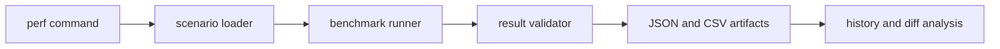

# Benchmark Architecture

## Components

- Configuration and isolation model: `src/config.rs`
- Dataset registry and tiers: `src/dataset.rs`
- Result and diff model: `src/harness.rs`
- Runtime command surface: `crates/bijux-dev-atlas/src/commands/perf.rs`
