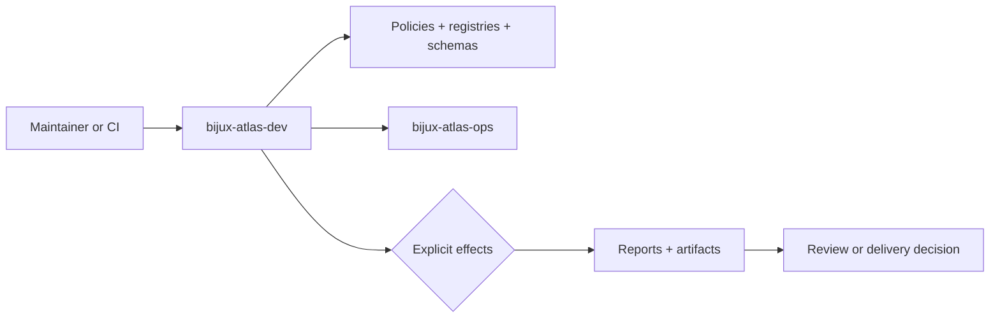
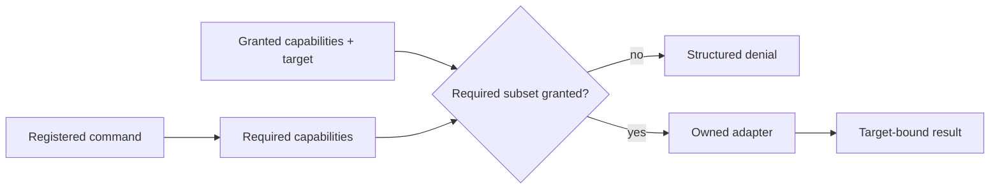

# bijux-atlas-dev

[](https://github.com/bijux/bijux-atlas)
[](https://github.com/bijux/bijux-atlas/blob/main/LICENSE)
[](https://github.com/bijux/bijux-atlas/actions/workflows/ci.yml?query=branch%3Amain)
[](https://bijux.io/bijux-atlas/bijux-atlas-dev/)
[](https://github.com/bijux/bijux-atlas)

`bijux-atlas-dev` is the repository control plane for Atlas. It discovers owned
contracts, validates explicit inputs, gates external effects, and emits
structured reports for documentation, governance, stack, Kubernetes,
observability, load, security, and release work.

The crate has `publish = false`. It is not an SDK and does not own product
runtime behavior.



Reusable operational models live in `bijux-atlas-ops`. Query, ingest, API, CLI,
server, and runtime behavior remain in their product crates.

## Run it

From a checkout:

```bash
cargo run --locked -p bijux-atlas-dev -- --help
cargo run --locked -p bijux-atlas-dev -- \
  --repo-root "$PWD" docs nav-integrity --format json
```

From an installed Bijux environment:

```bash
bijux dev atlas --help
bijux dev atlas list
bijux dev atlas docs --help
bijux dev atlas ops --help
```

Use `--repo-root` outside the repository root. Prefer JSON for automation and
human output for interactive diagnosis.

## Command ownership

| Family | Responsibility |
| --- | --- |
| `docs` | Validate, link, build, inventory, graph, and generate documentation |
| `ops` | Inspect and execute stack, Kubernetes, observability, load, and evidence workflows |
| `load`, `perf` | Plan workloads, run scenarios, compare baselines, and report regressions |
| `security`, `audit` | Validate security models, policy, audit records, and evidence |
| `governance`, `policies`, `invariants` | Enforce repository contracts and produce decision reports |
| `configs`, `registry`, `reports` | Validate owned configuration and expose machine-readable catalogs |
| `runtime`, `datasets`, `ingest`, `api` | Exercise integration boundaries around product crates |
| `system`, `observe`, `suites`, `tests`, `ci` | Coordinate broader repository verification |
| `list`, `describe`, `run`, `validate` | Discover and invoke registered actions |

Run `<family> --help` before building automation around a route. Registry
membership, parser exposure, dispatch, and umbrella delegation are separate
facts and must agree.

## Effects are explicit



Read-only commands should not require writes, subprocesses, network, Git, or
cluster authority. Effectful commands must declare their requirements and fail
visibly when capability, tool, metric, or contract is absent. Missing evidence
is not a successful no-op.

Before execution:

1. select repository root, exact profile, scenario, suite, or report;
2. inspect help and any plan output;
3. grant only required effects;
4. preserve structured output and external target identity;
5. inspect internal report status, findings, and artifact references.

## Report truth

Stable automation consumes documented commands, registries, schemas, exit
semantics, and report fields—not Rust module paths or terminal formatting.

The generic `reports validate` route currently checks registered `report_id`
and numeric `version`. It does not validate each payload against its referenced
JSON Schema, inspect internal status, or prove referenced artifacts exist. A
decision-bearing report may also require semantic validation, artifact hashes,
and candidate binding.

## Source ownership

| Area | Responsibility |
| --- | --- |
| `interfaces`, `bootstrap` | CLI parsing, dispatch, and process entry |
| `application` | Command use cases and orchestration |
| `model` | Control-plane values, report identity, routes, and exit semantics |
| `ports`, `infrastructure` | Filesystem, process, network, and workspace adapters |
| `engine` | Selection, execution, rendering, and report encoding |
| `registry` | Command, check, config, report, and runnable identities |
| `reference` | Repository layout and reproducibility contracts |
| `core`, `performance`, `policies` | Shared checks, load harnesses, and policy validation |

When adding behavior, keep it with its durable owner, reuse operational models,
make effects injectable, resolve paths from the repository root, emit
deterministic schema-owned reports, and add discovery metadata. Runtime
behavior remains in product crates.

## Documentation

- [Maintainer handbook](../../docs/bijux-atlas-dev/index.md)
- [Automation command surface](../../docs/bijux-atlas-dev/automation/automation-command-surface.md)
- [Automation control plane](../../docs/bijux-atlas-dev/automation/automation-control-plane.md)
- [Report contracts](../../docs/bijux-atlas-dev/automation/automation-reports-reference.md)
- [Testing and evidence](../../docs/bijux-atlas-dev/governance/testing-and-evidence.md)
