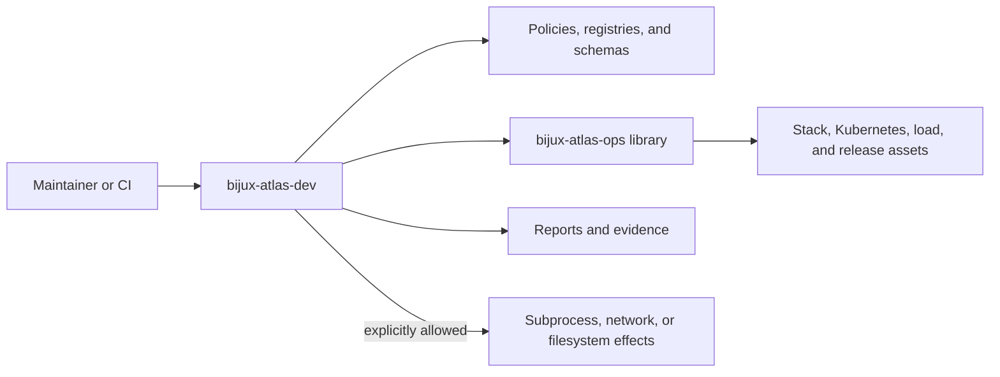

# bijux-atlas-dev

[](https://github.com/bijux/bijux-atlas)
[](https://github.com/bijux/bijux-atlas/blob/main/LICENSE)
[](https://github.com/bijux/bijux-atlas/actions/workflows/ci.yml?query=branch%3Amain)
[](https://bijux.io/bijux-atlas/bijux-atlas-dev/)
[](https://github.com/bijux/bijux-atlas)

`bijux-atlas-dev` is the repository control plane for Atlas. It turns
documentation, governance, stack, Kubernetes, observability, load, security,
and release workflows into one discoverable command surface with structured
reports and explicit effects.

This crate is repository infrastructure. Its manifest sets `publish = false`;
it is not an SDK and is not released to crates.io. It also does not own the
product runtime: query, ingest, API, CLI, server, and runtime behavior remain in
their product crates.

## Control-Plane Position



The control plane owns orchestration and presentation. Reusable operational
models and validation live in `bijux-atlas-ops`; product behavior lives in the
leaf runtime crates. Commands should consume those owners instead of recreating
their rules.

## Run It

The direct binary works from a repository checkout:

```bash
cargo run -p bijux-atlas-dev -- --help
cargo run -p bijux-atlas-dev -- --repo-root "$PWD" docs validate --format json
```

Installed Bijux environments also expose the same control plane under the
`bijux dev atlas ...` umbrella namespace:

```bash
bijux dev atlas --help
bijux dev atlas list
bijux dev atlas docs --help
bijux dev atlas ops --help
```

Use `--repo-root` when automation is not launched from the repository root.
Use JSON output for machines and human output for interactive diagnosis.

## Command Families

| Family | Responsibility |
| --- | --- |
| `docs` | Validate, lint, link-check, build, inventory, graph, and generate documentation |
| `ops` | Inspect profiles and tools; plan, validate, render, install, observe, and collect evidence |
| `load`, `perf` | Plan workloads, run scenarios, compare baselines, and report regressions |
| `security`, `audit` | Validate policy, audit records, and security evidence |
| `governance`, `policies`, `invariants` | Enforce repository contracts and produce decision reports |
| `configs`, `registry`, `reports` | Validate owned configuration and expose machine-readable catalogs |
| `runtime`, `datasets`, `ingest`, `api` | Exercise repository integration boundaries around the product crates |
| `system`, `observe`, `suites`, `tests`, `ci` | Coordinate broader verification and operational workflows |
| `list`, `describe`, `run`, `validate` | Discover and execute registered control-plane actions |

Run `<family> --help` for its current subcommands. The generated command
reference is the durable catalog; this summary explains ownership rather than
duplicating every leaf command.

## Effects and Safety

Many read-only commands run without network, subprocess, or filesystem-write
capability. Commands that build sites, invoke external tools, contact services,
or change a cluster require the corresponding explicit allow flag. This makes
the effects visible in local use and CI logs.

Before running an operational command:

1. set the intended repository root;
2. select the exact profile, scenario, suite, or report;
3. inspect the command help and plan output;
4. grant only the effects required by that command;
5. preserve structured output under the repository artifact root when the run
   produces evidence.

The command must fail clearly when a required capability, tool, metric, or
contract is absent. Missing evidence is not a successful no-op.

## Output Contract

Automation-facing output is deterministic and schema-oriented. Reports identify
their command, run, inputs, status, findings, and owned artifact paths. Stable
consumers should depend on documented commands, registries, schemas, and report
fields—not internal Rust modules or terminal formatting.

Exit codes distinguish successful validation from rejected contracts and
execution errors where a domain defines that distinction. See the handbook's
[error and exit-code reference](../../docs/bijux-atlas/interfaces/error-codes-and-exit-codes.md)
before integrating a command into CI.

## Security Evidence Boundary

The `security` family exposes repository validation for authentication,
authorization, dependency, compliance, threat, and data-protection contracts.
Each command owns a narrow observation. It does not collapse those observations
into an unqualified “secure” result.

For the governed threat model, the focused verification pair is:

```bash
cargo run --locked -p bijux-atlas-dev -- \
  security threats verify --format json
cargo test --locked -p bijux-atlas-dev security_threat_ -- --nocapture
```

The first command checks that threat categories, likelihoods, assets,
mitigations, and registry membership agree, then writes
`artifacts/security/security-threat-coverage-report.json`. The test selector
executes both the valid-registry command contract and the registry-mismatch
rejection contract. A successful filter that runs zero tests is not evidence;
retain the Cargo test count with the result.

| Result | Maintainer interpretation |
| --- | --- |
| command exits nonzero | the governed model is invalid or execution failed; do not publish a passing report |
| report status is non-passing | preserve its findings even if an outer workflow uploaded the file |
| required report is absent | the run is incomplete, not empty success |
| model and command contracts pass | model linkage is qualified for the recorded revision; runtime and deployment claims still require direct evidence |

Security reports must retain source identity, selected command, governed input
hashes, tool identity, internal status, findings, and artifact path. Workflow
conclusion and artifact presence are transport facts, not replacements for
those fields.

## Source Architecture

| Area | Ownership |
| --- | --- |
| `interfaces` and `bootstrap` | CLI parsing, dispatch, and process entry |
| `application` | Command use cases and domain orchestration |
| `model` | Control-plane values, report identities, routes, and exit semantics |
| `ports` and `infrastructure` | Explicit filesystem, process, network, and workspace adapters |
| `engine` | Selection, execution, rendering, and report encoding |
| `registry` | Commands, checks, configs, reports, and runnable identities |
| `reference` | Repository layout and reproducibility contracts |
| `core`, `performance`, `policies` | Shared checks, load harnesses, and policy validation |

Internal modules can change as ownership becomes clearer. The supported
integration boundary is the CLI plus documented data contracts.

## Maintainer Contract

When extending the control plane:

- place behavior with the domain that owns it;
- reuse `bijux-atlas-ops` models for operational surfaces;
- make external effects explicit and injectable;
- emit deterministic, schema-owned reports;
- resolve paths from the repository root rather than the current directory;
- add discovery metadata so new commands appear in registries and references;
- keep runtime behavior in the product crate that owns it.

## Documentation

- maintainer handbook: [../../docs/bijux-atlas-dev/index.md](../../docs/bijux-atlas-dev/index.md)
- command surface: [../../docs/bijux-atlas-dev/automation/automation-command-surface.md](../../docs/bijux-atlas-dev/automation/automation-command-surface.md)
- control-plane model: [../../docs/bijux-atlas-dev/automation/automation-control-plane.md](../../docs/bijux-atlas-dev/automation/automation-control-plane.md)
- report contracts: [../../docs/bijux-atlas-dev/automation/automation-reports-reference.md](../../docs/bijux-atlas-dev/automation/automation-reports-reference.md)
- security validation lanes: [../../docs/bijux-atlas-dev/delivery/security-validation-lanes.md](../../docs/bijux-atlas-dev/delivery/security-validation-lanes.md)
- testing and evidence: [../../docs/bijux-atlas-dev/governance/testing-and-evidence.md](../../docs/bijux-atlas-dev/governance/testing-and-evidence.md)
