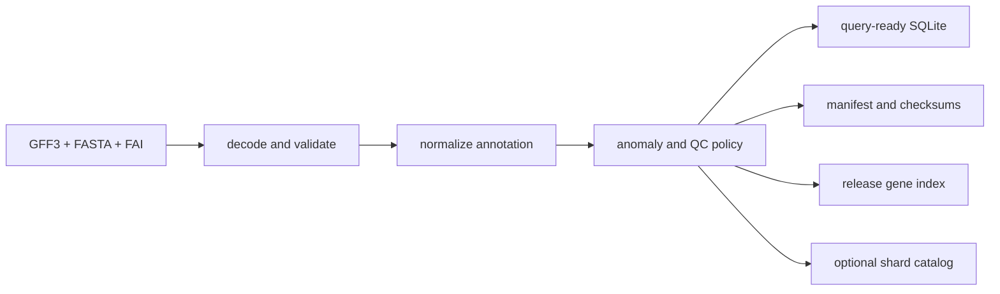

# bijux-atlas-ingest

`bijux-atlas-ingest` is the published library crate that owns the path from
governed source files to build-ready Atlas artifacts. It is where raw GFF3 and
FASTA inputs stop being source files and start becoming deterministic release
material.

Ingest is a scientific contract as well as a file conversion. Source identity,
normalization policy, anomaly decisions, and build identity travel with the
outputs so a release can be explained and reproduced.

## Inputs and Outputs

| Boundary | Required or produced material | Governing rule |
| --- | --- | --- |
| Source | GFF3, FASTA, and FASTA index paths | All inputs are explicit; production ingest does not silently invent a missing index. |
| Dataset | Release, species, and assembly | The placeholder dataset identity is rejected. |
| Policy | Strictness, identifier, name, biotype, transcript, feature, and seqid rules | Normalization choices are configuration, not parser side effects. |
| Primary artifacts | Manifest and SQLite database | Content hashes and build identity make the pair verifiable. |
| Evidence | Anomaly report, QC report, release gene index, and ingest events | Warnings and rejected records remain reviewable. |
| Optional artifacts | Normalized debug data and shard catalog | Debug data is prohibited in production mode; sharding is explicit. |

`IngestOptions::for_dataset` starts from strict, deterministic defaults. A
caller must then provide the three source paths, output root, and build hash.
Policy relaxations should be visible in configuration and release evidence.

## Pipeline Checkpoints

The public `ingest_dataset` function runs a bounded sequence:

1. Validate dataset identity, parallelism, and production-only restrictions.
2. Decode GFF3, FASTA, and FAI inputs into the canonical annotation model.
3. Apply normalization and anomaly policy before persistence.
4. Enforce warning and error thresholds, including `fail_on_warn` when set.
5. Write the query database, manifest, QC evidence, gene index, and optional
   sharding outputs.
6. Return paths, parsed evidence, manifest data, and structured ingest events
   in `IngestResult`.

Failure before persistence is a rejected build, not a partial publication.
Publication into an authoritative artifact store is a separate responsibility
owned by `bijux-atlas-store`.

## Reproducibility and Scientific Integrity

- Coordinates remain 1-based and closed throughout ingest and query contracts.
- Normalized sequence identifiers are collision-checked by default.
- Duplicate genes, duplicate transcripts, unknown features, and incomplete
  parent relationships follow explicit policies.
- Deterministic-zero timestamps are the default; source-metadata timestamps
  must be selected deliberately.
- Gene signatures, contig fractions, transcript lengths, and shards are
  declared computations, never implicit release embellishments.
- Normalized replay mode supports comparing normalization behavior without
  pretending a different source was ingested.

An anomaly report is not a success token. Consumers must evaluate its severity
classes and the configured thresholds before treating artifacts as eligible for
publication.

## Ownership Boundary

- deterministic ingest execution and source decoding
- canonical annotation extraction and normalization
- artifact construction, anomaly classification, QC evidence, and replay
- ingest-specific throughput, validation, compression, sharding, and resource
  benchmarks

This crate does not own query execution, artifact publication, HTTP serving, or
CLI process wiring. It owns the ingest boundary itself and is then composed by
the product command surface. Use `bijux-atlas-query` for serving semantics and
`bijux-atlas-store` for locks, immutability, and backend publication.

## Documentation

- Atlas handbook: <https://bijux.io/bijux-atlas/>
- Rust API docs: <https://docs.rs/bijux-atlas-ingest/latest/bijux_atlas_ingest/>
- Source repository: <https://github.com/bijux/bijux-atlas>
