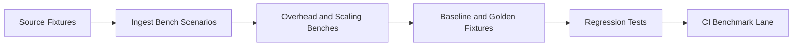

# Ingest Performance Architecture

```mermaid
flowchart LR
    A[Source Fixtures] --> B[Ingest Bench Scenarios]
    B --> C[Overhead and Scaling Benches]
    C --> D[Baseline and Golden Fixtures]
    D --> E[Regression Tests]
    E --> F[CI Benchmark Lane]
```

This architecture separates execution benchmarks from policy fixtures and enforces regression checks in CI.
