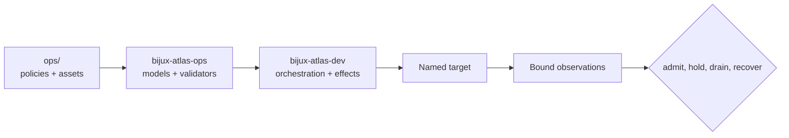
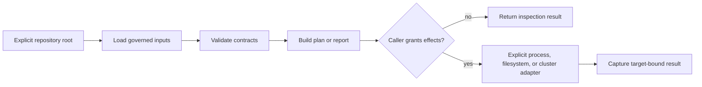

# bijux-atlas-ops

[](https://crates.io/crates/bijux-atlas-ops)
[](https://github.com/bijux/bijux-atlas/blob/main/LICENSE)
[](https://github.com/bijux/bijux-atlas)
[](https://crates.io/crates/bijux-atlas-ops)
[](https://github.com/bijux/bijux-atlas/pkgs/container/bijux-atlas%2Fbijux-atlas-ops)
[](https://docs.rs/bijux-atlas-ops/latest/bijux_atlas_ops/)
[](https://bijux.io/bijux-atlas/bijux-atlas-ops/)

`bijux-atlas-ops` is the published Rust library for Atlas operational models,
validators, path contracts, plans, observations, and evidence structures. It
lets Rust consumers reason about stack composition, Kubernetes safety,
observability, load, resilience, and release custody without duplicating
repository conventions.

It is one part of the operations system:



The `ops/` tree owns concrete Helm, profile, scenario, dashboard, security,
schema, and release inputs. `bijux-atlas-dev` owns repository command routing
and explicit effects. This crate does not install an operator CLI or run Atlas.

## Add the library

```toml
[dependencies]
bijux-atlas-ops = "0.2"
```

Begin with an explicit repository root:

```rust,no_run
use std::path::Path;

use bijux_atlas_ops::workspace::stack::{
    load_stack_manifest,
    validate_stack_manifest,
};

let root = Path::new("/path/to/bijux-atlas");
let manifest = load_stack_manifest(root)?;
let findings = validate_stack_manifest(root, &manifest);
assert!(findings.is_empty(), "{findings:#?}");
# Ok::<(), Box<dyn std::error::Error>>(())
```

This validates implemented static relationships for that repository root. It
does not render Helm, contact Kubernetes, generate load, or prove target health.

## Public domains

| Module | Owns |
| --- | --- |
| `diagnostics` | Bundle paths, evidence collection, explanation payloads, and secret-field redaction |
| `inventory` | Operations assets, scenarios, tools, pins, runbooks, and resilience reports |
| `kubernetes` | Target guards, profile and render policy, probes, status, waits, and conformance models |
| `lifecycle` | Install state, release inventory, bundles, compatibility, and simulation evidence |
| `load` | Load manifests, plans, execution adapters, thresholds, and report contracts |
| `observe` | SLO, alert, runbook, telemetry, and readiness verification |
| `reference` | Durable command and repository path identities |
| `stack` | Composition manifests, profiles, dependencies, pins, and SBOM payloads |
| `workspace` | Repository-root adapters for owned operational surfaces |

Modules return typed values or deterministic JSON so tests, CI, and commands
can share implementations. External effects remain explicit at the caller.

## Interpret results by strength

| Result | Safe conclusion | Still required for an operating claim |
| --- | --- | --- |
| loaded inventory or profile | Governed data parsed from the selected root | Source revision and content identity |
| validation report | Implemented static rules were evaluated | Target fitness and live behavior |
| typed plan | Intended inputs, commands, and components are inspectable | Authorization, capabilities, and target identity |
| probe or status payload | One adapter observed one target at one time | Release, dataset, workload, and observation window |
| load or resilience report | The named execution produced measurements | Measurement validity, threshold verdict, comparable baseline |
| evidence manifest | Selected files and identities were collected or checked | Custody, redaction, and decision binding |

An empty static finding list is not cluster evidence. A typed observation is
not durable until retained with target identity and time. Deterministic output
for the same inputs does not prove that an external environment still exists.

## Choose the boundary deliberately



Use this crate to resolve operations assets, validate manifests and profiles,
build deterministic reports, model Kubernetes safeguards, prepare load
evidence, or assemble release inventories. Query planning, ingest, HTTP serving,
and end-user commands belong to product crates.

## Documentation

- operations handbook: <https://bijux.io/bijux-atlas/bijux-atlas-ops/>
- Rust API: <https://docs.rs/bijux-atlas-ops/latest/bijux_atlas_ops/>
- source: <https://github.com/bijux/bijux-atlas>
