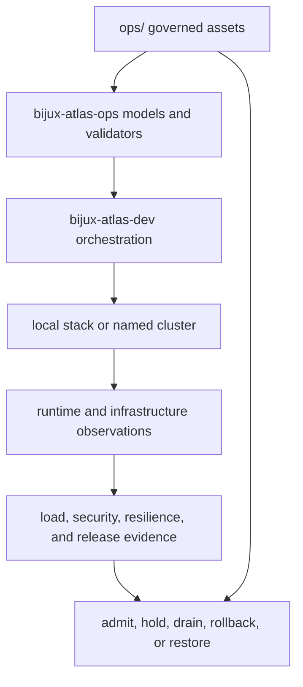
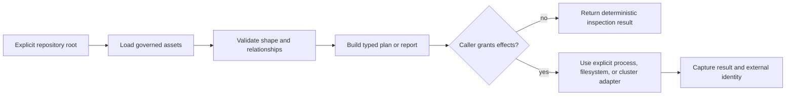
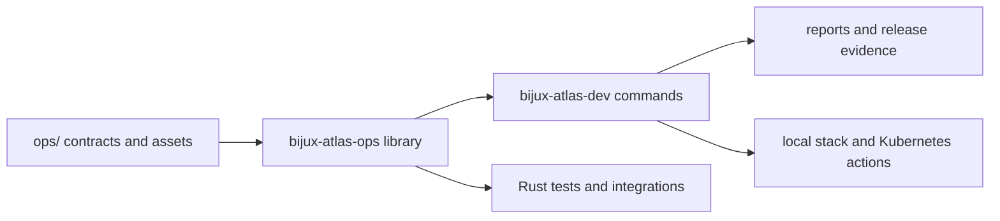

# bijux-atlas-ops

[](https://crates.io/crates/bijux-atlas-ops)
[](https://github.com/bijux/bijux-atlas/blob/main/LICENSE)
[](https://github.com/bijux/bijux-atlas)
[](https://crates.io/crates/bijux-atlas-ops)
[](https://github.com/bijux/bijux-atlas/pkgs/container/bijux-atlas%2Fbijux-atlas-ops)
[](https://docs.rs/bijux-atlas-ops/latest/bijux_atlas_ops/)
[](https://bijux.io/bijux-atlas/bijux-atlas-ops/)

`bijux-atlas-ops` is the published Rust library behind the Atlas operational
contract system. It models stack profiles, Kubernetes safety, load plans,
observability checks, diagnostics, release evidence, tool inventories, and
repository-owned paths.

The library is only one layer of Atlas operations. The repository's `ops/`
tree contains the Helm chart, deployment profiles, load scenarios, dashboards,
alerts, security exercises, schemas, and release records. This crate gives Rust
consumers typed access to those assets and the rules that connect them.

It does not install an operator CLI or run the Atlas server. Executable
orchestration belongs to the repository-only `bijux-atlas-dev` control plane.

## The operations system

Atlas operations is a governed system rather than a deployment wrapper. The
crate models stable relationships; the `ops/` tree owns concrete policy and
assets; the maintainer control plane evaluates plans and performs explicitly
selected effects.



| Operational plane | Governed material | Decision supported |
| --- | --- | --- |
| stack and environment | component manifests, profiles, pins, and dependency inventory | what should run together |
| Kubernetes | chart, values, render rules, access guards, and conformance | what may be applied to which target |
| security | threat model, scenarios, posture checks, and reports | whether identity and exposure controls hold |
| traffic and load | suites, scenarios, thresholds, baselines, and raw measurements | whether capacity and shedding claims are comparable |
| observability | metrics, traces, logs, alerts, dashboards, SLOs, and runbooks | whether runtime behavior is visible and actionable |
| resilience and release | drills, simulations, compatibility, custody, and evidence packets | whether change and reversal are supportable |

No plane substitutes for another. A valid Helm render is not runtime
readiness; passing load thresholds are not a security result; a release bundle
is not trustworthy unless its component evidence remains bound to the tested
target and release.

## Add the Library

```toml
[dependencies]
bijux-atlas-ops = "0.2"
```

Most consumers should begin with `workspace` helpers, which resolve and
validate repository surfaces from an explicit root:

```rust,no_run
use std::path::Path;

use bijux_atlas_ops::workspace::stack::{
    load_stack_manifest,
    validate_stack_manifest,
};

let root = Path::new("/path/to/bijux-atlas");
let manifest = load_stack_manifest(root)?;
let errors = validate_stack_manifest(root, &manifest);
assert!(errors.is_empty(), "{errors:#?}");
# Ok::<(), Box<dyn std::error::Error>>(())
```

## Public Domains

| Module | Responsibility |
| --- | --- |
| `diagnostics` | Bundle paths, evidence collection, explanation payloads, and secret-field redaction |
| `inventory` | Operational surfaces, scenarios, tools, pins, runbooks, and resilience reports |
| `kubernetes` | Context guards, profile validation, render policy, probes, status, waits, and conformance |
| `lifecycle` | Install state, release inventory and bundles, compatibility checks, and simulation evidence |
| `load` | Load manifests, plans, runs, report contracts, and report artifacts |
| `observe` | SLO, alert, runbook, telemetry, and operational-readiness verification |
| `reference` | Durable command and workspace path references |
| `stack` | Stack manifests, profile catalogs, path contracts, and dependency SBOM payloads |
| `workspace` | Repository-root adapters for inventory, profiles, load, stack, reports, and artifacts |

The modules return typed values or deterministic JSON payloads so command-line
and CI consumers can share one implementation. Filesystem mutation and cluster
execution remain explicit at the call site.

## Interpret Library Results

The return type identifies the strongest claim a caller may make. Keep the
external target and effect receipt beside any result that crosses the pure
contract boundary.

| Library result | Safe conclusion | Additional evidence required |
| --- | --- | --- |
| loaded inventory or profile | governed data parsed from the selected repository root | source revision and content digest for release use |
| validation report | implemented relationships and schema rules were evaluated | no additional evidence for that static claim; environment fitness remains untested |
| typed plan | intended commands, inputs or components are reviewable before effects | capability, target and authorization for execution |
| status, probe or conformance payload | the named adapter observed the recorded target at that time | workload, release, dataset and observation-window identity |
| load or resilience report | the selected scenario produced the recorded measurements | threshold evaluation and comparable baseline before capacity acceptance |
| diagnostics or evidence manifest | selected files and identities were collected or verified | custody, redaction review and binding to the incident or release decision |

An empty error list from static validation is not cluster evidence. A typed
external-state payload is not durable until the caller persists it with target
identity and timing. A deterministic JSON rendering is reproducible output for
the same inputs, not proof that the represented environment still exists.

## Library and Execution Boundary

The crate contains both pure contract logic and adapters that can inspect or
act on external state. Callers choose the boundary explicitly:



Loading a profile, producing a plan, or validating a manifest does not execute
Helm, contact Kubernetes, run load traffic, or prove an environment healthy.
Execution evidence must retain the target, command, inputs, capabilities,
result, and generated artifact paths supplied by the caller.

| Need | Begin with | Escalate only when |
| --- | --- | --- |
| inspect repository paths and manifests | `workspace`, `reference`, `inventory` | a decision requires external state |
| validate composition and profiles | `stack` and `workspace` | render or deployment behavior is in scope |
| reason about Kubernetes safety | `kubernetes` policies | cluster identity and authority are explicit |
| evaluate signal contracts | `observe` | a target and observation window are named |
| prepare load evidence | `load` plan and report contracts | the scenario, endpoint, and budget are selected |
| assemble release evidence | `lifecycle` and diagnostics | consumer verification and custody are defined |

## Operations Architecture



The crate prevents command implementations from scattering string paths and
duplicating validation logic. A profile, scenario, report, or governed asset
should have one repository owner and one model used by all higher-level tools.

## Use This Crate For

- resolving Atlas operational assets without hard-coded relative paths;
- validating stack, load, pin, and profile manifests;
- building deterministic reports for CI or another Rust command;
- checking Kubernetes safety and observability contracts;
- collecting or inspecting diagnostics and release-evidence inventories.

Do not use it for query planning, ingest, HTTP serving, or end-user commands.
Those capabilities belong to the product crates. Do not treat the public Rust
library as a replacement for the operational policies and assets in `ops/`;
the code and governed data form the contract together.

## Documentation

- operations handbook: <https://bijux.io/bijux-atlas/bijux-atlas-ops/>
- Rust API: <https://docs.rs/bijux-atlas-ops/latest/bijux_atlas_ops/>
- source: <https://github.com/bijux/bijux-atlas>
