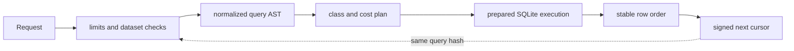

# bijux-atlas-query

`bijux-atlas-query` is the published library crate that owns the Atlas query
language and execution boundary. It is where requests become plans, cursors,
and SQLite-backed result sets with stable semantics.

The crate separates query intent from HTTP presentation. A CLI, server, or Rust
consumer supplies a dataset connection, a request, governed limits, and a
cursor secret; the query engine supplies validation, planning, execution, and
stable pagination.

## Query Contract

| Concern | Public surface | Behavior |
| --- | --- | --- |
| Requests | `GeneQueryRequest`, `GeneFilter`, `GeneFields` | Filters, projection, sort, dataset key, limit, and cursor are explicit. |
| Planning | `plan_gene_query`, `QueryPlan`, `QueryClass` | Requests become point, name, prefix, region, or filtered-scan plans with work estimates. |
| Budgets | `QueryLimitsExport`, `BudgetHook` | Limit, region span, prefix cost, and total work are rejected before execution when excessive. |
| Execution | `query_genes`, `query_gene_by_id_fast`, `query_gene_count` | Prepared SQLite queries preserve owned filtering and row-decoding semantics. |
| Pagination | `encode_cursor`, `decode_cursor`, `CursorPayload` | HMAC-signed cursors bind order, query hash, depth, and dataset identity. |
| Inspection | `freeze_query_model`, `explain_query_plan` | Automation can retain the normalized contract and inspect expected index use. |

## Planning Before Execution

Query classes are operational signals, not promises of a fixed duration:

- exact gene identifiers are cheap point lookups;
- unfiltered or ordinary filtered scans are medium work;
- region and prefix searches are heavy and receive stronger budget checks.

The planner records the plan node, sort key, normalized form, estimated work,
and applicable budget hooks. `freeze_query_model` adds a stable hash to that
model, which makes plan-policy changes reviewable without exposing raw SQL as
the public contract.

## Cursor Safety

A cursor is valid only for the query and dataset that created it. Changing a
filter, sort, projection-relevant query identity, order mode, dataset key, or
signing secret invalidates continuation. Consumers should return the cursor
unchanged and must not decode it to synthesize pages.

Stable pagination also depends on immutable dataset artifacts. Replacing the
SQLite file beneath an active dataset identity violates the store contract even
if the query cursor is cryptographically valid.

## Query Execution Invariants

- Coordinates use 1-based closed intervals.
- A limit of zero and limits above policy are rejected.
- Region spans and estimated result work are bounded before scanning.
- Prefix searches are normalized and costed before execution.
- Strand filtering is rejected when the current dataset schema cannot honor
  it, rather than being approximated.
- Unknown biotypes and sequence identifiers fail quickly using dataset
  statistics; close sequence identifiers may be suggested without changing the
  request.
- Fan-out queries merge rows in deterministic genomic order and deduplicate by
  gene identifier before issuing a continuation cursor.

## Ownership Boundary

- gene and transcript query parsing, normalization, planning, and limits
- cursor encoding, validation, and pagination identity
- SQLite execution, row decoding, index-plan inspection, and shard fan-out
- query concurrency, cache, pattern, routing, planner, and stage benchmarks

It depends on `bijux-atlas-core` for canonical hashing and on
`bijux-atlas-model` for shared dataset, diff, and gene value types.

`bijux-atlas-query` owns the query boundary itself, but not CLI presentation,
HTTP lifecycle, ingest normalization, or artifact publication. Use
`bijux-atlas-api` for wire envelopes, `bijux-atlas-server` for transport and
backpressure, and `bijux-atlas-ingest` for the SQLite schema producer.

## Documentation

- Atlas handbook: <https://bijux.io/bijux-atlas/>
- Rust API docs: <https://docs.rs/bijux-atlas-query/latest/bijux_atlas_query/>
- Source repository: <https://github.com/bijux/bijux-atlas>
