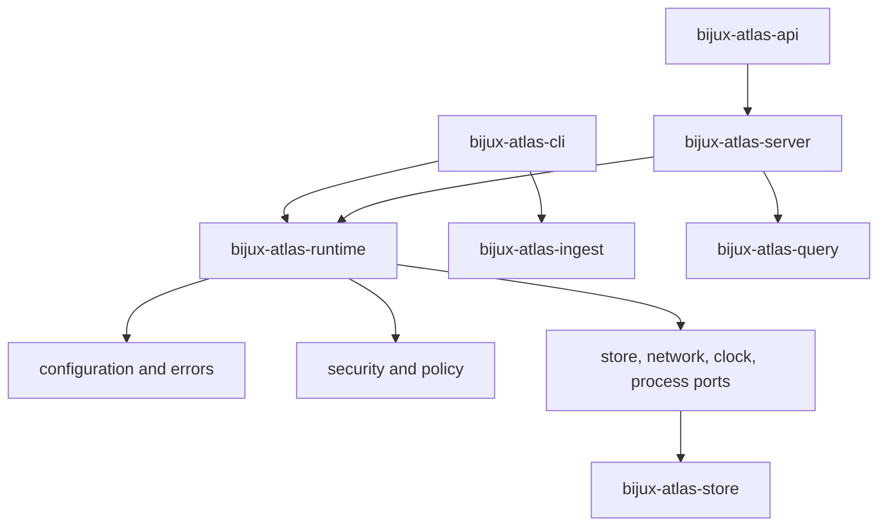

# bijux-atlas-runtime

[](https://crates.io/crates/bijux-atlas-runtime)
[](https://github.com/bijux/bijux-atlas/blob/main/LICENSE)
[](https://github.com/bijux/bijux-atlas)
[](https://crates.io/crates/bijux-atlas-runtime)
[](https://github.com/bijux/bijux-atlas/pkgs/container/bijux-atlas%2Fbijux-atlas-runtime)
[](https://docs.rs/bijux-atlas-runtime/latest/bijux_atlas_runtime/)
[](https://bijux.io/bijux-atlas/bijux-atlas/)

`bijux-atlas-runtime` is the canonical published orchestration library crate
for Atlas. It pulls together ingest, query, store, API, cache, policy, and
runtime configuration so the direct CLI and server crates can expose one
coherent product.



The runtime is the composition boundary, not a second owner for every domain.
Leaf crates remain responsible for ingest, query, store, model, and wire
semantics. The runtime selects implementations, validates configuration, and
provides application ports that keep process code independent of concrete
backends.

## Public Architecture

| Module | Responsibility | Stable reason to depend on it |
| --- | --- | --- |
| `contracts` | Runtime configuration artifacts and stable error context. | Validate or exchange process configuration without importing a binary. |
| `domain` | Runtime-owned cluster, security, policy, and deterministic-time rules. | Apply product policy consistently across CLI and server hosts. |
| `app` | Application ports and cache orchestration. | Supply or test store, filesystem, network, clock, process, and telemetry adapters. |
| `adapters` | Concrete outbound integrations. | Run the composed application against supported filesystem and store implementations. |
| `runtime` | Settings, paths, environment resolution, and build identity. | Resolve the same effective configuration as shipped processes. |
| `packaged` | Packaged resource access. | Consume runtime-owned resources without relying on repository paths. |

Dependencies point inward: binaries depend on runtime services, runtime
services depend on ports and domain contracts, and adapters implement those
ports. Transport details do not become domain rules, and persistence details do
not leak into API envelopes.

## Composition Guarantees

- runtime composition across ingest, query, store, API, and policy crates
- application wiring, cache setup, runtime config, and orchestration
- shared product-facing runtime modules consumed by CLI and server owners
- feature-flagged backend selection for local and remote storage integrations
- deterministic behavior: randomness is forbidden and time-sensitive work uses
  explicit policy or ports
- configuration precedence and effective values are inspectable rather than
  hidden in process-specific startup code
- backend selection is compile-time explicit through features and runtime
  explicit through validated settings

## Related Shipped Surfaces

- `bijux-atlas-cli`: end-user CLI owner for dataset, catalog, ingest, diff, garbage-collection,
  config, and OpenAPI workflows
- `bijux-atlas-server`: runtime HTTP server owner for Atlas APIs
- `bijux-atlas-api`: OpenAPI export owner for `bijux-atlas-openapi`
- `bijux-atlas`: compatibility alias crate for the historical `bijux_atlas`
  import path
- Rust library modules rooted in `adapters`, `app`, `contracts`, `domain`, and
  `runtime`

## Select Features Deliberately

| Feature | Effect |
| --- | --- |
| `backend-local` | Enables the local filesystem-backed store integration; included by default. |
| `backend-s3` | Adds the S3-like store integration and retains local support. |
| `jemalloc` | Selects the optional allocator for shipped process integrations. |
| `bench-ingest-throughput` | Enables heavyweight ingest benchmark targets. |

Disable default features when a consumer needs a narrow contract-only build,
then enable only the backend it will operate. Feature selection does not choose
a live store by itself; validated runtime configuration remains authoritative.

## Direct and Umbrella Commands

Atlas owns the genomic dataset runtime itself. The sibling `bijux-cli`
repository owns the umbrella command runtime that can route Atlas under
`bijux atlas ...` and `bijux dev atlas ...` when that command surface is
already installed in an environment.

Use this crate when you want the canonical Atlas runtime and libraries
directly. Use `bijux-cli` when you want a shared command root that can host
Atlas alongside other Bijux tools.

## Ownership Boundary

`bijux-atlas-runtime` is not the direct owner of the installed CLI binary, the
installed server binary, the OpenAPI binary, or maintainer governance
automation. Those surfaces belong to `bijux-atlas-cli`,
`bijux-atlas-server`, `bijux-atlas-api`, and `bijux-atlas-dev`.

## Install the Shipped Processes

Choose one install route at a time.

Install the published binaries directly when you want Atlas without the
umbrella runtime:

```bash
cargo install --locked bijux-atlas-cli --bin bijux-atlas
cargo install --locked bijux-atlas-server --bin bijux-atlas-server
cargo install --locked bijux-atlas-api --bin bijux-atlas-openapi
```

Verify the installed runtime surfaces:

```bash
bijux-atlas --help
bijux-atlas version
bijux-atlas-server --help
bijux-atlas-openapi --help
```

Run the current checkout directly:

```bash
cargo run -p bijux-atlas-cli --bin bijux-atlas -- --help
cargo run -p bijux-atlas-server --bin bijux-atlas-server -- --help
cargo run -p bijux-atlas-api --bin bijux-atlas-openapi -- --out ./openapi.json
```

## Documentation

- Product documentation: <https://bijux.io/bijux-atlas/>
- Rust API documentation:
  <https://docs.rs/bijux-atlas-runtime/latest/bijux_atlas_runtime/>
- Source repository: <https://github.com/bijux/bijux-atlas>
- Maintainer control plane: <https://github.com/bijux/bijux-atlas/tree/main/crates/bijux-atlas-dev>

The GitHub Pages site is the human-facing documentation surface. `docs.rs` is the API reference
for the Rust crate itself.

## Stability and Contract Policy

- Top-level command names and documented noun-first command families are treated as release
  surfaces.
- `--json` output is deterministic and intended for CI snapshots and automation.
- API errors, status mappings, and OpenAPI output are governed by contract tests.
- API-facing HTTP contract, response-shape, and observability suites are owned in `bijux-atlas-api`; startup, cache, backend, and server-wiring suites are owned in `bijux-atlas-server`; runtime keeps only shared library, compatibility, and boundary-contract tests.
- Runtime configuration is owned by contracts and validators, not ad hoc scripts.
- Compatibility tests, contract tests, and golden outputs are part of the supported maintenance
  model.

The following are not stable API promises:

- undocumented helper functions
- convenience imports outside the canonical module owners
- benchmark-only or internal testing helpers

## Scientific Annotation Handling

- Atlas uses 1-based closed genomic coordinates across ingest, query, and export contracts.
- Partial or missing annotation structures are retained and classified explicitly in canonical
  completeness fields instead of being silently normalized away.
- Biotype derivation records attribute-key provenance in ingest evidence so downstream users can
  distinguish source-provided annotations from fallback-derived values.
- Ambiguous scientific signals such as unresolved biotypes or conflicting normalized contig sources
  are emitted as first-class evidence and block publication under strict publish gates.

## Source Layout

- `src/adapters`: runtime-owned outbound integrations such as filesystem and
  store-facing adapters
- `src/app`: orchestration, ports, cache coordination, and process-facing
  runtime services
- `src/contracts`: runtime config contracts and stable error definitions
- `src/domain`: cluster, policy, security, and other runtime-owned domain
  behavior
- `src/runtime`: runtime configuration and process-level setup

CLI entrypoints live in `bijux-atlas-cli`, HTTP entrypoints live in
`bijux-atlas-server`, OpenAPI export lives in `bijux-atlas-api`, and the
historical Rust import path lives in the `bijux-atlas` compatibility crate.

If a change affects transport or persistence details, it usually belongs in `adapters`. If it
changes business behavior, it usually belongs in `domain`. If it changes an external schema or
stable error surface, it belongs in `contracts`.
