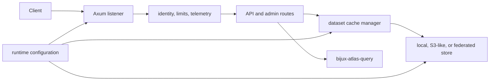

# bijux-atlas-server

[](https://crates.io/crates/bijux-atlas-server)
[](https://github.com/bijux/bijux-atlas/blob/main/LICENSE)
[](https://github.com/bijux/bijux-atlas)
[](https://crates.io/crates/bijux-atlas-server)
[](https://github.com/bijux/bijux-atlas/pkgs/container/bijux-atlas%2Fbijux-atlas-server)
[](https://docs.rs/bijux-atlas-server/latest/bijux_atlas_server/)
[](https://bijux.io/bijux-atlas/bijux-atlas/)

`bijux-atlas-server` is the published crate that owns the long-running
`bijux-atlas-server` executable. It is the direct binary surface for serving
Atlas over HTTP with the expected runtime config, telemetry bootstrap, and
startup behavior.



The process combines transport policy with the composed Atlas runtime. It does
not redefine API DTOs, dataset semantics, or persistence contracts; it applies
those contracts at the HTTP boundary.

## Start With a Validated Configuration

Install the server and inspect its complete option surface:

```bash
cargo install --locked bijux-atlas-server --bin bijux-atlas-server
bijux-atlas-server --help
```

Validate a configuration without binding a listener, then inspect the resolved
configuration that the process will use:

```bash
bijux-atlas-server --config ./atlas.toml --validate-config
bijux-atlas-server --config ./atlas.toml --print-effective-config
```

Start explicitly when an operator needs to override configured paths or the
listener address:

```bash
bijux-atlas-server \
  --config ./atlas.toml \
  --bind 127.0.0.1:8080 \
  --store-root ./data/store \
  --cache-root ./data/cache
```

The effective configuration is the diagnostic source of truth. Keep secrets
out of command history, validate before rollout, and use the same resolved
configuration when comparing replicas.

## Process Lifecycle

| Checkpoint | Server responsibility | Operator evidence |
| --- | --- | --- |
| Bootstrap | Load and validate configuration; initialize structured logging and tracing. | Effective configuration, release identity, startup events. |
| Store connection | Construct the selected local, S3-like, or federated backend. | Backend mode and source-health events. |
| Warmup | Coordinate dataset cache population and contain duplicate work. | Warmup lock, contention, expiry, and cache metrics. |
| Admission | Bind only after required state is available; expose readiness independently from liveness. | `/healthz`, `/readyz`, and startup logs. |
| Serving | Apply request limits, authorization, rate policy, query execution, and response encoding. | Request IDs, route-class metrics, status and latency series. |
| Drain | Stop accepting new work and complete bounded shutdown. | Drain state, in-flight request count, termination events. |

Redis-backed coordination is an optimization for shared cache and warmup work,
not a replacement for the authoritative dataset store. Cache or coordination
failure must remain distinguishable from dataset corruption and store
unavailability.

## Operational Surfaces

- `/healthz` reports process health.
- `/readyz` reports whether the replica may receive traffic.
- `/metrics` exposes the governed metrics contract.
- `/debug/*` is an administrative surface and requires the deployment's
  explicit access policy.

API responses use contracts from `bijux-atlas-api`; the server adds process
concerns such as request identity, telemetry, compression, cache behavior, and
backpressure. Consumers should generate clients from the API-owned OpenAPI
document rather than reconstructing contracts from router code.

## Ownership Boundary

- the installed `bijux-atlas-server` binary
- server process startup and shutdown wiring
- runtime config loading for the HTTP process
- telemetry bootstrap, route exposure, and cache warmup behavior
- server-facing tests and benchmarks that validate the deployed process surface

It does not own:

- end-user CLI command ownership, owned by `bijux-atlas-cli`
- OpenAPI export ownership, owned by `bijux-atlas-api`
- leaf query, ingest, and store implementations, composed by
  `bijux-atlas-runtime`

Use this crate when the change concerns the deployed HTTP process. Put API
schema changes in `bijux-atlas-api`, runtime composition in
`bijux-atlas-runtime`, and data behavior in its owning leaf crate.

## Documentation

- Atlas handbook: <https://bijux.io/bijux-atlas/>
- Rust API docs: <https://docs.rs/bijux-atlas-server/latest/bijux_atlas_server/>
- Source repository: <https://github.com/bijux/bijux-atlas>
