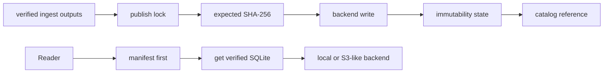

# bijux-atlas-store

`bijux-atlas-store` is the published library crate that owns Atlas publication
and storage semantics. It defines how artifacts are laid out, locked,
verified, and persisted across local and remote backends.

The store treats the manifest and SQLite artifact as one dataset publication.
A successful write means the expected hashes were checked and the backend's
publication contract completed; a catalog reference is not a substitute for
artifact verification.

## Contract Layers

| Layer | Public surface | Responsibility |
| --- | --- | --- |
| Paths | `StorePath` and dataset layout helpers | Relative, normalized keys and one canonical dataset layout. |
| Read | `StoreRead` | List datasets, read manifests and SQLite bytes, and test existence. |
| Write | `StoreWrite` | Publish a manifest and SQLite pair against expected hashes. |
| Administration | `StoreAdmin` | Acquire the dataset-scoped publication lock. |
| Unified store | `ArtifactStore` | Combine read, write, verification, atomic-publication, and locking behavior. |
| Integrity | `ManifestLock`, `verify_expected_sha256` | Bind artifact content to recorded checksums. |
| Catalog | canonical serialization, strict validation, and merge helpers | Keep discovery deterministic without making catalogs authoritative for bytes. |

The narrower traits let consumers depend only on the capability they need.
Read-only services should not receive a write or administration capability.

## Canonical Dataset Layout

Layout helpers derive every store key from the complete dataset identity. The
owned files include:

- `manifest.json` for identity, schema, provenance, and checksums;
- `atlas.sqlite` for the queryable dataset;
- `manifest.lock.json` for the locked manifest contract;
- publication and immutability markers;
- lifecycle state and transition records.

Call the helpers rather than concatenating backend paths. `StorePath::parse`
rejects empty, absolute, and parent-traversing paths so a remote object key and
a local path share the same relative-key discipline.

## Safe Publication

1. Validate the manifest and compute the manifest and SQLite SHA-256 values.
2. Acquire the dataset publication lock.
3. Call `put_dataset` or `publish_atomic` with both byte sequences and both
   expected hashes.
4. Verify the stored manifest and SQLite content before exposing a catalog
   reference.
5. Retain lifecycle and immutability evidence with the published dataset.

Retries may repeat safe backend operations according to `RetryPolicy`; they do
not authorize overwriting an immutable dataset identity with different bytes.
On an ambiguous write result, verify the stored hashes before retrying or
rolling forward.

## Backends and Capabilities

| Backend | Feature | Intended use |
| --- | --- | --- |
| `LocalFsStore` | `backend-local`, enabled by default | Local development, offline workflows, and filesystem-backed serving. |
| `S3LikeStore` | `backend-s3` | Object storage with the same key, integrity, and publication semantics. |
| `HttpReadonlyStore` | `backend-s3` | Read-only retrieval over HTTP; never publication authority. |

Use `validate_backend_compiled` at the configuration boundary so an unavailable
backend fails at startup instead of during a dataset request.

## Read Integrity

Prefer `get_sqlite_bytes_verified` when loading a serving artifact. It reads
the manifest, hashes the SQLite bytes, and rejects a mismatch. A failed hash is
dataset corruption or incomplete publication; it must not be converted into a
cache miss or an empty result.

## Ownership Boundary

- publish-time store contracts, locks, instrumentation, and errors
- deterministic dataset keys, file names, and lifecycle paths
- manifest locks and SHA-256 verification
- local, HTTP read-only, and S3-like backend behavior
- catalog canonicalization and strict merge validation

This crate does not own ingest normalization, query planning, CLI dispatch, or
HTTP process behavior. It owns immutable artifact publication and backend
verification semantics. Cache eviction and replica warmup are serving concerns,
not reasons to weaken the authoritative store contract.

## Documentation

- Atlas handbook: <https://bijux.io/bijux-atlas/>
- Rust API docs: <https://docs.rs/bijux-atlas-store/latest/bijux_atlas_store/>
- Source repository: <https://github.com/bijux/bijux-atlas>
