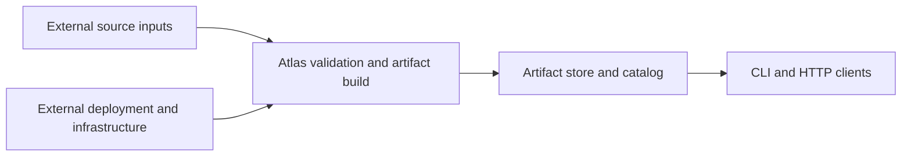
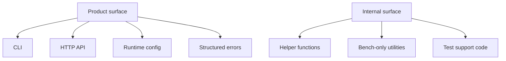
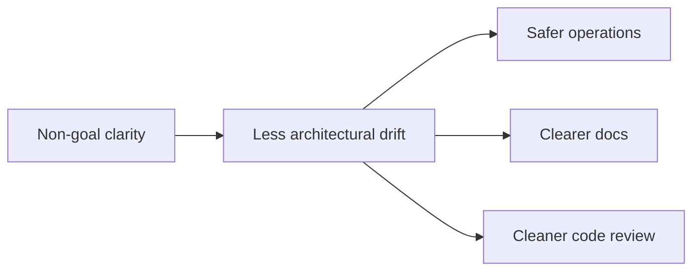

# Boundaries and Non-Goals

Atlas becomes easier to trust when its boundaries are explicit. This page explains what Atlas owns, what it depends on, and what it intentionally does not try to be.

## Atlas System Boundary

Atlas owns:

- validation and normalization of supported data inputs
- artifact generation and release-shaped dataset workflows
- catalog and serving integration over built artifacts
- runtime and operational behavior of the Atlas server
- documented contracts for stable surfaces

Atlas does not own:

- upstream data source correctness
- external infrastructure guarantees outside documented operational assumptions
- arbitrary ad hoc data transforms outside supported workflows
- undocumented helper behavior as a public promise

## Reader-Facing Boundary Model

The key distinction is between supported surfaces and implementation detail. Atlas tries to keep that distinction boring:

- commands, endpoints, and contracts are public-facing
- helpers, shims, and internal glue are not

## What Atlas Is Not Trying to Be

Atlas is not:

- a general ETL framework
- a generic workflow runner
- a mutable operational database where runtime writes redefine release state
- a shell-script-first control plane
- a compatibility promise for every internal Rust path

## Why These Non-Goals Matter

When a system tries to be everything, documentation, code ownership, and contracts all blur together. Atlas does better when it stays narrow:

- artifacts are durable truth
- contracts are explicit truth
- runtime code serves or validates that truth

## Boundary Questions to Ask During Changes

1. Does this change alter a public surface or only an implementation detail?
2. Does this belong to artifact state, runtime state, or operational procedure?
3. Is the change making Atlas broader than it needs to be?
4. Would a user or operator reasonably expect this to be stable?

If the answer to the last question is yes, the change probably belongs in a contract-aware path and should be documented as such.

