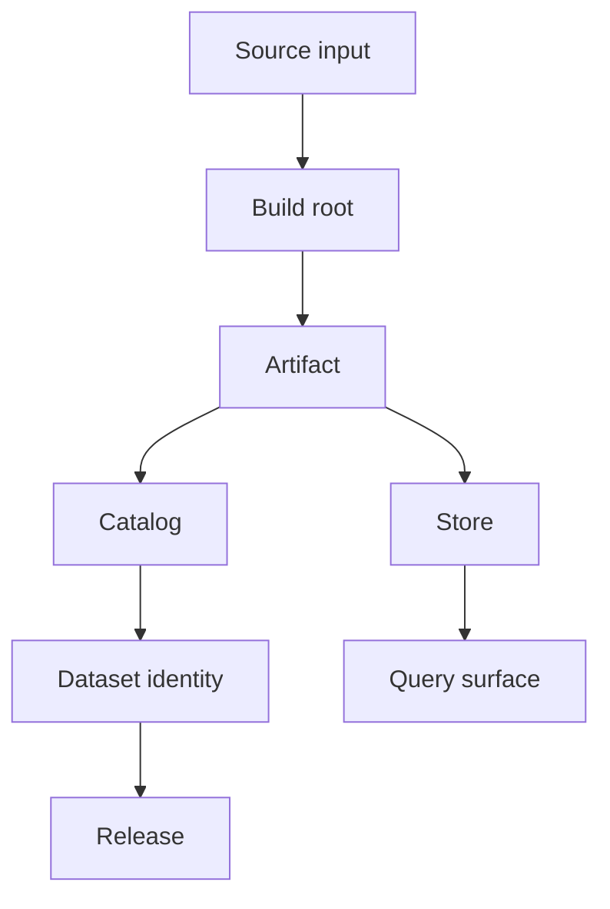
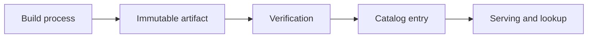
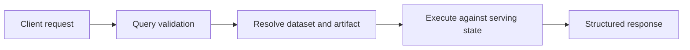

# Core Concepts

The rest of the Atlas documentation assumes a small vocabulary. If these concepts are clear, most commands, APIs, and architecture pages become much easier to read.

## The Concept Map

This concept map shows the vocabulary Atlas keeps separate. If these terms blur together, readers
often misread later workflow pages and assume a successful local build is already the final serving
state.

The most common mistake is to collapse these boundaries into one idea. Atlas works better when you keep them distinct:

- source inputs are not yet release state
- a build root is validated output, but not yet the serving store
- published artifacts and catalog state are the durable serving boundary

## Build Root

A build root is the validated output of ingest before publication into a serving store. It exists so
Atlas can inspect and verify produced dataset state before the runtime starts depending on it.

Treat the build root as a staging boundary, not as the final public-serving shape.

## Dataset

A dataset is the logical unit of released data. In Atlas docs, dataset identity is usually expressed
by release, species, and assembly together. It is the thing you validate, publish, catalog, and
later query.

## Release

A release is the versioned point in time for dataset content. Releases matter because:

- clients ask for them explicitly
- compatibility and diff workflows compare them
- publication and rollback are release-shaped operations

## Artifact

An artifact is the durable, immutable output of a validated build process. Artifacts are the safe handoff point between ingest-time concerns and runtime serving concerns.

This artifact path matters because it explains why Atlas has more than one boundary after ingest.
The product deliberately creates room to verify and publish before the runtime depends on the data.

## Catalog

A catalog is the discoverable inventory of published datasets and their artifact locations or metadata. It answers two practical questions:

- what published dataset identities exist
- where the runtime should find their durable release state

## Store

The store is the persistence layer for immutable artifacts and related content. Atlas can expose
different store implementations, but the conceptual role is stable: hold durable artifact state, not
transient request state and not raw ingest fixtures.

## Query

A query is a request over published dataset state. Atlas query behavior is defined by:

- explicit parameters
- compatibility rules
- cost and limit enforcement
- deterministic structured responses

This query flow anchors later API and architecture pages. Atlas query behavior is not just “run SQL”
or “hit an endpoint”; it is a validated request against explicit published dataset state.

## Runtime Configuration

Runtime configuration controls how the server behaves, not what the released data means. That distinction matters:

- data artifacts define content state
- runtime config defines server behavior around that state

## Contract

A contract is a documented and test-backed promise about some stable surface. Atlas uses contracts for:

- API schemas and endpoint behavior
- runtime configuration
- error codes and structured output
- operational expectations

## Why These Concepts Matter

Most Atlas confusion comes from mixing these layers:

- treating source inputs as if they were already release artifacts
- treating a build root as if it were already the serving store
- treating server memory or cache state as if it were durable product state
- treating internal helper code as if it were part of the public contract

When in doubt, ask three questions:

1. Is this source input, validated dataset state, or immutable artifact state?
2. Is this about runtime behavior or durable release content?
3. Is this a contract-owned surface or an implementation detail?

## Terms Worth Remembering

- build root: validated ingest output before publication into a serving store
- artifact: immutable durable release output
- catalog: published discoverability layer for dataset identities
- store: persistence layer for immutable artifacts used by the runtime

## Purpose

This page explains the Atlas material for core concepts and points readers to the canonical checked-in workflow or boundary for this topic.

## Stability

This page is part of the canonical Atlas docs spine. Keep it aligned with the current repository behavior and adjacent contract pages.
