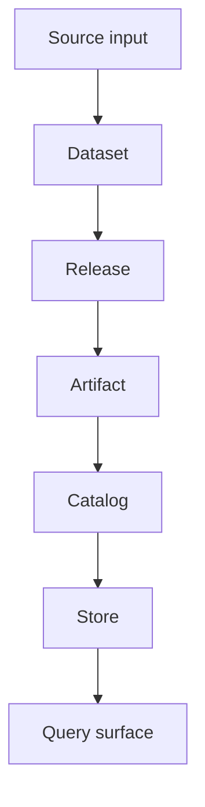
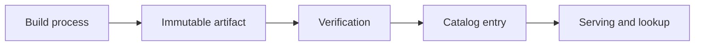
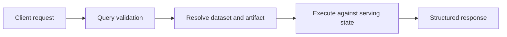

# Core Concepts

The rest of the Atlas documentation assumes a small vocabulary. If these concepts are clear, most commands, APIs, and architecture pages become much easier to read.

## The Concept Map

## Dataset

A dataset is the logical unit of released data identified by release, species, and assembly. It is the thing you validate, publish, catalog, and later query.

## Release

A release is a versioned point in time for dataset content. Releases matter because:

- clients ask for them explicitly
- compatibility and diff workflows compare them
- publication and rollback are release-shaped operations

## Artifact

An artifact is the durable, immutable output of a validated build process. Artifacts are the safe handoff point between ingest-time concerns and runtime serving concerns.

## Catalog

A catalog is the discoverable inventory of published datasets and their artifact locations or metadata. It tells Atlas what is available and where the durable release state lives.

## Store

The store is the persistence layer for immutable artifacts and related content. Atlas can expose different store implementations, but the conceptual role is stable: hold durable artifact state, not transient request state.

## Query

A query is a request over published dataset state. Atlas query behavior is defined by:

- explicit parameters
- compatibility rules
- cost and limit enforcement
- deterministic structured responses

## Runtime Configuration

Runtime configuration controls how the server behaves, not what the released data means. That distinction matters:

- data artifacts define content state
- runtime config defines server behavior around that state

## Contract

A contract is a documented and test-backed promise about some stable surface. Atlas uses contracts for:

- API schemas and endpoint behavior
- runtime configuration
- error codes and structured output
- operational expectations

## Why These Concepts Matter

Most Atlas confusion comes from mixing these layers:

- treating source inputs as if they were already release artifacts
- treating server memory or cache state as if it were durable product state
- treating internal helper code as if it were part of the public contract

When in doubt, ask three questions:

1. Is this source input, validated dataset state, or immutable artifact state?
2. Is this about runtime behavior or durable release content?
3. Is this a contract-owned surface or an implementation detail?

