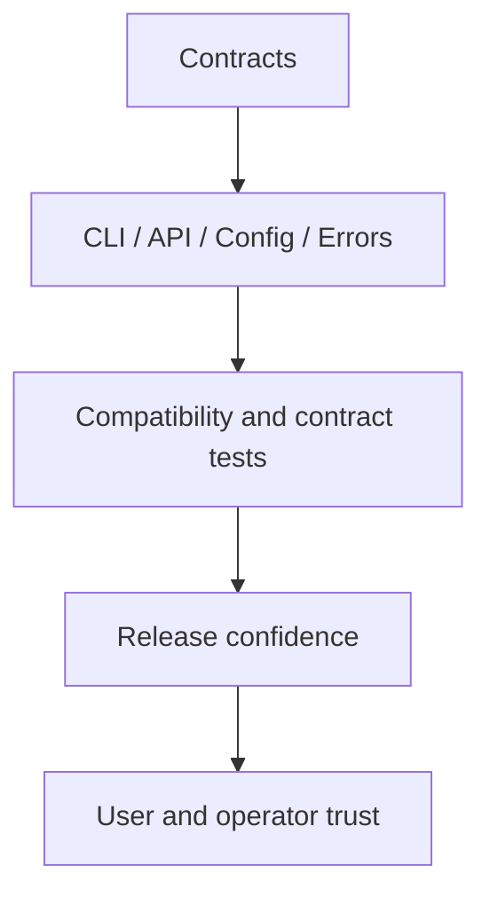
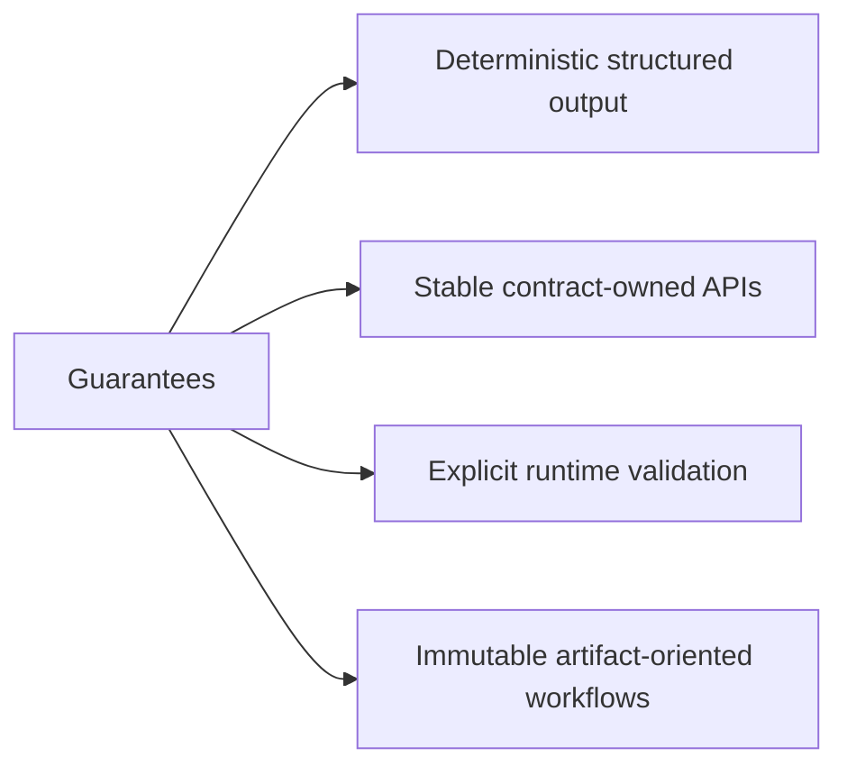
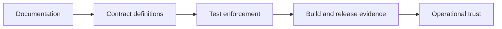

# Guarantees and Stability

Atlas is opinionated about stability: it does not promise everything, but what it does promise should be explicit, test-backed, and documented.

## The Stability Stack

Atlas aims to make stability understandable by layer:

- public commands and options are more stable than internal helper code
- API schemas and structured output are more stable than ad hoc debug payloads
- runtime config contracts are more stable than undocumented environment-dependent behavior

## What Atlas Tries to Guarantee

Atlas tries to provide:

- deterministic machine-readable output where documented
- explicit validation rather than silent coercion
- stable contract-owned API and config surfaces
- immutable artifact workflows for release state

## What Atlas Does Not Guarantee

- all internal Rust module paths remain unchanged
- all debug-only behavior remains stable
- all internal fixtures or benchmark helpers are public API
- every implementation detail remains source-compatible across refactors

## Why Stability Is Evidence-Based

Atlas does not treat “we intended this to be stable” as enough. Stability is meaningful only when:

- the surface is documented
- ownership is clear
- tests enforce it
- releases validate it

## How to Interpret Stability in Practice

If you are a user:

- trust documented commands, config contracts, and query behavior

If you are an operator:

- trust documented runtime and operational contracts, not incidental local behavior

If you are a maintainer:

- do not turn undocumented implementation details into accidental promises

## Next Pages

- [Run Atlas Locally](../02-getting-started/run-atlas-locally.md)
- [Contracts and Boundaries](../05-architecture/contracts-and-boundaries.md)
- [Ownership and Versioning](../08-contracts/ownership-and-versioning.md)

