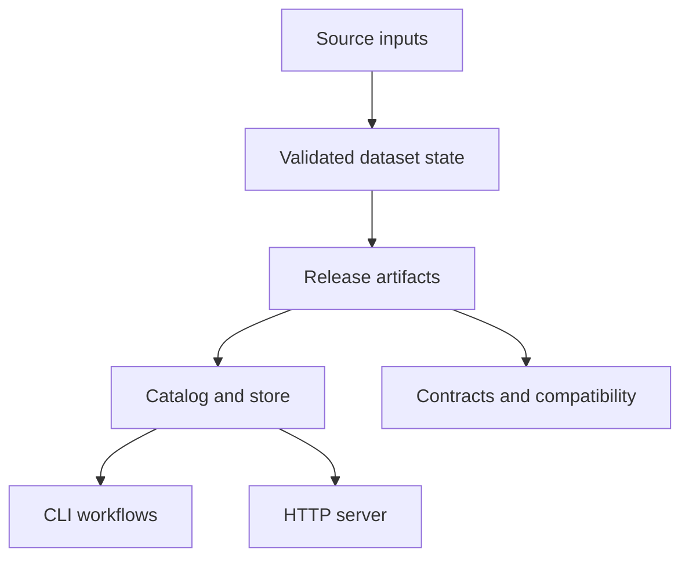
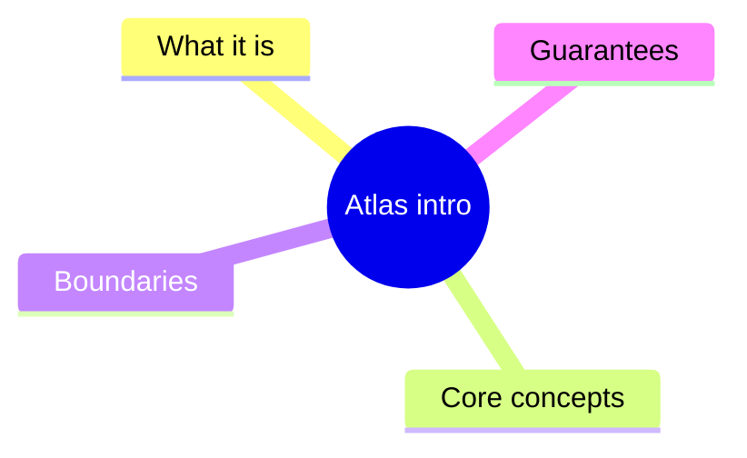
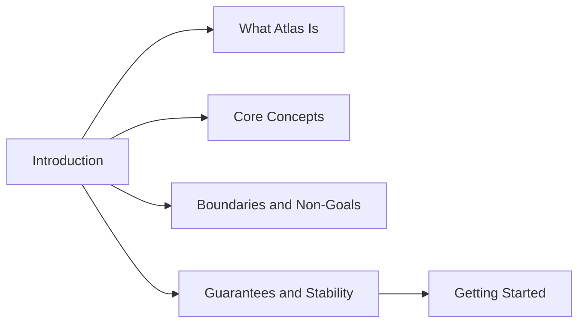

# Introduction

This section builds the mental model you need before you start running commands or reading source code.

Atlas is easiest to understand when you separate four concerns:

- source inputs are not the product
- immutable release artifacts are the durable product state
- server and CLI surfaces are views over those artifacts
- contracts define which parts of that behavior are stable

This flow is the core introduction model. It shows that Atlas centers the artifact boundary, not the
source tree and not the live server process. Readers who understand this diagram will read the rest
of the docs with the right expectations.

The introduction pages answer these foundational questions:

- what Atlas is and is not
- which concepts matter to every reader
- where the system boundaries are
- what guarantees Atlas actually makes

This mind map explains why the introduction section exists at all. It is not a feature tour. It is
the conceptual groundwork needed before workflow pages or reference pages will make sense.

## Pages in This Section

- [What Atlas Is](what-atlas-is.md)
- [Core Concepts](core-concepts.md)
- [Boundaries and Non-Goals](boundaries-and-non-goals.md)
- [Guarantees and Stability](guarantees-and-stability.md)

This page map shows the intended order inside the section. Most readers should move through these
pages before jumping into commands, because each page removes a different category of confusion.

## What You Should Know After This Section

- what Atlas considers a durable product artifact
- which behaviors are described as current implementation versus stable promise
- where Atlas draws system boundaries and non-goals
- which next section to read for hands-on work

## Reading Advice

Do not skip this section if you are planning to:

- ingest new data
- operate the server
- change runtime behavior
- review compatibility claims

Without this model, it is easy to confuse source files with durable artifacts, runtime details with public contracts, or internal code layout with user-facing guarantees.

## Common Reader Mistakes This Section Prevents

- assuming ingest output and published serving artifacts are the same thing
- treating every CLI detail as a compatibility commitment
- assuming the live server is the source of truth for dataset state
- reading architecture pages before learning the product vocabulary

## Purpose

This page explains the Atlas material for introduction and points readers to the canonical checked-in workflow or boundary for this topic.

## Stability

This page is part of the canonical Atlas docs spine. Keep it aligned with the current repository behavior and adjacent contract pages.
