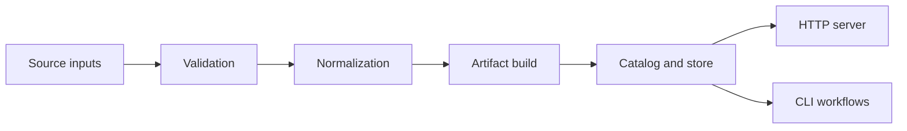
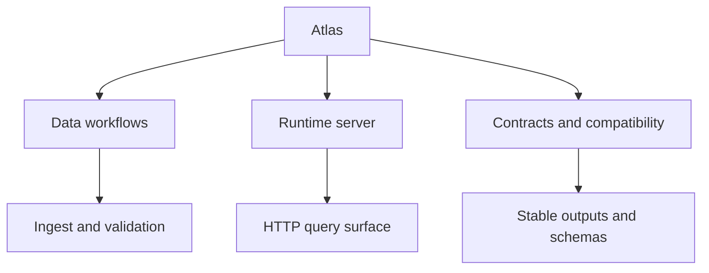
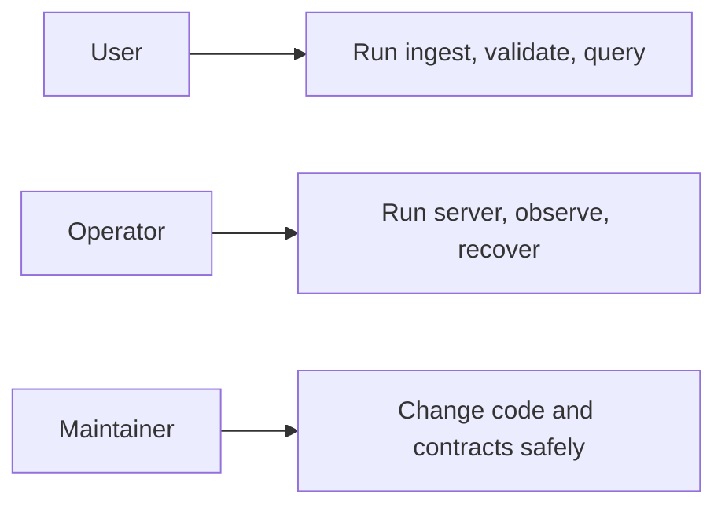

# What Atlas Is

Atlas is a data-serving system built around a simple discipline: validate inputs explicitly, build immutable release artifacts deterministically, and expose those artifacts through well-defined query and operational surfaces.

Atlas is not just a server and not just a CLI. It is a full workflow that begins with source inputs, passes through validation and artifact construction, and ends with stable ways to inspect or serve the resulting release data.

## The Product in One Picture

Atlas treats the artifact boundary as the center of gravity. That means:

- raw inputs are important, but they are not the serving surface
- runtime services are important, but they are not the source of truth
- stable artifacts and contracts are what tie the whole system together

## The Three Main Faces of Atlas

1. Data workflow system
   Atlas validates source inputs, creates artifacts, and tracks releases.

2. Runtime system
   Atlas serves those artifacts through a query-oriented HTTP surface and health or observability endpoints.

3. Contract system
   Atlas publishes stability expectations through config, API, error, and output contracts.

## Who Atlas Is For

Atlas serves three kinds of readers and users:

- users who need deterministic dataset and catalog workflows
- operators who need a predictable runtime and clear observability
- maintainers who need a codebase with explicit ownership and compatibility boundaries

## What Atlas Optimizes For

- deterministic outputs over accidental convenience
- explicit contracts over implied behavior
- immutable artifacts over mutable serving state
- evidence and validation over trust-by-convention

## What Makes Atlas Different

Atlas is opinionated in ways that matter operationally:

- it resists hidden runtime mutation
- it treats structured output as a product surface
- it keeps artifact ownership separate from server request handling
- it tries to make compatibility visible rather than accidental

## Read Next

- [Core Concepts](core-concepts.md)
- [Boundaries and Non-Goals](boundaries-and-non-goals.md)
- [Run Atlas Locally](../02-getting-started/run-atlas-locally.md)

