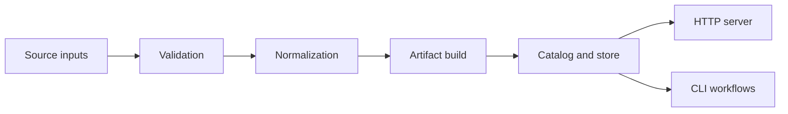
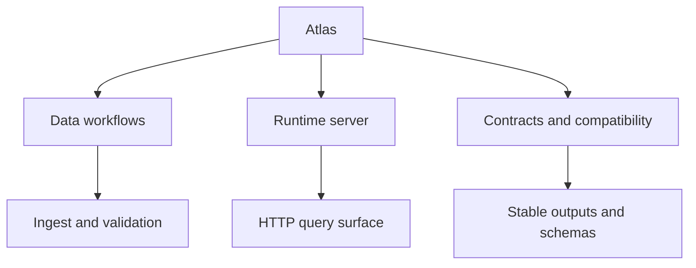
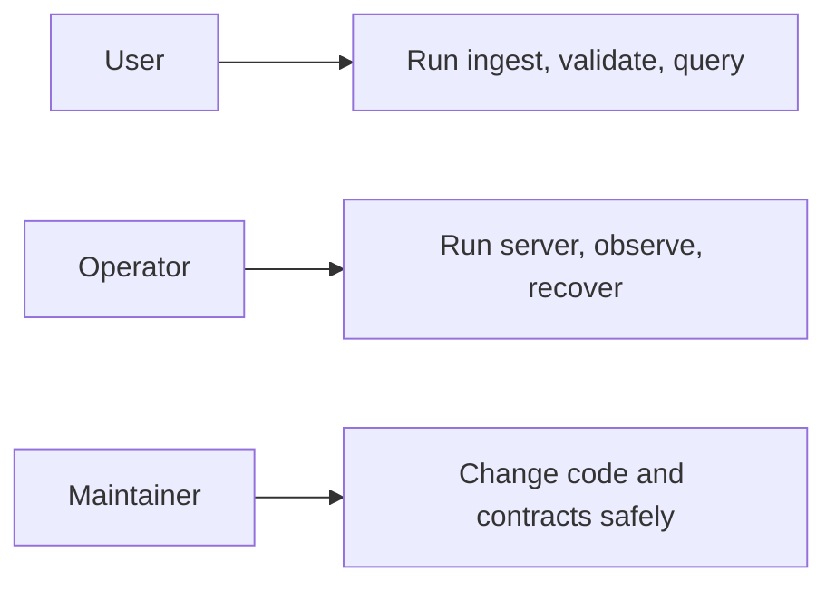

# What Atlas Is

Atlas is a data-serving system built around a simple discipline: validate inputs explicitly, build
immutable release artifacts deterministically, and expose those artifacts through well-defined query
and operational surfaces.

Atlas is not just a server and not just a CLI. It is a full workflow that begins with source inputs,
passes through validation and artifact construction, and ends with stable ways to inspect or serve
the resulting release data.

## The Product in One Picture

This diagram is the shortest honest description of the product. Atlas is not only a runtime and not
only a build tool. It is a governed path from inputs to immutable artifacts and then to serving
surfaces.

Atlas treats the artifact boundary as the center of gravity. That means:

- raw inputs are important, but they are not the serving surface
- runtime services are important, but they are not the source of truth
- stable artifacts and contracts are what tie the whole system together

## The Three Main Faces of Atlas

This view matters because many readers arrive through only one face of Atlas. The product is easier
to understand when you see how data workflows, runtime behavior, and contracts reinforce each other
instead of competing for ownership.

1. Data workflow system
   Atlas validates source inputs, creates artifacts, and tracks releases.

2. Runtime system
   Atlas serves those artifacts through a query-oriented HTTP surface and health or observability endpoints.

3. Contract system
   Atlas publishes stability expectations through config, API, error, and output contracts.

## Who Atlas Is For

Atlas serves three kinds of readers and users:

This audience diagram sets expectations for the rest of the docs. Different readers need different
entry points, but they are still reading one coherent product surface.

- users who need deterministic dataset and catalog workflows
- operators who need a predictable runtime and clear observability
- maintainers who need a codebase with explicit ownership and compatibility boundaries

## Where Atlas Fits Well

Atlas is a strong fit when you need:

- explicit ingest validation before data becomes serveable
- durable release artifacts that can be published, cataloged, and rolled back deliberately
- query and operational surfaces that are easier to reason about than mutable runtime state
- engineering workflows where documented contracts matter more than convenience shortcuts

## Where Atlas Is a Weak Fit

Atlas is a weak fit when you need:

- a generic data transformation framework for arbitrary pipelines
- live runtime writes to redefine release content on the fly
- a minimal tool with almost no governance or compatibility surface
- every internal helper, fixture, or crate path to be treated like public API

## What Atlas Optimizes For

- deterministic outputs over accidental convenience
- explicit contracts over implied behavior
- immutable artifacts over mutable serving state
- evidence and validation over trust-by-convention

## What Makes Atlas Different

Atlas is opinionated in ways that matter operationally:

- it resists hidden runtime mutation
- it treats structured output as a product surface
- it keeps artifact ownership separate from server request handling
- it tries to make compatibility visible rather than accidental

## What a Reader Should Take Away

- Atlas separates source inputs, artifact production, and runtime serving on purpose.
- Atlas treats contracts as part of the product, not as documentation garnish.
- Atlas is strongest when you want deterministic release-shaped data workflows.

## Common Misreadings to Avoid

- Atlas is not a claim that every local shortcut is a supported production workflow.
- Atlas is not a promise that every internal repository detail is stable.
- Atlas is not a generic mutable database that rewrites release content at runtime.

## Current Limits to Keep in Mind

- Atlas does not claim ownership of upstream data correctness; it validates what crosses supported input boundaries.
- Atlas does not treat ingest build output as the serving contract. Publication into a serving store is a separate step on purpose.
- Atlas does not promise that internal Rust module layout, debug-only output, or maintainer-only automation surfaces are stable for downstream consumers.

## Read Next

- [Core Concepts](core-concepts.md)
- [Boundaries and Non-Goals](boundaries-and-non-goals.md)
- [Run Atlas Locally](../02-getting-started/run-atlas-locally.md)

## Purpose

This page explains the Atlas material for what atlas is and points readers to the canonical checked-in workflow or boundary for this topic.

## Stability

This page is part of the canonical Atlas docs spine. Keep it aligned with the current repository behavior and adjacent contract pages.
