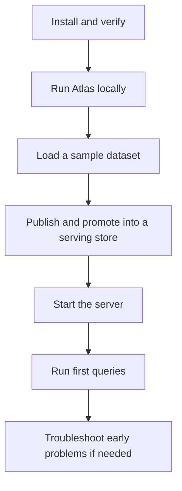
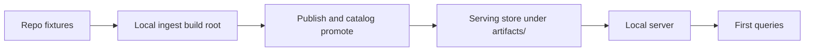
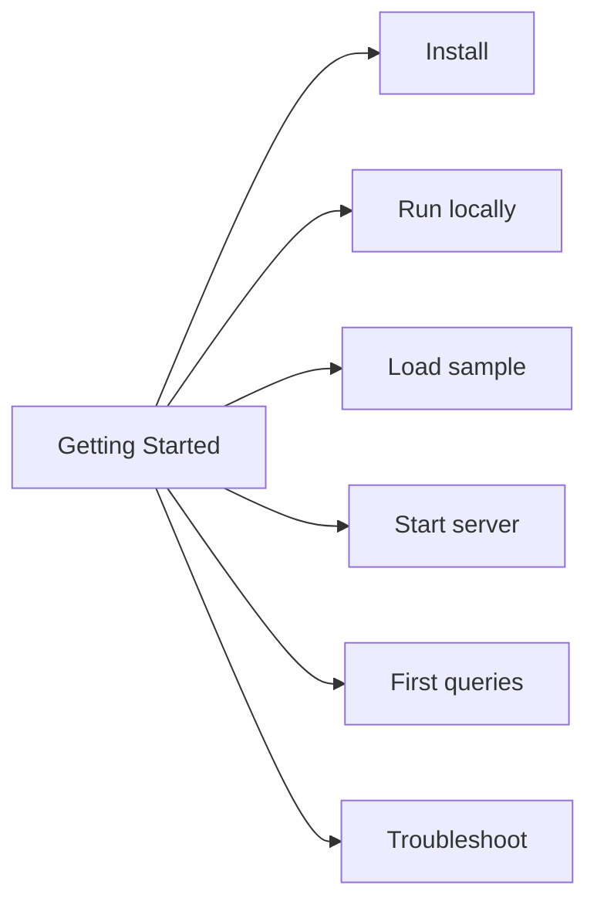

# Getting Started

This section gets Atlas running with real commands and real repository fixtures.

The goal is not to teach every feature. The goal is to give you a successful first run that makes the rest of the documentation meaningful.

## The First-Run Path

## What You Will Have at the End

- a working Atlas CLI invocation
- a sample build root under `artifacts/`
- a sample serving store under `artifacts/`
- a running local Atlas server
- successful queries against the local runtime

## Pages in This Section

- [Install and Verify](install-and-verify.md)
- [Run Atlas Locally](run-atlas-locally.md)
- [Load a Sample Dataset](load-a-sample-dataset.md)
- [Start the Server](start-the-server.md)
- [Run Your First Queries](run-your-first-queries.md)
- [Troubleshoot Early Problems](troubleshoot-early-problems.md)

## Ground Rules

- commands prefer repository-relative paths so you can follow them from the workspace root
- sample data comes from committed test fixtures rather than invented fake commands
- output roots go under `artifacts/`, not inside crate directories

## Purpose

This page explains the Atlas material for getting started and points readers to the canonical checked-in workflow or boundary for this topic.

## Stability

This page is part of the canonical Atlas docs spine. Keep it aligned with the current repository behavior and adjacent contract pages.
