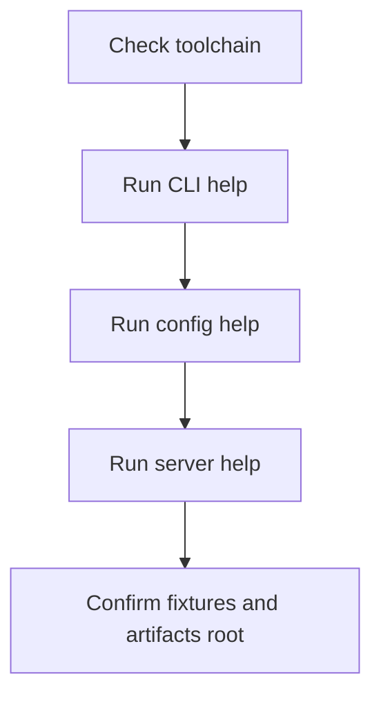
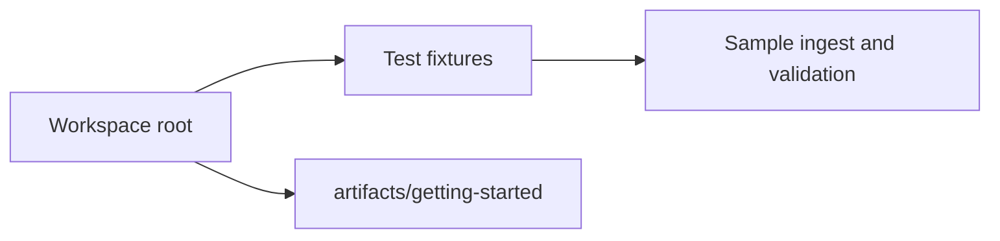
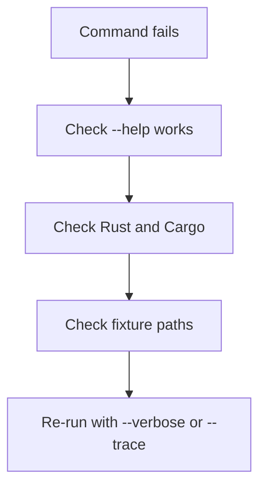

# Install and Verify

The fastest reliable way to start with Atlas is to run it from the workspace with Cargo. That avoids installation drift while you are learning the system.

This page verifies that the binaries, fixture paths, and local artifact roots are usable. It does not verify that ingest, publication, or runtime serving are already correct. Those come in later steps.

## Verification Flow



## Prerequisites

- Rust toolchain compatible with the workspace
- Cargo
- a shell that can run `cargo run`

## Step 1: Verify the CLI Entrypoint

```bash
cargo run -p bijux-atlas --bin bijux-atlas -- --help
```

You should see the top-level families such as `config`, `catalog`, `dataset`, `ingest`, `diff`, `gc`, `policy`, and `openapi`.

If `--help` does not work, stop here. A failing help surface usually means the workspace or binary wiring is not healthy enough for the rest of the getting-started flow.

## Step 2: Verify Runtime and Config Surfaces

```bash
cargo run -p bijux-atlas --bin bijux-atlas -- config --help
cargo run -p bijux-atlas --bin bijux-atlas-server -- --help
```

These two commands tell you whether both the product CLI and runtime server binary are wired correctly in your environment.

They do not prove that your local store, dataset, or runtime configuration is valid yet. They only prove that the entrypoints are present and invokable.

## Step 3: Verify Repository Fixture Availability and Local Output Paths

```bash
ls crates/bijux-atlas/tests/fixtures/tiny
ls crates/bijux-atlas/tests/fixtures/realistic
mkdir -p artifacts/getting-started/tiny-build
mkdir -p artifacts/getting-started/tiny-store
mkdir -p artifacts/getting-started/server-cache
```

Atlas documentation uses committed fixtures under `crates/bijux-atlas/tests/fixtures/` for the getting-started path.



## Step 4: Sanity-Check the CLI in JSON Mode

```bash
cargo run -p bijux-atlas --bin bijux-atlas -- config --canonical --json
```

This is a good first check because it exercises a structured-output path without requiring a built dataset or running server.

It is also the first place to notice whether your shell setup, JSON mode, and top-level config surface agree with each other.

## If Something Fails



- if `cargo run` fails, resolve the workspace build issue first
- if help commands fail, do not proceed to ingest or server startup
- if fixture paths are missing, confirm you are at the repository root

## What Good Looks Like

At this point you should be able to:

- run CLI help successfully
- run server help successfully
- see committed fixtures under `crates/bijux-atlas/tests/fixtures`
- create an `artifacts/getting-started` directory for local outputs

If all of that works, you have a usable starting environment. You do not yet have proof that Atlas can ingest, publish, or serve real dataset state.
