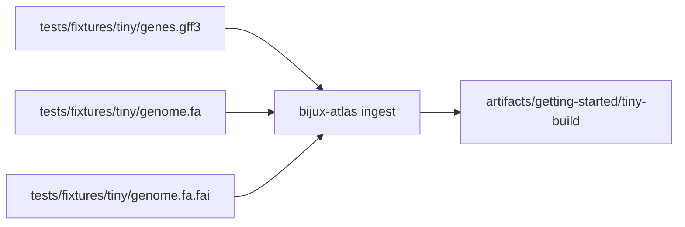
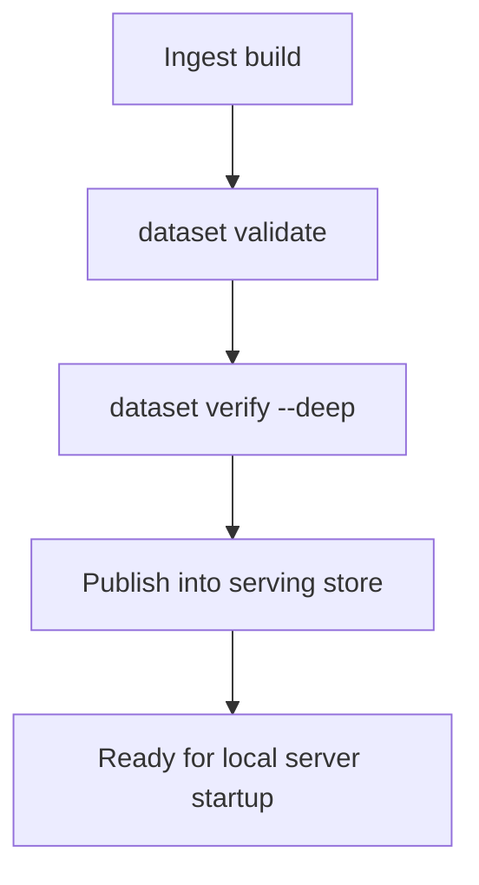
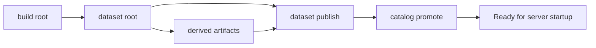

# Load a Sample Dataset

This guide builds a small local dataset from the committed `tiny` fixtures so you have real Atlas artifacts to validate and serve.

The point of this guide is not just to make files appear on disk. The point is to walk through the intended data path: ingest, validate, verify, publish, and promote.

## Sample Input Set



This input diagram makes the required dataset ingredients explicit. The tutorial uses the committed
`tiny` fixture so readers can reproduce the flow exactly instead of adapting undocumented local
inputs on the first attempt.

## Build the Tiny Sample

Run from the repository root:

```bash
mkdir -p artifacts/getting-started/tiny-build
mkdir -p artifacts/getting-started/tiny-store

cargo run -p bijux-atlas --bin bijux-atlas -- ingest \
  --gff3 crates/bijux-atlas/tests/fixtures/tiny/genes.gff3 \
  --fasta crates/bijux-atlas/tests/fixtures/tiny/genome.fa \
  --fai crates/bijux-atlas/tests/fixtures/tiny/genome.fa.fai \
  --output-root artifacts/getting-started/tiny-build \
  --release 110 \
  --species homo_sapiens \
  --assembly GRCh38
```

Those identity flags matter. If you change them, later validation, publication, and query steps must use the same values.

## Why This Input Set

The `tiny` fixture is small enough for a fast first run but still exercises the main ingest contract:

- GFF3 annotation input
- FASTA sequence input
- FAI index input
- release, species, and assembly identity

This fixture is intentionally tiny. It is useful for learning the workflow shape, not for proving realistic throughput, storage pressure, or operational behavior.

## Validate the Built Dataset Root

```bash
cargo run -p bijux-atlas --bin bijux-atlas -- dataset validate \
  --root artifacts/getting-started/tiny-build \
  --release 110 \
  --species homo_sapiens \
  --assembly GRCh38
```

For a deeper pass:

```bash
cargo run -p bijux-atlas --bin bijux-atlas -- dataset verify \
  --root artifacts/getting-started/tiny-build \
  --release 110 \
  --species homo_sapiens \
  --assembly GRCh38 \
  --deep
```

Use `validate` first and `verify --deep` second. If `validate` already fails, jumping straight to deeper checks usually adds noise rather than clarity.



This sequence matters because it turns a raw ingest run into a checked dataset root before the
runtime ever sees it. Atlas is intentionally conservative at that boundary.

## Publish into a Serving Store

The build root is validated dataset state. The server expects a serving store with published artifacts and catalog state.

```bash
cargo run -p bijux-atlas --bin bijux-atlas -- dataset publish \
  --source-root artifacts/getting-started/tiny-build \
  --store-root artifacts/getting-started/tiny-store \
  --release 110 \
  --species homo_sapiens \
  --assembly GRCh38

cargo run -p bijux-atlas --bin bijux-atlas -- catalog promote \
  --store-root artifacts/getting-started/tiny-store \
  --release 110 \
  --species homo_sapiens \
  --assembly GRCh38
```

Do not treat publication and promotion as optional ceremony. They are the
boundary between "I built something" and "the runtime can discover and serve it
in the intended way."

Keep the identity flags consistent across ingest, validate, verify, publish, and promote. If the
release, species, or assembly values drift, later failures can look like runtime bugs when they are
really just identity mismatches.

## What You Should See

- a build root under `artifacts/getting-started/tiny-build`
- a valid dataset root for release `110`, species `homo_sapiens`, assembly `GRCh38`
- derived artifact files under the build release path such as the manifest, QC outputs, and SQLite summary
- a serving store under `artifacts/getting-started/tiny-store` containing published artifacts and `catalog.json`



This expected-output diagram helps readers confirm the result shape, not only the command exit
status. A successful first run should leave both a validated build root and a serving store ready
for runtime startup.

## If This Step Fails

- confirm you are using the repository fixture paths exactly
- confirm `artifacts/getting-started/tiny-build` and `artifacts/getting-started/tiny-store` are writable
- re-run with `--verbose` or `--trace` for more detail
- use the `tiny` fixture first before trying the `realistic` fixture
- fix the first failing boundary before continuing; do not skip from ingest failure straight to server startup

## What This Step Proves

- the committed fixture set is valid for the documented ingest path
- Atlas can build and verify a sample dataset root locally
- publication and catalog promotion create discoverable serving state

## Purpose

This page explains the Atlas material for load a sample dataset and points readers to the canonical checked-in workflow or boundary for this topic.

## Stability

This page is part of the canonical Atlas docs spine. Keep it aligned with the current repository behavior and adjacent contract pages.
