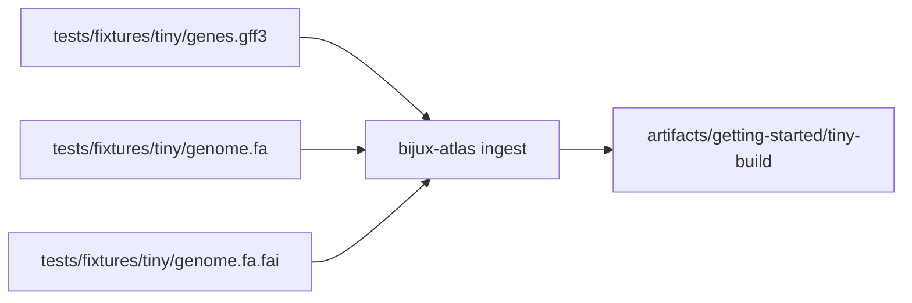
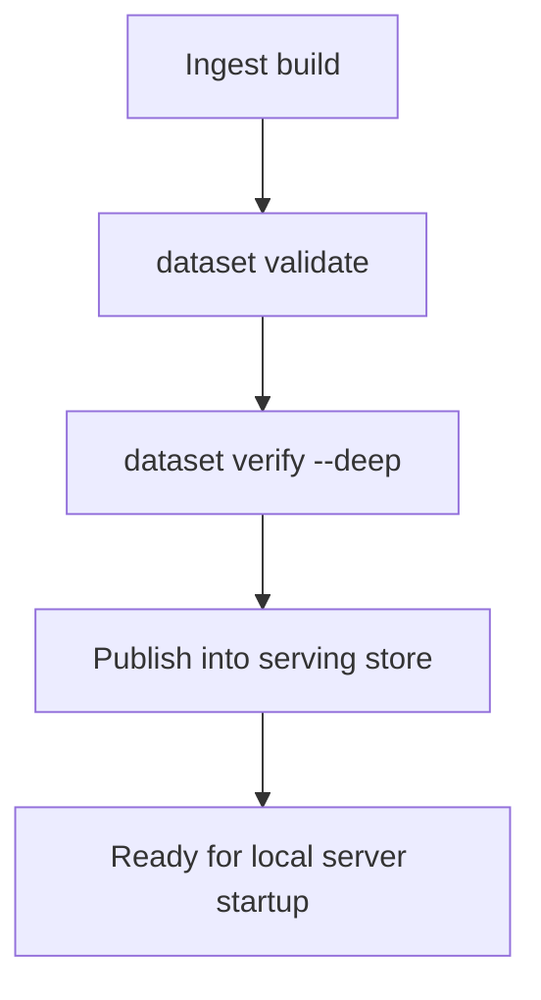
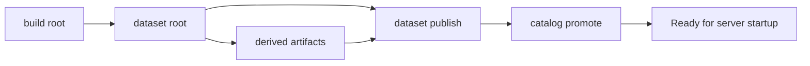

# Load a Sample Dataset

This guide builds a small local dataset from the committed `tiny` fixtures so you have real Atlas artifacts to validate and serve.

## Sample Input Set



## Build the Tiny Sample

Run from the repository root:

```bash
mkdir -p artifacts/getting-started/tiny-build
mkdir -p artifacts/getting-started/tiny-store

cargo run -p bijux-atlas --bin bijux-atlas -- ingest \
  --gff3 crates/bijux-atlas/tests/fixtures/tiny/genes.gff3 \
  --fasta crates/bijux-atlas/tests/fixtures/tiny/genome.fa \
  --fai crates/bijux-atlas/tests/fixtures/tiny/genome.fa.fai \
  --output-root artifacts/getting-started/tiny-build \
  --release 110 \
  --species homo_sapiens \
  --assembly GRCh38
```

## Why This Input Set

The `tiny` fixture is small enough for a fast first run but still exercises the main ingest contract:

- GFF3 annotation input
- FASTA sequence input
- FAI index input
- release, species, and assembly identity

## Validate the Built Dataset Root

```bash
cargo run -p bijux-atlas --bin bijux-atlas -- dataset validate \
  --root artifacts/getting-started/tiny-build \
  --release 110 \
  --species homo_sapiens \
  --assembly GRCh38
```

For a deeper pass:

```bash
cargo run -p bijux-atlas --bin bijux-atlas -- dataset verify \
  --root artifacts/getting-started/tiny-build \
  --release 110 \
  --species homo_sapiens \
  --assembly GRCh38 \
  --deep
```



## Publish into a Serving Store

The build root is validated dataset state. The server expects a serving store with published artifacts and catalog state.

```bash
cargo run -p bijux-atlas --bin bijux-atlas -- dataset publish \
  --source-root artifacts/getting-started/tiny-build \
  --store-root artifacts/getting-started/tiny-store \
  --release 110 \
  --species homo_sapiens \
  --assembly GRCh38

cargo run -p bijux-atlas --bin bijux-atlas -- catalog promote \
  --store-root artifacts/getting-started/tiny-store \
  --release 110 \
  --species homo_sapiens \
  --assembly GRCh38
```

## What You Should See

- a build root under `artifacts/getting-started/tiny-build`
- a valid dataset root for release `110`, species `homo_sapiens`, assembly `GRCh38`
- derived artifact files under the build release path such as the manifest, QC outputs, and SQLite summary
- a serving store under `artifacts/getting-started/tiny-store` containing published artifacts and `catalog.json`



## If This Step Fails

- confirm you are using the repository fixture paths exactly
- confirm `artifacts/getting-started/tiny-build` and `artifacts/getting-started/tiny-store` are writable
- re-run with `--verbose` or `--trace` for more detail
- use the `tiny` fixture first before trying the `realistic` fixture
