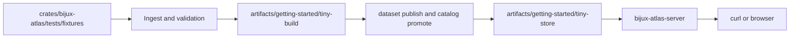
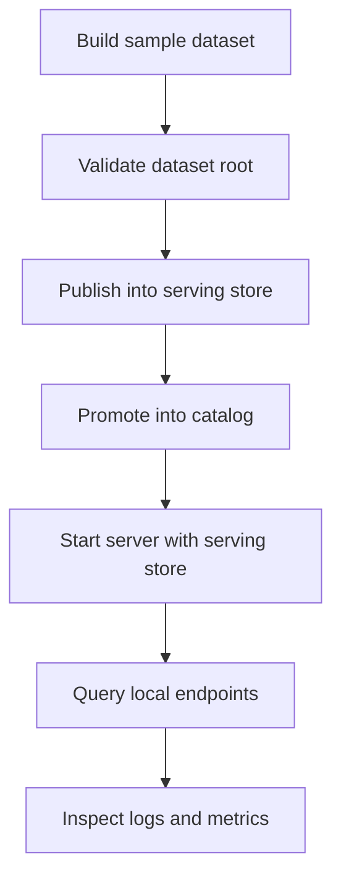
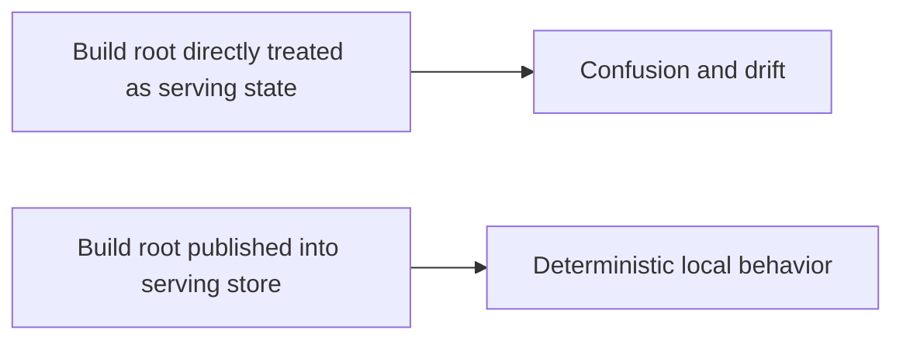

# Run Atlas Locally

Running Atlas locally is easiest when you separate the workflow into three areas:

- source fixtures
- built artifacts
- runtime processes

A good local run proves that your inputs, artifacts, store, and server wiring agree with each other.
It does not prove that production infrastructure, scaling, or operational policy are already
correct.

## Local Layout



## Prepare a Local Workspace

```bash
mkdir -p artifacts/getting-started/tiny-build
mkdir -p artifacts/getting-started/tiny-store
mkdir -p artifacts/getting-started/server-cache
```

Keep all throwaway local outputs under `artifacts/`. Do not create crate-local scratch directories.

## Inspect the Main Surfaces

```bash
cargo run -p bijux-atlas --bin bijux-atlas -- --help
cargo run -p bijux-atlas --bin bijux-atlas-server -- --help
```

## Understand the Local Loop



The local development loop is not “start the server and hope.” It is:

1. build a sample dataset into an artifact root
2. validate the resulting build root
3. publish and promote into a serving store
4. point the server at that serving store
5. query the resulting release state

## Why Atlas Prefers This Loop

Atlas is artifact-centric. That means local runtime behavior should be tested against built dataset state, not against half-prepared source inputs or improvised mutable state.



## What This Local Loop Proves

- ingest and validation accept the chosen fixture set
- publication creates a serving-shaped store and catalog state
- the runtime can boot from that store with explicit config
- query behavior matches the release state you just built

## What This Local Loop Does Not Prove

- that a shared or production deployment is sized, secured, or observed correctly
- that local filesystem shortcuts are acceptable in managed environments
- that skipping publication into a serving store is safe just because a local test happened to work

## Recommended Local Sequence

- follow [Load a Sample Dataset](load-a-sample-dataset.md)
- then follow [Start the Server](start-the-server.md)
- then follow [Run Your First Queries](run-your-first-queries.md)

## Local Success Criteria

You are running Atlas locally in the intended way when:

- ingest outputs live under `artifacts/`
- dataset validation succeeds on the build root
- the serving store contains published artifacts plus catalog state
- the server points at the serving store rather than raw fixtures or the ingest build root
- queries return data for the release you just built

If any of those conditions are false, you may still have a working demo, but you do not yet have the Atlas workflow running in its intended shape.

## Purpose

This page explains the Atlas material for run atlas locally and points readers to the canonical checked-in workflow or boundary for this topic.

## Stability

This page is part of the canonical Atlas docs spine. Keep it aligned with the current repository behavior and adjacent contract pages.
