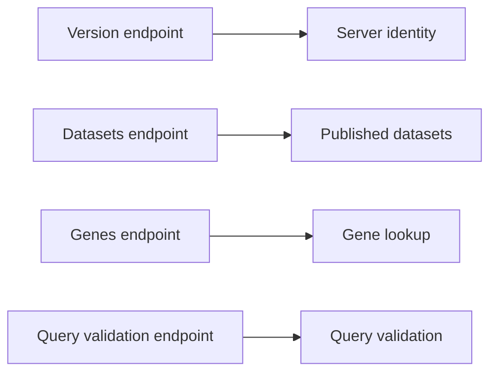
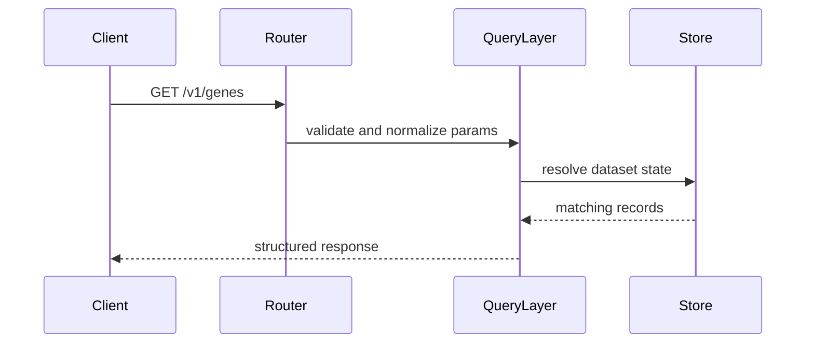
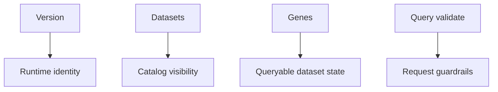

# Run Your First Queries

After the server is running, the quickest way to understand Atlas is to hit a small set of stable endpoints that show identity, data lookup, and query validation behavior.

## First Query Set



## 1. Check Server Identity

```bash
curl -s http://127.0.0.1:8080/v1/version
```

This confirms you are talking to a live Atlas runtime rather than only a health endpoint.

## 2. Discover Published Datasets

```bash
curl -s "http://127.0.0.1:8080/v1/datasets"
```

This confirms the server can see the catalog and published dataset identity that came from your built sample store.

## 3. Run a Simple Gene Query

```bash
curl -s "http://127.0.0.1:8080/v1/genes?release=110&species=homo_sapiens&assembly=GRCh38&gene_id=g1&limit=1"
```

## 4. Run a Gene Count Query

```bash
curl -s "http://127.0.0.1:8080/v1/genes/count?release=110&species=homo_sapiens&assembly=GRCh38&gene_id=g1"
```



## 5. Validate a Query Without Executing It

```bash
curl -s \
  -H 'Content-Type: application/json' \
  -d '{"release":"110","species":"homo_sapiens","assembly":"GRCh38","gene_id":"g1","limit":"1"}' \
  http://127.0.0.1:8080/v1/query/validate
```

This endpoint is useful when you want to understand whether a request is well-formed before you depend on full execution behavior.

## What These Queries Teach You



- `v1/version` proves the runtime is alive
- `v1/datasets` proves the store and catalog are wired
- `v1/genes` proves the query path is working with an explicit selector
- `v1/query/validate` proves request-shape rules are active before execution

## What to Do Next

- read [Configuration and Output](../03-user-guide/configuration-and-output.md)
- read [Query Workflows](../03-user-guide/query-workflows.md)
- read [Request Lifecycle](../05-architecture/request-lifecycle.md)

## Purpose

This page explains the Atlas material for run your first queries and points readers to the canonical checked-in workflow or boundary for this topic.

## Stability

This page is part of the canonical Atlas docs spine. Keep it aligned with the current repository behavior and adjacent contract pages.
