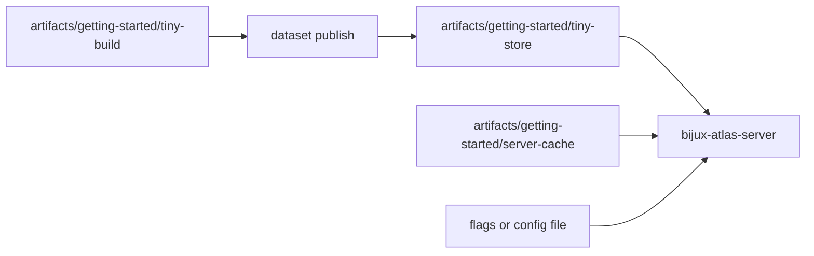
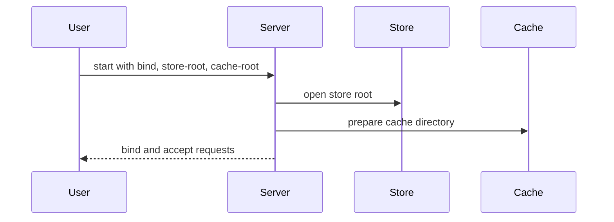
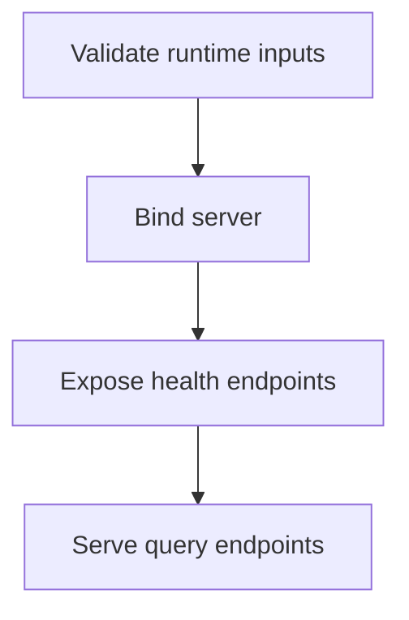

# Start the Server

Once you have published and promoted a sample dataset into a serving store, starting the local
server is straightforward: point the runtime at that store root and keep the cache root under
`artifacts/`.

The important precondition is real: the sample dataset must already be published and
catalog-promoted. Starting the server against a build root is a workflow mistake, not a supported
shortcut.

## Runtime Inputs



## Validate the Runtime Shape First

```bash
mkdir -p artifacts/getting-started/server-cache

cargo run -p bijux-atlas --bin bijux-atlas-server -- \
  --store-root artifacts/getting-started/tiny-store \
  --cache-root artifacts/getting-started/server-cache \
  --validate-config
```

This is a low-risk first step because it validates runtime inputs without committing to a long-running process.

If `--validate-config` fails, fix that before trying to bind the server. A broken validation step usually means startup would fail or produce misleading partial behavior anyway.

## Start the Local Server

```bash
cargo run -p bijux-atlas --bin bijux-atlas-server -- \
  --bind 127.0.0.1:8080 \
  --store-root artifacts/getting-started/tiny-store \
  --cache-root artifacts/getting-started/server-cache
```

Leave the server running in one terminal while you query it from another.

## Startup Sequence



## First Health Checks

In another terminal:

```bash
curl -s http://127.0.0.1:8080/healthz
curl -s http://127.0.0.1:8080/readyz
curl -s http://127.0.0.1:8080/v1/version
```

Interpret them in order:

- `healthz` tells you whether the process is alive enough to answer
- `readyz` tells you whether it considers itself ready to serve
- `/v1/version` tells you whether the API surface is reachable beyond pure health plumbing

## What the Startup Model Is Protecting



Atlas tries to make startup failure explicit rather than turning configuration drift into partial runtime behavior.

## If the Server Does Not Start

- confirm the sample dataset was built, published, and catalog-promoted first
- confirm the `--store-root` points at the serving store, not the ingest build root or source fixture directory
- confirm the `--cache-root` is under `artifacts/` and writable
- re-run with `--print-effective-config` if you need to inspect resolved settings
- treat “process started” and “runtime is ready” as different questions

## Purpose

This page explains the Atlas material for start the server and points readers to the canonical checked-in workflow or boundary for this topic.

## Stability

This page is part of the canonical Atlas docs spine. Keep it aligned with the current repository behavior and adjacent contract pages.
