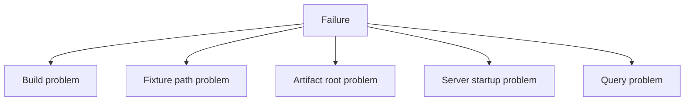
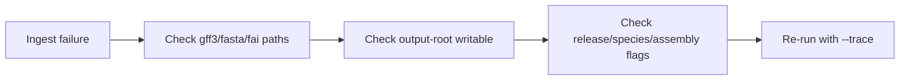
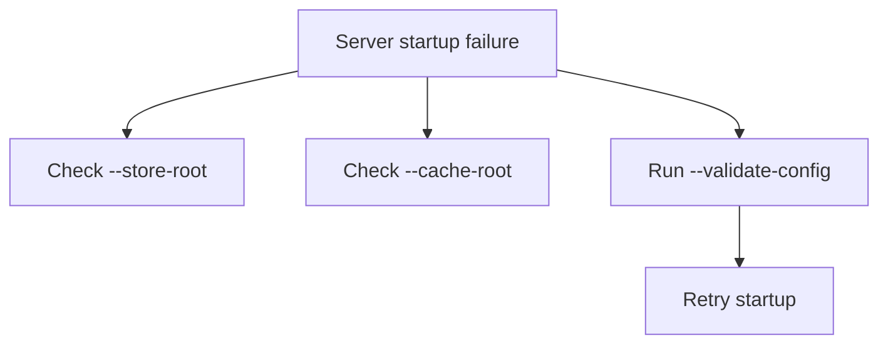

# Troubleshoot Early Problems

Most first-run Atlas failures fall into a small number of categories. This page is meant to shorten the time between “something failed” and “I know which layer is wrong.”

## Early Failure Map



## If `cargo run` Fails Before the Command Starts

Focus on build and workspace issues first:

- confirm you are at the repository root
- confirm the workspace compiles
- re-run the exact command with `--verbose` or `--trace`

## If Fixture Paths Cannot Be Found

Check that these exist:

```bash
ls crates/bijux-atlas/tests/fixtures/tiny/genes.gff3
ls crates/bijux-atlas/tests/fixtures/tiny/genome.fa
ls crates/bijux-atlas/tests/fixtures/tiny/genome.fa.fai
```

If they do not, you are likely not at the workspace root or the worktree is incomplete.

## If Ingest Fails



Common causes:

- wrong fixture path
- build root not writable
- mismatched flags for release, species, or assembly
- trying to skip the FAI or other required inputs

## If Dataset Validation Fails

The usual causes are:

- ingest never completed successfully
- validation is pointed at the wrong build root
- release identity flags do not match the built output

Always validate the same root you passed as `--output-root` during ingest.

## If the Server Fails Even Though Ingest Succeeded

One common reason is using the ingest build root as if it were the serving store. Atlas serving expects published artifacts plus a catalog.

Run these steps before startup:

```bash
cargo run -p bijux-atlas --bin bijux-atlas -- dataset publish \
  --source-root artifacts/getting-started/tiny-build \
  --store-root artifacts/getting-started/tiny-store \
  --release 110 \
  --species homo_sapiens \
  --assembly GRCh38

cargo run -p bijux-atlas --bin bijux-atlas -- catalog promote \
  --store-root artifacts/getting-started/tiny-store \
  --release 110 \
  --species homo_sapiens \
  --assembly GRCh38
```

## If the Server Does Not Start



Use:

```bash
cargo run -p bijux-atlas --bin bijux-atlas-server -- \
  --store-root artifacts/getting-started/tiny-store \
  --cache-root artifacts/getting-started/server-cache \
  --validate-config
```

## If Health Works but Queries Fail

That usually means the runtime started, but the store or dataset resolution path is not returning the state you expect.

Check:

- `curl -s http://127.0.0.1:8080/v1/version`
- `curl -s http://127.0.0.1:8080/v1/datasets`
- your query parameters for release, species, and assembly

## Fast Diagnosis Order

1. Can `--help` run?
2. Can the fixture files be listed?
3. Did ingest complete?
4. Did dataset validation pass?
5. Does server config validation pass?
6. Does `v1/version` work?
7. Does `v1/datasets` work?

If you answer those in order, you usually isolate the failing layer quickly.
