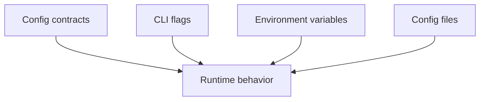
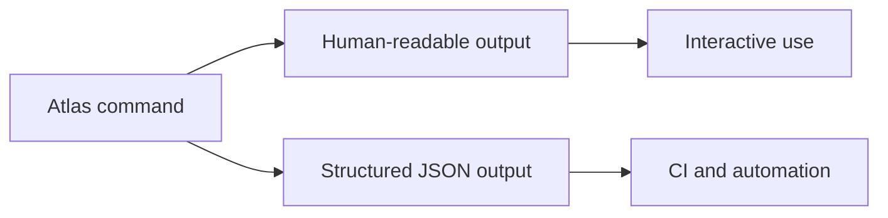
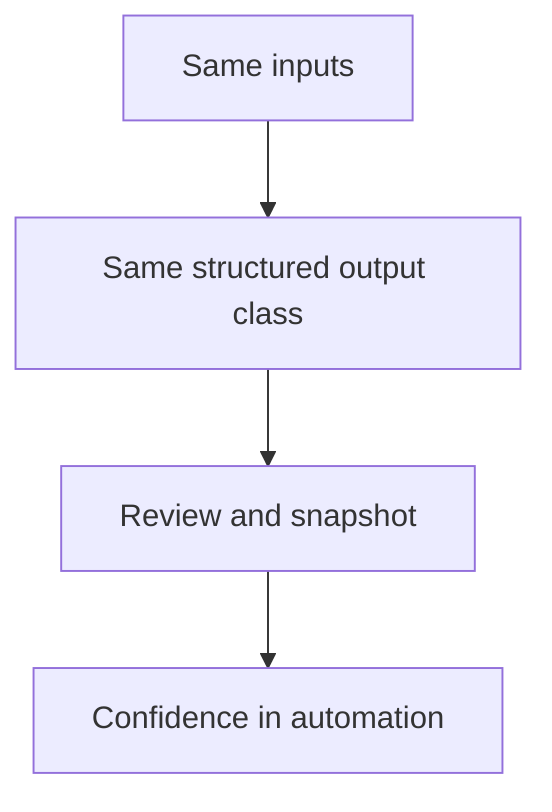

# Configuration and Output

Atlas tries to make two things explicit:

- how behavior is configured
- how results are reported back to you

That matters because Atlas is designed for automation and review, not only interactive use.

This page is about user-facing output and configuration habits. It is not a promise that every string printed by every command is stable forever.

## Configuration Model



This configuration model shows the supported inputs that shape runtime behavior. It also signals an
important honesty rule: readers should prefer documented flags, files, and environment variables
over accidental local defaults.

In practice:

- CLI commands expose explicit flags
- server startup exposes runtime flags and optional config-file usage
- environment variables exist for a small number of stable cases such as logging and cache root behavior

## Output Model



This output split is one of the most important practical boundaries in Atlas. Human-readable output
helps people inspect behavior, while structured output is what automation should depend on.

Atlas output is designed around two modes:

- human-readable output for direct usage
- deterministic structured output for automation

The important rule is:

- human output is for people first
- documented structured output is for automation first

## When to Use `--json`

Use `--json` when:

- you want stable machine-readable output
- you are capturing results in CI
- you want to compare outputs across runs

Prefer human-readable mode when:

- you are exploring commands interactively
- you are diagnosing failures in a terminal

Do not mix the two mental models. If a workflow might be automated later, start with `--json` early instead of reverse-engineering terminal text later.

## Common Output Expectations

- success and failure should be explicit
- output should not depend on hidden local state if the same inputs are provided
- structured output should be stable enough for governed automation
- undocumented debug prose should not be treated as a parser target



This determinism diagram is here to explain why Atlas spends effort on structured output contracts.
Automation becomes safer when the same inputs lead to the same output class and field shape.

## Practical Commands

Inspect canonical config:

```bash
cargo run -p bijux-atlas --bin bijux-atlas -- config --canonical --json
```

Inspect server runtime surface:

```bash
cargo run -p bijux-atlas --bin bijux-atlas-server -- --help
```

## Good Habits

- keep artifact and cache roots under `artifacts/`
- prefer explicit paths over relying on the current directory
- use `--json` for anything you may later automate
- do not assume undocumented debug text is part of the stable contract

## Honest Boundary

If you are depending on a field or response shape in automation, verify that it is documented in reference or contracts. Being visible in one command run is not enough by itself.

## A Good User Habit

- use human-readable output while learning a command
- switch to `--json` before you automate the workflow
- confirm the exact field contract in reference or contract pages

## Purpose

This page explains the Atlas material for configuration and output and points readers to the canonical checked-in workflow or boundary for this topic.

## Stability

This page is part of the canonical Atlas docs spine. Keep it aligned with the current repository behavior and adjacent contract pages.
