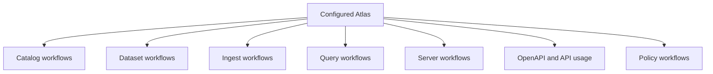
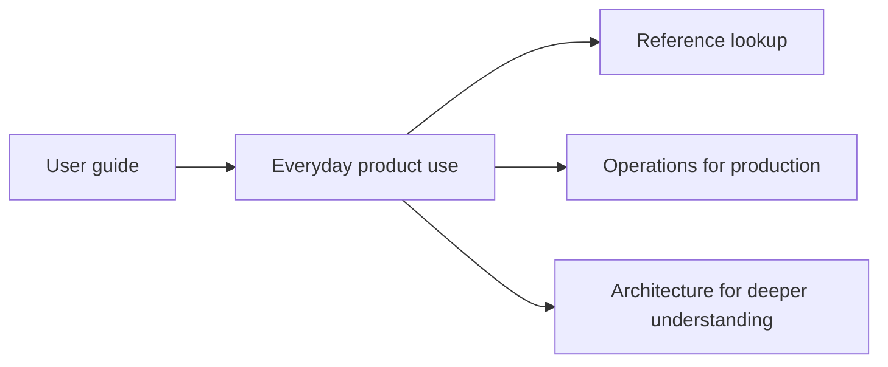

# User Guide

This section explains how to use Atlas once you already understand the basics and can complete the first-run flow.

The user guide is organized by practical work:

- prepare configuration and understand outputs
- validate, publish, and move datasets and catalogs
- build diffs, query results, and OpenAPI artifacts
- operate the everyday product surface without drifting into maintainer internals

This workflow map shows the practical jobs Atlas users return to most often. The user guide is
organized around those jobs so readers can start from the action they need instead of from internal
implementation structure.

This second diagram clarifies the section boundary. The user guide should help you use Atlas well,
but it should not try to replace the operator runbooks, reference indexes, or maintainer
architecture pages.

## Pages in This Section

- [Configuration and Output](configuration-and-output.md)
- [Catalog Workflows](catalog-workflows.md)
- [Dataset Workflows](dataset-workflows.md)
- [Ingest Workflows](ingest-workflows.md)
- [Query Workflows](query-workflows.md)
- [Server Workflows](server-workflows.md)
- [OpenAPI and API Usage](openapi-and-api-usage.md)
- [Policy Workflows](policy-workflows.md)
- [Troubleshooting](troubleshooting.md)

## What This Section Is Not

This section is not:

- the deep system explanation of why the code is shaped a certain way
- the production operator runbook
- the complete reference listing of every config key or endpoint

For those, move to:

- [Operations](../04-operations/index.md)
- [Architecture](../05-architecture/index.md)
- [Reference](../07-reference/index.md)

## When to Use This Section

- you can already run Atlas locally
- you need to repeat a workflow such as ingest, publish, query, or server startup
- you want procedure and examples, not just a flat command listing

## Purpose

This page explains the Atlas material for user guide and points readers to the canonical checked-in workflow or boundary for this topic.

## Stability

This page is part of the canonical Atlas docs spine. Keep it aligned with the current repository behavior and adjacent contract pages.
