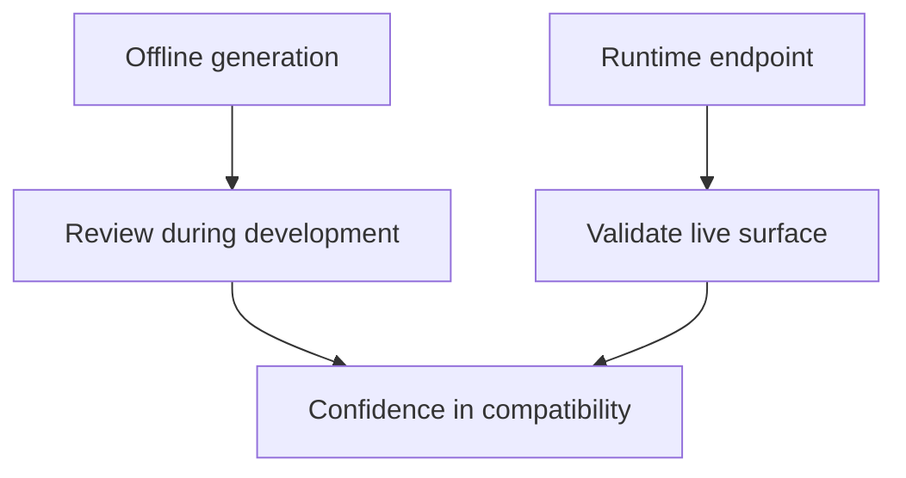

# OpenAPI and API Usage

Atlas exposes its HTTP surface both as running endpoints and as a generated OpenAPI document. Those two views should reinforce each other.

## OpenAPI Relationship

```mermaid
flowchart LR
    Contracts[API contracts] --> Generate[openapi generate]
    Generate --> File[openapi.generated.json]
    Runtime[Running server] --> Endpoint[/v1/openapi.json]
    File --> Consumers[Client generation and review]
    Endpoint --> Consumers
```

## Two Ways to Access the API Description

- offline generation through the CLI
- runtime retrieval through `/v1/openapi.json`

## Generate OpenAPI Offline

```bash
cargo run -p bijux-atlas --bin bijux-atlas -- openapi generate \
  --out configs/openapi/v1/openapi.generated.json
```

## Read OpenAPI from a Running Server

```bash
curl -s http://127.0.0.1:8080/v1/openapi.json
```

## Why Both Matter



The generated file is useful during code review, CI, and contract validation. The runtime endpoint is useful for confirming what a live server is exposing.

## API Usage Guidance

- treat OpenAPI as a description of the contract-owned surface, not as a substitute for operational understanding
- pair endpoint usage with explicit dataset identity fields
- use the generated contract during integration work and the runtime endpoint during environment verification

## Where to Read More

- [API Endpoint Index](../07-reference/api-endpoint-index.md)
- [API Compatibility](../08-contracts/api-compatibility.md)

