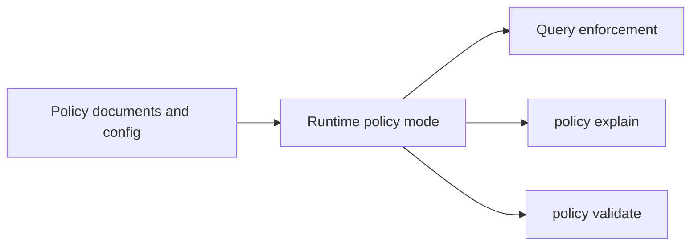
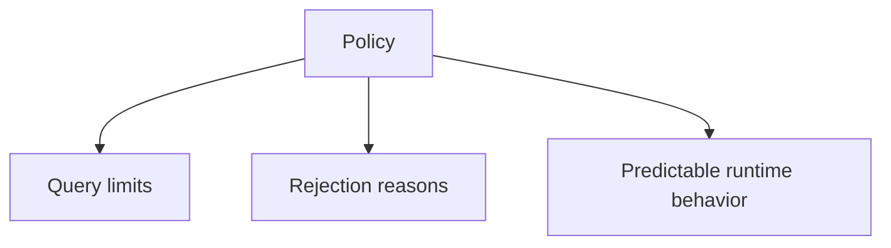

# Policy Workflows

Policy workflows explain how Atlas exposes and enforces runtime or query-related rules.

## Policy Surface



## Main Policy Commands

- `policy validate`
- `policy explain`

## Why Users Should Care About Policy



Policy is what turns “the server happened to reject my request” into “the server enforced a known rule for a known reason.”

## Practical Commands

Validate the active policy surface:

```bash
cargo run -p bijux-atlas --bin bijux-atlas -- policy validate --json
```

Explain active policy deltas:

```bash
cargo run -p bijux-atlas --bin bijux-atlas -- policy explain --json
```

## How to Read Policy Effects

If a query fails because it is too broad or too expensive, that is usually a policy decision, not a random implementation quirk.

Common policy-sensitive areas:

- full-scan restrictions
- page size limits
- region span limits
- serialization budget limits

## Workflow Advice

- use policy output to explain runtime behavior to clients
- do not treat policy rejection as a server bug by default
- change policy intentionally, not by relying on hidden defaults

