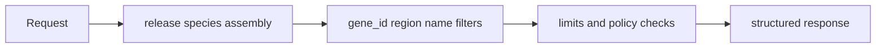
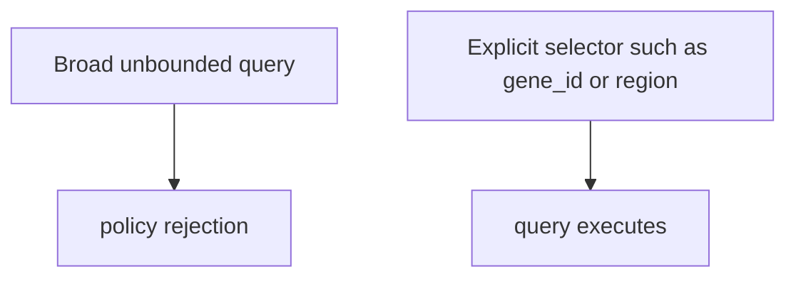

# Query Workflows

Atlas query workflows are designed around explicit dataset identity and explicit selectors. The query layer prefers clarity over permissive ambiguity.

## Query Shape



## Most Useful Query Endpoints

- `/v1/datasets`
- `/v1/version`
- `/v1/genes`
- `/v1/genes/count`
- `/v1/genes/{gene_id}/transcripts`
- `/v1/transcripts/{tx_id}`
- `/v1/query/validate`

## Use Explicit Selectors



The server will reject some broad scans unless they are explicitly allowed. For a reliable first query, prefer selectors such as:

- `gene_id`
- `region`
- bounded limits

## Good First Queries

```bash
curl -s "http://127.0.0.1:8080/v1/version"
curl -s "http://127.0.0.1:8080/v1/datasets"
curl -s "http://127.0.0.1:8080/v1/genes?release=110&species=homo_sapiens&assembly=GRCh38&gene_id=g1&limit=1"
curl -s "http://127.0.0.1:8080/v1/genes/count?release=110&species=homo_sapiens&assembly=GRCh38&gene_id=g1"
```

Validate a query shape before execution:

```bash
curl -s \
  -H 'Content-Type: application/json' \
  -d '{"release":"110","species":"homo_sapiens","assembly":"GRCh38","gene_id":"g1","limit":"1"}' \
  http://127.0.0.1:8080/v1/query/validate
```

## Query Workflow Advice

- always include release, species, and assembly
- prefer explicit selectors over wide scans
- use `query/validate` when teaching clients how to form requests
- treat policy rejection as signal, not as a nuisance to work around blindly

## Purpose

This page explains the Atlas material for query workflows and points readers to the canonical checked-in workflow or boundary for this topic.

## Stability

This page is part of the canonical Atlas docs spine. Keep it aligned with the current repository behavior and adjacent contract pages.
