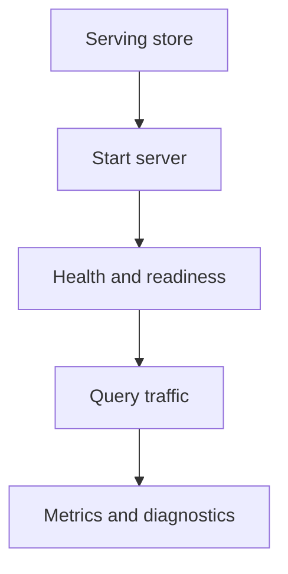

# Server Workflows

Server workflows cover the product-facing runtime surface: starting the server, checking health, and using the main HTTP routes as intended.

## Server Workflow Model



## Main Server Surfaces

```mermaid
flowchart LR
    Runtime[Server runtime] --> Health[/healthz /readyz]
    Runtime --> Metrics[/metrics]
    Runtime --> Version[/v1/version]
    Runtime --> Data[/v1/datasets and query routes]
    Runtime --> OpenAPI[/v1/openapi.json]
```

## Common Day-to-Day Actions

- validate config before startup
- bind to a local or service address
- check health and readiness before sending traffic
- verify dataset discovery through `/v1/datasets`
- confirm API identity through `/v1/version`

## Practical Startup

```bash
cargo run -p bijux-atlas --bin bijux-atlas-server -- \
  --bind 127.0.0.1:8080 \
  --store-root artifacts/getting-started/tiny-store \
  --cache-root artifacts/getting-started/server-cache
```

## Important Everyday Checks

```bash
curl -s http://127.0.0.1:8080/healthz
curl -s http://127.0.0.1:8080/readyz
curl -s http://127.0.0.1:8080/metrics
curl -s http://127.0.0.1:8080/v1/openapi.json
```

## Operational Boundary

This page explains normal usage of the runtime surface. For deployment, rollback, resource tuning, and incident handling, move to [Operations](../04-operations/index.md).

