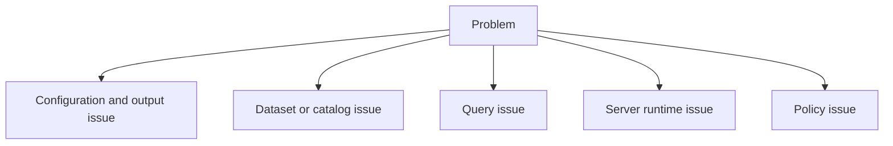
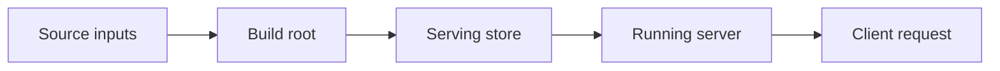

# Troubleshooting

This page is for problems that occur after the initial getting-started path: command confusion, workflow mismatches, rejected queries, or uncertainty about which Atlas layer you are interacting with.

## Troubleshooting Map

## The Fastest Diagnostic Question

Ask: which lifecycle stage am I in?

Most confusion comes from mixing those stages:

- build-root issues are not the same as serving-store issues
- serving-store issues are not the same as runtime issues
- runtime issues are not the same as query-shape issues

## Common User Errors

- trying to start the server against an ingest build root
- expecting broad queries to succeed without explicit selectors
- treating a missing catalog as a generic server failure
- using human-readable output in automation and then depending on its exact wording

## Practical Debug Order

1. confirm the command surface with `--help`
2. confirm the relevant build root or serving store exists
3. confirm dataset identity values are correct
4. confirm runtime health with `/healthz`, `/readyz`, and `/v1/version`
5. validate query shape before assuming the data is missing

## When to Leave This Section

Move to:

- [Operations](../04-operations/index.md) for deployment or production incidents
- [Reference](../07-reference/index.md) for exact endpoint or config lookup
- [Architecture](../05-architecture/index.md) if the problem is really conceptual confusion

