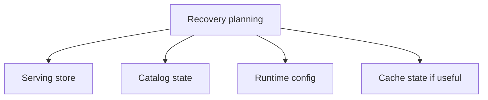

# Backup and Recovery

Atlas recovery planning should focus on the durable serving store and the ability to reconstruct runtime state safely.

## Recovery Priority

## What Matters Most

- published manifests and SQLite artifacts
- catalog state that exposes those published datasets
- the runtime configuration needed to serve them correctly

## Recovery Model

## Practical Advice

- back up the serving store, not only a build root
- treat catalog integrity as part of recoverability
- keep recovery procedures separate from cache rewarming procedures
- verify readiness after restore rather than assuming successful file copy equals successful service recovery

## What Recovery Is Not

Recovery is not “copy whatever is in the cache and hope for the best.” Cache loss may hurt performance, but store loss is what threatens durable serving ability.

## Purpose

This page explains the Atlas material for backup and recovery and points readers to the canonical checked-in workflow or boundary for this topic.

## Stability

This page is part of the canonical Atlas docs spine. Keep it aligned with the current repository behavior and adjacent contract pages.
