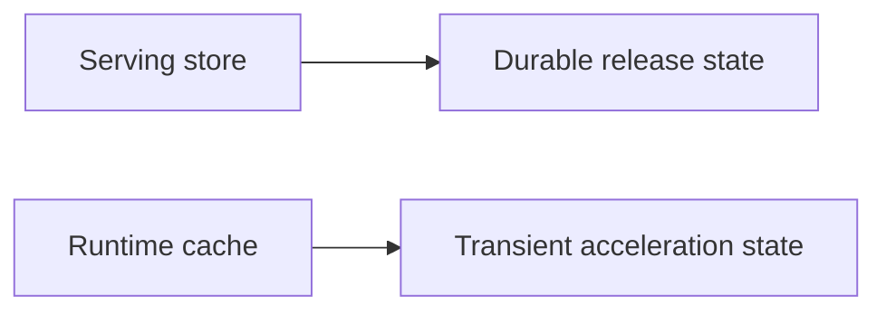
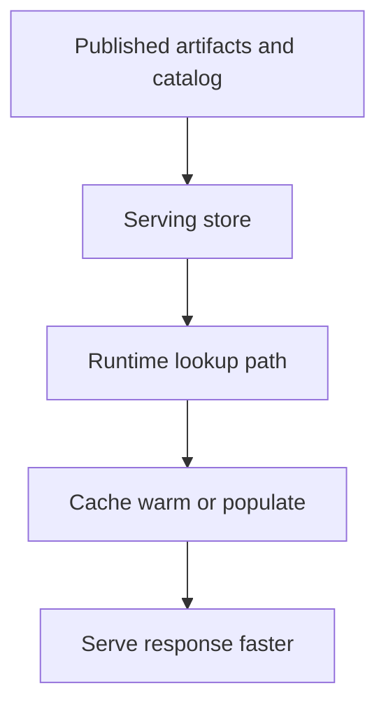

# Cache and Store Operations

Atlas has strong opinions about store and cache behavior because durable release state and transient performance state should not blur together.

## Store vs Cache

This store-versus-cache diagram names the most important operational separation in Atlas. The store
is durable serving truth; the cache is optional performance help.

The store is durable and authoritative for serving content.

The cache is disposable and performance-oriented.

## Operational Model

This operating model shows where the cache sits in the request path. It is downstream of the store,
which is why cache loss and store loss should be treated as different classes of incident.

## Operator Rules

- never treat cache contents as the durable source of truth
- keep cache roots under the sanctioned artifacts hierarchy
- understand what happens when caches are cold or unavailable
- validate store integrity before assuming query failures are only cache-related

## Practical Questions

- is the store root complete and discoverable?
- is `catalog.json` present and correct?
- is cache growth bounded and expected?
- can the service recover safely from cache loss?

## Failure Interpretation

If a cold cache makes responses slower, that is usually a performance issue.

If the store is missing or inconsistent, that is a correctness and availability issue.

## Operator Checks Worth Automating

- verify the serving store layout and catalog presence
- observe cache size, miss behavior, and recovery after cold start
- make sure cache loss does not look like data loss in your runbooks

## Purpose

This page explains the Atlas material for cache and store operations and points readers to the canonical checked-in workflow or boundary for this topic.

## Stability

This page is part of the canonical Atlas docs spine. Keep it aligned with the current repository behavior and adjacent contract pages.
