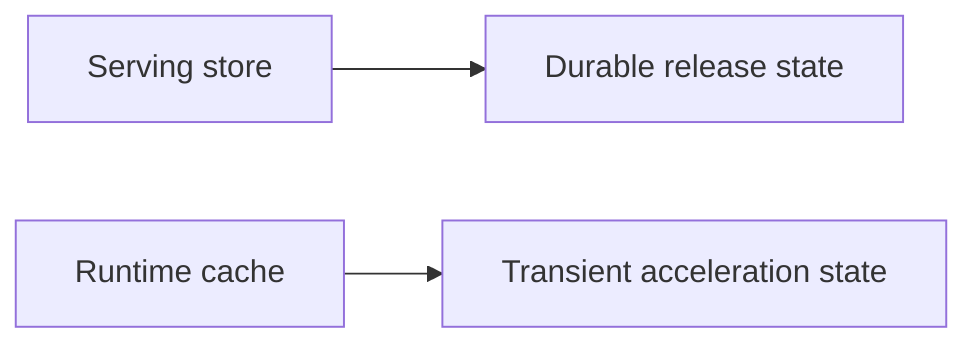
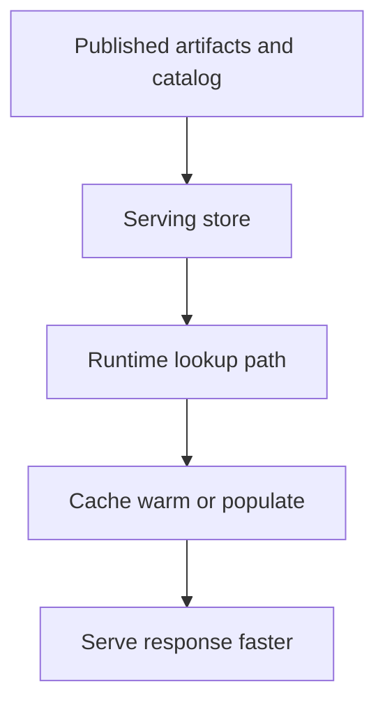

# Cache and Store Operations

Atlas has strong opinions about store and cache behavior because durable release state and transient performance state should not blur together.

## Store vs Cache

The store is durable and authoritative for serving content.

The cache is disposable and performance-oriented.

## Operational Model

## Operator Rules

- never treat cache contents as the durable source of truth
- keep cache roots under the sanctioned artifacts hierarchy
- understand what happens when caches are cold or unavailable
- validate store integrity before assuming query failures are only cache-related

## Practical Questions

- is the store root complete and discoverable?
- is `catalog.json` present and correct?
- is cache growth bounded and expected?
- can the service recover safely from cache loss?

## Failure Interpretation

If a cold cache makes responses slower, that is usually a performance issue.

If the store is missing or inconsistent, that is a correctness and availability issue.

