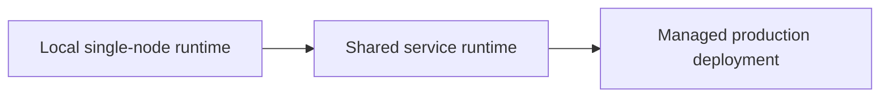
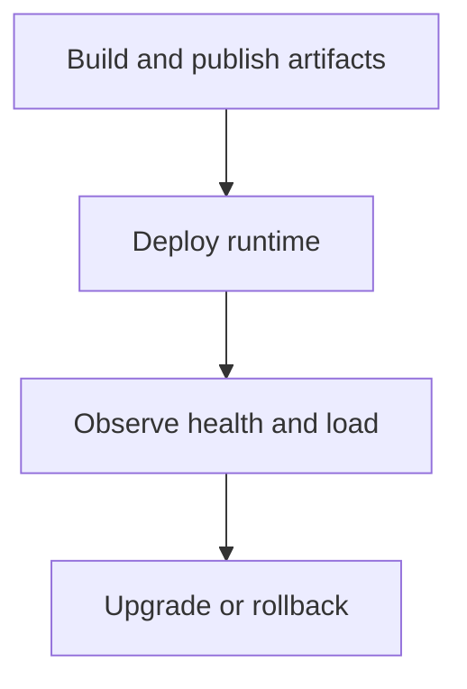

# Deployment Models

Atlas can run locally for development or in managed environments for shared access, but the core
deployment principle stays the same: the runtime should serve from an explicit store root with
explicit catalog state and explicit runtime configuration.

## Deployment Shapes

These models describe operational shape, not a maturity badge. The real boundary is whether artifact
publication, runtime config, observability, and rollback are handled deliberately enough for the
environment you are serving.

## Model 1: Local Development Runtime

Use this when:

- validating local workflow changes
- testing a built sample store
- checking endpoint behavior quickly

Characteristics:

- local bind address
- local artifact store under `artifacts/`
- minimal operational complexity
- useful for validating workflow shape, not for proving production readiness

## Model 2: Shared Internal Service

Use this when:

- a team needs a stable shared query surface
- artifact publication is handled by a controlled pipeline
- health, readiness, and observability matter across users

Characteristics:

- stable network address
- managed artifact store
- runtime config treated as controlled deployment input
- enough observability and rollback discipline that other people can depend on it

## Model 3: Managed Production Service

Use this when:

- uptime, rollback, and incident response are formal concerns
- capacity and security boundaries matter
- releases and runtime configuration are governed operationally

This model assumes the operator owns the surrounding infrastructure story. Atlas defines the
runtime, contract, and artifact boundaries, but it does not replace environment-specific security,
networking, storage, or incident policy.

## What Does Not Change Across Models

- the runtime serves from published artifacts, not ingest build roots
- the catalog remains the discoverability boundary
- health and readiness remain first-class concerns
- runtime config should be explicit and reviewable

## What These Models Are Not

- a license to serve directly from ingest build roots
- a promise that local filesystem habits scale unchanged into managed environments
- a substitute for operator-owned capacity, security, backup, or compliance decisions

## Choosing a Model

If you are unsure, start with the simplest model that still preserves:

- explicit artifact ownership
- observable health behavior
- safe rollback of runtime or store state

## Purpose

This page explains the Atlas material for deployment models and points readers to the canonical checked-in workflow or boundary for this topic.

## Stability

This page is part of the canonical Atlas docs spine. Keep it aligned with the current repository behavior and adjacent contract pages.
