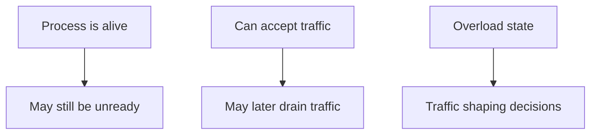

# Health, Readiness, and Drain

Atlas exposes separate ideas that operators should not collapse into one boolean:

- health
- readiness
- overload or drain state

## Endpoint Model

```mermaid
flowchart LR
    Runtime[Atlas runtime] --> Health[/healthz]
    Runtime --> Ready[/readyz]
    Runtime --> Overload[/healthz/overload]
    Runtime --> Live[/live]
```

## Why the Distinction Matters



Health answers “is the process alive enough to answer basic liveness checks?”

Readiness answers “should this instance currently receive normal traffic?”

Drain or overload state answers “is the instance reducing or refusing certain work classes?”

## Operational Usage

- use liveness checks to detect dead processes
- use readiness checks to gate traffic
- use overload or drain signals to avoid making a bad situation worse

## Practical Checks

```bash
curl -s http://127.0.0.1:8080/healthz
curl -s http://127.0.0.1:8080/readyz
curl -s http://127.0.0.1:8080/healthz/overload
```

## Operator Advice

- do not route normal traffic based only on liveness
- treat readiness regression as a first-class operational signal
- observe overload behavior under stress before calling a deployment “ready for production”

