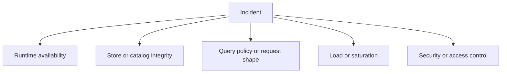
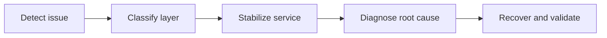

# Incident Response

Incident response in Atlas is easier when operators classify failures by layer before reaching for fixes.

## Incident Classification

## Response Flow

## First Questions to Ask

1. Is the process alive?
2. Is the instance ready?
3. Is the catalog discoverable?
4. Are queries failing because of policy, data absence, or runtime problems?
5. Is this a correctness incident, a capacity incident, or a security incident?

## Stabilization Order

- preserve evidence
- avoid making store state more ambiguous
- reduce traffic or drain when necessary
- restore safe readiness before declaring success

## Operator Reminder

During incidents, do not confuse:

- cache loss with store loss
- policy rejection with dataset absence
- liveness with readiness
- runtime rollback with store rollback

## Purpose

This page explains the Atlas material for incident response and points readers to the canonical checked-in workflow or boundary for this topic.

## Stability

This page is part of the canonical Atlas docs spine. Keep it aligned with the current repository behavior and adjacent contract pages.
