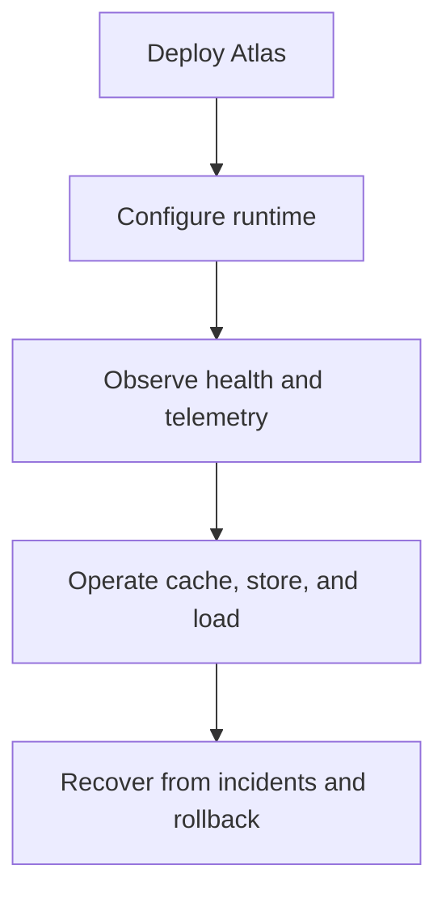
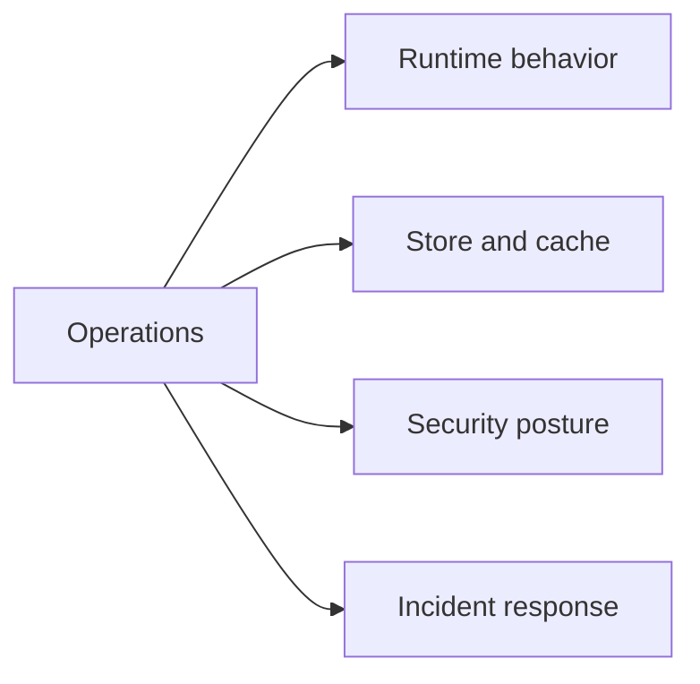

# Operations

This section is for running Atlas safely and predictably outside a toy local session.

Operations documentation answers questions such as:

- how Atlas should be deployed
- how runtime configuration should be managed
- how health, readiness, drain, and recovery should work
- how to reason about store, cache, performance, and security behavior

## Pages in This Section

- [Deployment Models](deployment-models.md)
- [Runtime Configuration](runtime-configuration.md)
- [Health, Readiness, and Drain](health-readiness-and-drain.md)
- [Logging, Metrics, and Tracing](logging-metrics-and-tracing.md)
- [Cache and Store Operations](cache-and-store-operations.md)
- [Backup and Recovery](backup-and-recovery.md)
- [Upgrades and Rollback](upgrades-and-rollback.md)
- [Performance and Load](performance-and-load.md)
- [Security Operations](security-operations.md)
- [Incident Response](incident-response.md)

## Operational Principle

Atlas should be run from explicit artifact and catalog state, with explicit runtime inputs, and with observability that explains what the system is doing rather than hiding drift.

## Purpose

This page explains the Atlas material for operations and points readers to the canonical checked-in workflow or boundary for this topic.

## Stability

This page is part of the canonical Atlas docs spine. Keep it aligned with the current repository behavior and adjacent contract pages.
