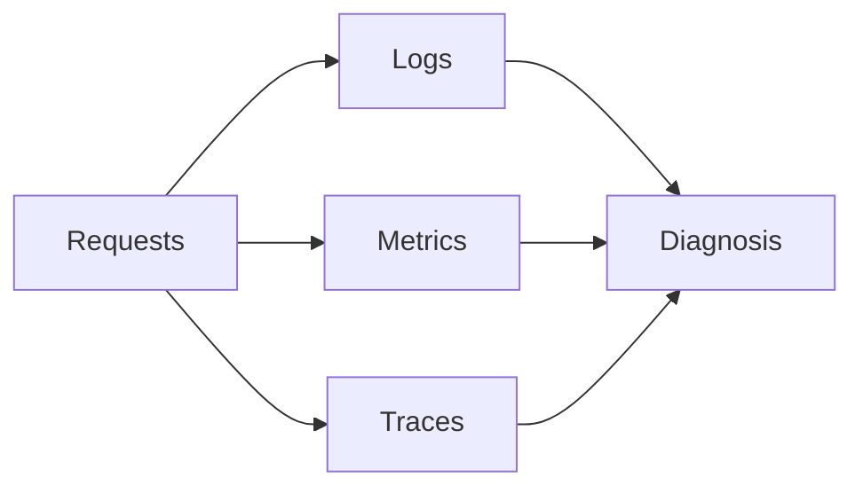

# Logging, Metrics, and Tracing

Observability is what turns Atlas from a black box into an operable service.

## Observability Layers



## What Each Signal Is Good For

- logs explain events and failures in context
- metrics show aggregate runtime behavior and saturation trends
- traces help follow a request path across internal work

## Metrics Surface

```mermaid
flowchart TD
    Runtime[Runtime] --> MetricsEndpoint[/metrics]
    MetricsEndpoint --> Scrape[Prometheus-style scraping]
    Scrape --> Alerting[Dashboards and alerts]
```

## Operational Priorities

When observing Atlas, pay closest attention to:

- readiness and overload behavior
- request classification and rejection patterns
- cache and store latency patterns
- request rate, concurrency, and error trends

## Logging Practice

- keep logs structured and machine-parseable where possible
- use request correlation data during incident analysis
- prefer stable fields and identifiers over ad hoc human prose only

## Tracing Practice

- use traces when request-level latency or path ambiguity matters
- correlate tracing with metrics rather than treating either as sufficient alone

