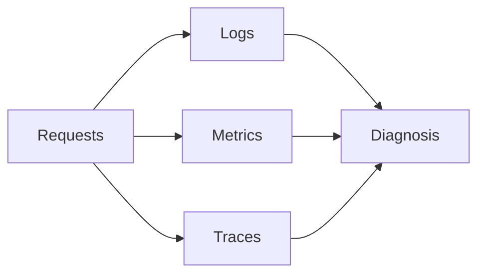
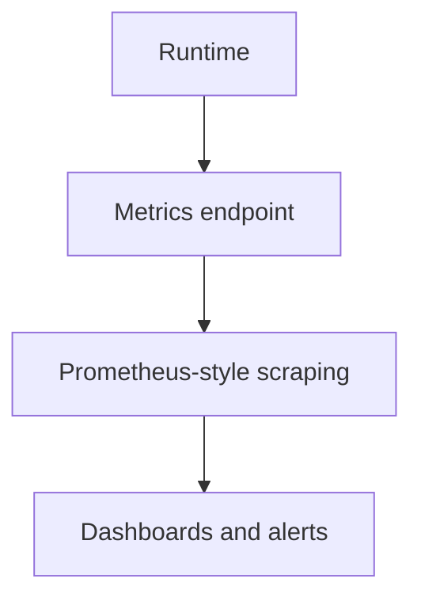

# Logging, Metrics, and Tracing

Observability is what turns Atlas from a black box into an operable service.

It is also easy to overclaim here. Telemetry helps you understand runtime behavior, but it does not replace clear contracts, explicit store state, or careful incident analysis.

## Observability Layers

This observability diagram shows the three complementary signal types Atlas expects operators to use.
No single one of them is enough to explain every failure mode on its own.

## What Each Signal Is Good For

- logs explain events and failures in context
- metrics show aggregate runtime behavior and saturation trends
- traces help follow a request path across internal work

Each signal also has limits:

- logs can be noisy or too local without correlation identifiers
- metrics can hide per-request pathologies behind aggregates
- traces can explain one path well while missing store-level or publication mistakes

## Metrics Surface

This metrics path matters because operators often rely on it for alerting and trend analysis. The
point is not just to expose a metrics endpoint, but to make the runtime’s operating state visible to
the wider monitoring system.

## Operational Priorities

When observing Atlas, pay closest attention to:

- readiness and overload behavior
- request classification and rejection patterns
- cache and store latency patterns
- request rate, concurrency, and error trends

Those priorities are runtime questions. They do not tell you by themselves whether the expected release was published or whether the wrong dataset identity was requested.

## Logging Practice

- keep logs structured and machine-parseable where possible
- use request correlation data during incident analysis
- prefer stable fields and identifiers over ad hoc human prose only

## Tracing Practice

- use traces when request-level latency or path ambiguity matters
- correlate tracing with metrics rather than treating either as sufficient alone

## Honest Limit

Good telemetry shortens diagnosis. It does not remove the need to ask whether the problem is runtime health, store state, catalog state, request shape, or contract drift.

## A Useful Observability Habit

- correlate logs, metrics, and traces before concluding a root cause
- keep runtime identity and dataset identity visible in your investigation path
- treat missing telemetry context as an operational gap worth fixing

## Purpose

This page explains the Atlas material for logging, metrics, and tracing and points readers to the canonical checked-in workflow or boundary for this topic.

## Stability

This page is part of the canonical Atlas docs spine. Keep it aligned with the current repository behavior and adjacent contract pages.
