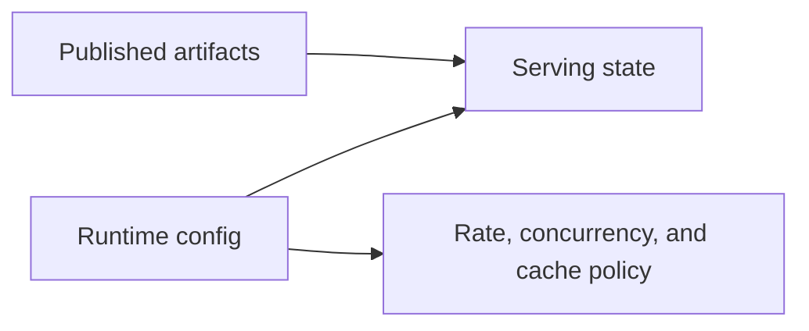
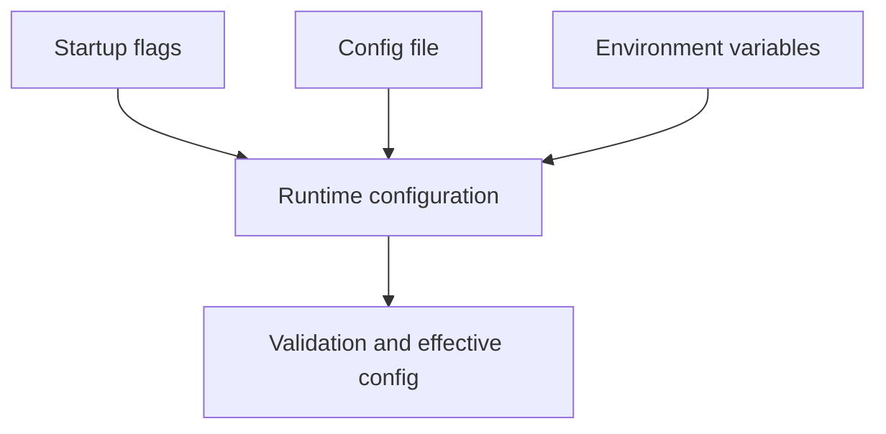

# Runtime Configuration

Runtime configuration controls how Atlas serves, limits, caches, logs, and responds. It does not redefine the content of published artifacts.

That separation matters because operators often have two different failure modes:

- trying to fix data-shape problems with runtime flags
- hiding runtime mistakes behind environment-specific defaults

## Runtime Config Boundary



## The Main Rule

Do not mix runtime configuration with release content configuration.

- published artifacts define what data exists
- runtime config defines how the server behaves around that data
- config should be explicit enough that another operator can explain the running behavior without guessing hidden environment state

## Configuration Inputs



## Operational Practices

- validate config before rollout when possible
- prefer explicit paths and values over environment-dependent assumptions
- keep cache roots and artifact roots clearly separated
- inspect effective config when behavior is surprising
- treat changes to limits, readiness behavior, or cache policy as operational changes that deserve rollout discipline

## Example Runtime Validation

```bash
cargo run -p bijux-atlas --bin bijux-atlas-server -- \
  --store-root artifacts/getting-started/tiny-store \
  --cache-root artifacts/getting-started/server-cache \
  --validate-config
```

## Runtime Config Questions to Ask

- where is the serving store root?
- where does the cache live?
- what are the active runtime limits?
- what logging and telemetry sinks are active?
- how will readiness and overload behave under stress?

## What Runtime Config Cannot Fix

- missing or unpublished dataset artifacts
- incorrect upstream source data
- compatibility changes that should have been handled in contracts or migration paths
